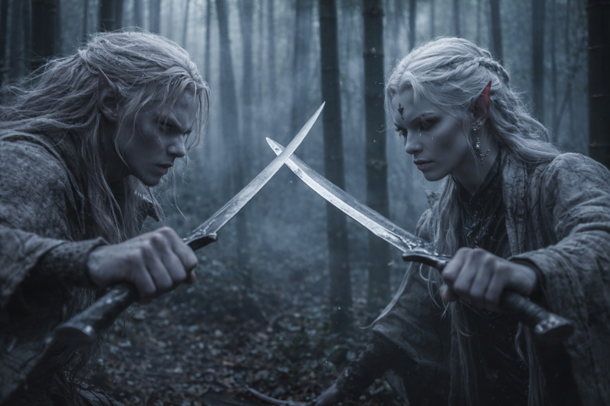
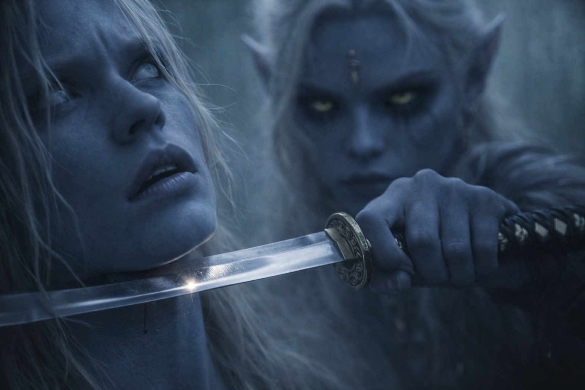

## Chapter 2

---

Drusniel slipped through the bamboo grove, each step placed the way his instructors had drilled into him since he could walk. His blade caught a sliver of light. Ahead, Shyntara's pale hair marked her against the dark like a challenge.

They circled each other. Feet quiet on the forest floor, watching for the first twitch of intent.

Blade met blade. The clash rang through the mist. Drusniel's arms shook as he pushed against her strength. She'd always been stronger. Knowing it didn't help.

He shoved hard, spinning into a series of strikes. Shyntara slipped past every one. Dodged left, leaned right, her hair swinging with the movement. Always just out of reach.

His jaw tightened. He'd trained for this. Practiced until his hands bled. And she hadn't even shifted her grip.

He pressed forward, found what looked like a gap. Lunged.

At the last instant, Shyntara twisted. His blade cut empty air. An elbow slammed into his sternum. He stumbled back, lungs emptying in a rush.

Cold metal pressed against his throat. Drusniel went still.

"Sloppy." Shyntara's lip curled. Not a hair out of place. Not even breathing hard. "You telegraphed that lunge from three steps out."

She lowered the blade. Drusniel rubbed his sternum. "If I could use my magic, I would've had you."

Shyntara cleaned her blade with a cloth she kept folded in her belt. She didn't laugh. She didn't argue. She just wiped the steel and said, "Father asked about your training hours."

Drusniel's hand stopped on his chest.

"I covered for you." She folded the cloth, precise as a surgical cut. "Told him you were running drills on the east terrace. He'll check eventually."

"I don't need you to cover for me."

"No. You need me to not report you." She sheathed the blade. "There's a difference."

Drusniel looked away. The bamboo trunks dissolved into mist in every direction. His thumb tapped against his thigh. "Annariel's been helping me. We've been practicing, and it's working. I can feel something when we reach together."

Shyntara was quiet for three heartbeats. When she spoke, her voice was flat and careful. "House Vrinn's second son."

"He's my friend."

"He's a Vrinn." She let the name sit between them. Their families had been in cold dispute over mining rights for two generations. Everyone in Umbra'kor knew it. "How often are you meeting him?"

"That's not the point."

"It's exactly the point." She pulled her hair back, tying it with a leather cord. The gesture was unhurried, practical. "If I found you out here, someone else can find you. If someone else finds you practicing unsanctioned techniques with the son of a rival house, Father doesn't get to cover for you. I don't get to cover for you. The Council handles it."

Drusniel's fists clenched. "So what? I should just stop?"

Shyntara studied him the way she studied a blade's edge. "Three Shadowblades were promoted last month. Decent assignments. Border work, but the pay's real. You could have that tomorrow."

"I don't want border work."

"I know what you want." Her voice didn't change. "I'm telling you what it costs if you're wrong."

He waited for the rest. The warning. The threat. The older-sister lecture about knowing his place.

It didn't come. Shyntara just stood there, arms crossed, watching him with an expression he couldn't quite read. Not anger. Something closer to arithmetic. Like she was measuring a distance and coming up short.

"The Duskborn Trials are in six days," he said.

"I know."

"If I pass, none of this matters. The Council, Father, the Vrinn dispute. All of it goes away."

Shyntara uncrossed her arms. She looked at the mist where the bamboo trunks disappeared, and for a moment her composure cracked, just slightly, around the eyes.

"Six days," she said. Then she turned and walked into the grove without looking back.

Drusniel stood alone in the mist. His hand rested on his sword hilt, his thumb tapping against the pommel. Four, five, six. He lost count and started over.

The bamboo creaked in a breeze he couldn't feel. Somewhere below, the spore tunnels carried the sound of the city waking up.

He should go back. Run drills on the east terrace, make the lie true. That was the smart move.

He picked up his blade and headed for the grove where Annariel would be waiting.

**End of Chapter 2 — continues in Chapter 3: [The Test of Venemora](/the-trial-the-test-of-venemora/)**
