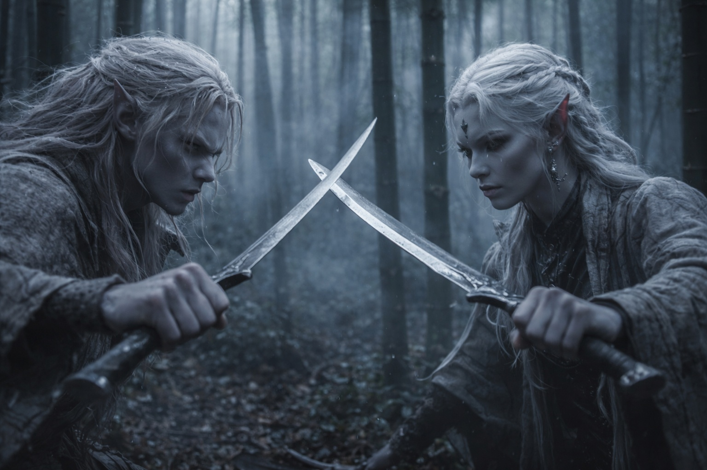

## Chapter 1 | Part 2
---

Drusniel slipped through the bamboo grove, each step placed the way his instructors had drilled into him since he could walk. His blade caught a sliver of light. Ahead, Shyntara's pale hair marked her against the dark like a challenge.

They circled each other. Feet quiet on the forest floor, watching for the first twitch of intent.

Blade met blade. The clash rang through the mist. Drusniel's arms shook as he pushed against her strength. She'd always been stronger. Knowing it didn't help.

He shoved hard, spinning into a series of strikes. Shyntara slipped past every one. Dodged left, leaned right, her hair swinging with the movement. Always just out of reach.

He'd practiced until his hands bled, and she hadn't even shifted her grip.

He pressed forward, found what looked like a gap. Lunged.

At the last instant, Shyntara twisted. His blade cut empty air. An elbow slammed into his sternum. He stumbled back, lungs emptying in a rush.

Cold metal pressed against his throat. Drusniel went still.

"Sloppy." Shyntara wasn't breathing hard. "You telegraphed that lunge from three steps out."

She lowered the blade. Drusniel rubbed his sternum. "If I could use my magic, I would've had you."

Shyntara wiped her blade with the cloth from her belt. "Father asked about your training hours."

Drusniel's hand stopped on his chest.

"I covered for you." She folded the cloth. "Told him you were running drills on the east terrace. He'll check eventually."

"I don't need you to cover for me."

"No. You need me to not report you." She sheathed the blade. "There's a difference."

Drusniel looked toward the path. "Annariel's been helping me. We've been practicing, and it's working. I can feel something when we reach together."

Shyntara tucked the cloth into her belt. "House Vrinn's second son."

"He's my friend."

"He's a Vrinn. How often are you meeting him?"

"That's not the point."

"It is the point." She tied back her hair. "I found you. A Council patrol could find you. I can cover a missed drill, Drusniel. Not unsanctioned practice with a rival house."

Drusniel's fists clenched. "So what? I should just stop?"

Shyntara studied him the way she studied a blade's edge. "Three Shadowblades were promoted last month. Decent assignments. Border work, but the pay's real. You could have that tomorrow."

"I don't want border work."

"I know what you want." Her voice didn't change. "I'm telling you what it costs if you're wrong."

He waited for the rest.

Shyntara glanced toward the path behind him, then back.

"The Duskborn Trials are in six days," he said.

"I know."

"If I pass, none of this matters. The Council, Father, the Vrinn dispute. All of it goes away."

Shyntara opened her mouth, then looked away into the bamboo.

"Six days," she said. Then she turned and walked into the grove without looking back.

Drusniel waited until her footsteps faded before bending to retrieve his fallen scabbard.

The bamboo creaked in a breeze he couldn't feel. Somewhere below, the spore tunnels carried the sound of the city waking up.

He should go back. Run drills on the east terrace, make the lie true. That was the smart move.

He sheathed his blade and headed for the grove where Annariel would be waiting.

**End of Chapter 1.2 —> 1.3: [The Sacred Chamber](/the-sacred-chamber/)**
