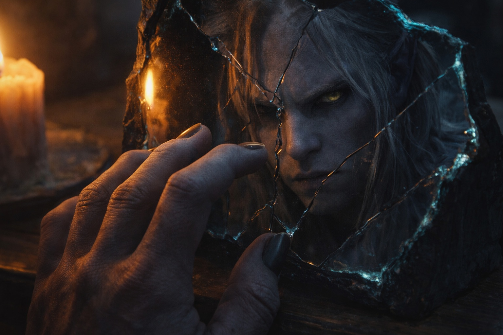

## Chapter 5 | Part 2
--- 

The presence found him that night.

Drusniel lay in darkness, unable to sleep, when the familiar warmth brushed against his awareness. The texture that felt almost like Annariel. Close enough.

*Drus. Are you alright? I sensed something... wrong.*

He reached toward the connection. *House Vrinn. My father says they're making moves against us.*

A pause. Then, carefully: *I've heard things.*

*What things?*

*Names. Fragments of dates, I think—the reports were coded.* The presence pulsed with urgency. *I can't say more—the training halls have ears, and they might be monitoring mental connections. But something about your family has been circulating. I've seen indirect references. Vrinn-aligned mages discussing Thel'varin territory.*

Drusniel sat up in bed. His heart thudded against his ribs. *How do you know?*

*I passed the trials. I have access to places you don't—council archives, intelligence summaries. Things filter through.* A thread of fear wound through the connection. *I've seen... I think it was correspondence. Vrinn agents reporting on house movements—I couldn't tell whose family specifically, but the context suggested...* The presence hesitated, correcting itself. *Actually, I'm not certain it was your family. But the territories they mentioned—it would fit.*

*They're spying on us.*

*More than spying. They're planning. I saw a reference to "the Thel'varin solution." I don't know what it means, but the context...* The presence darkened with worry. *Be careful, Drusniel. These people are dangerous. More dangerous than your family realizes.*

Drusniel's thumb tapped against his fingers. Twenty-three, twenty-four, twenty-five.

*What else did you see?*

*Weapons requisitions. Troop movements. They've been hiring mercenaries—surface-dwellers, outsiders who don't know drow customs.* A thread of disgust wound through the connection. *They're not even pretending this is political anymore. It's military.*

*My father thinks we have time.*

*You might not.* The presence pulsed with urgency. *Whatever they're planning, it could be soon. The reports I saw—they're moving assets into position. I couldn't read the timeline clearly, but the urgency in the correspondence... a week? Maybe two? I'm not certain, Drus. I wish I knew more.*

The words unsettled Drusniel. A week, maybe two. The voice wasn't certain—but even the uncertainty felt like a warning. Whatever his family thought they were preparing for, the reality might be worse.

*Why would they target us specifically? We're not the largest house. Not the most powerful.*

*You're in their way. Your territory blocks their expansion into the western districts. Your trade agreements compete with their merchant arm. And your father...* Hesitation. *Your father humiliated their house elder at the market council three years ago. Some grudges don't fade.*

It made sense. All of it made sense. The escalating tension, the mapped patrol routes, the assassins near the borders—it fit a pattern of calculated aggression.

*What should I do?*

*Stay alert. Stay close to your family.* The presence warmed with something that felt like protectiveness. *And train, Drus. Keep training with Zaelar. You might need that power sooner than you think.*

*I will.*

*I couldn't bear to lose you too.* The words carried weight—grief and fear and an ache that cut deeper than either. *You're the only real friend I have. The only person who understood me before all of this started. If Vrinn hurts you...*

The presence didn't finish the thought. Didn't need to.

*I'll be careful,* Drusniel sent. *I promise.*

*Good.* The warmth began to fade. *I'll keep listening. If I learn anything more, I'll tell you. But don't trust anyone outside your family right now. Not the servants. Not the guards. Not anyone who might have Vrinn connections.*

*I understand.*

The presence withdrew. Drusniel lay in darkness, staring at the ceiling.

House Vrinn. The enemy had always been faceless, nameless—the rival house that threatened from a distance. Now it had shape. History. Motivation.

And according to "Annariel," it had been watching his family for months. Planning something. Building toward a "solution."

Drusniel's hands clenched beneath his blankets. The air in the room stirred, responding to his anger.

If they touched his family—if they made good on whatever they were planning—

He would make them regret it.

---

**End of Chapter 5.2 — continues in Chapter 5.3: [The House Rivalry: The Secret Meeting](/the-house-rivalry-the-secret-meeting/)**
