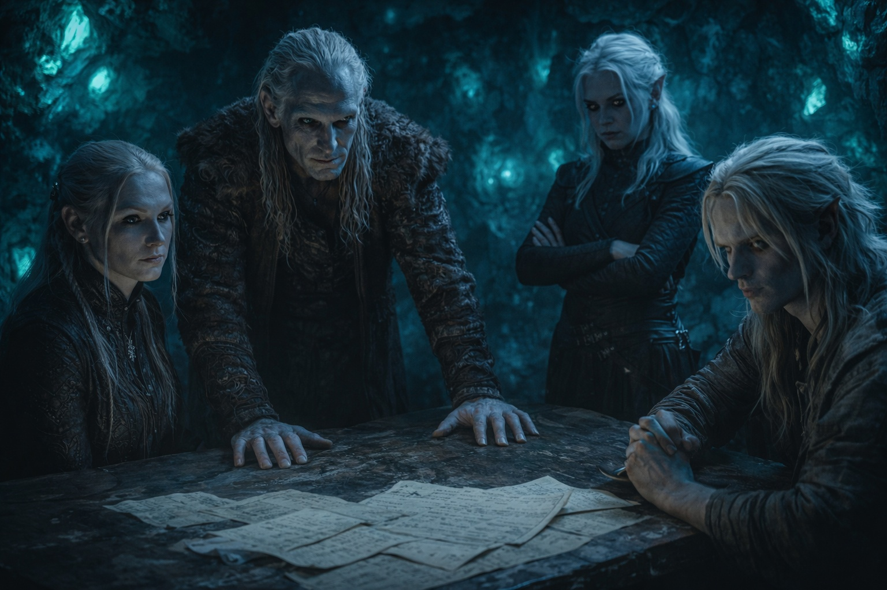
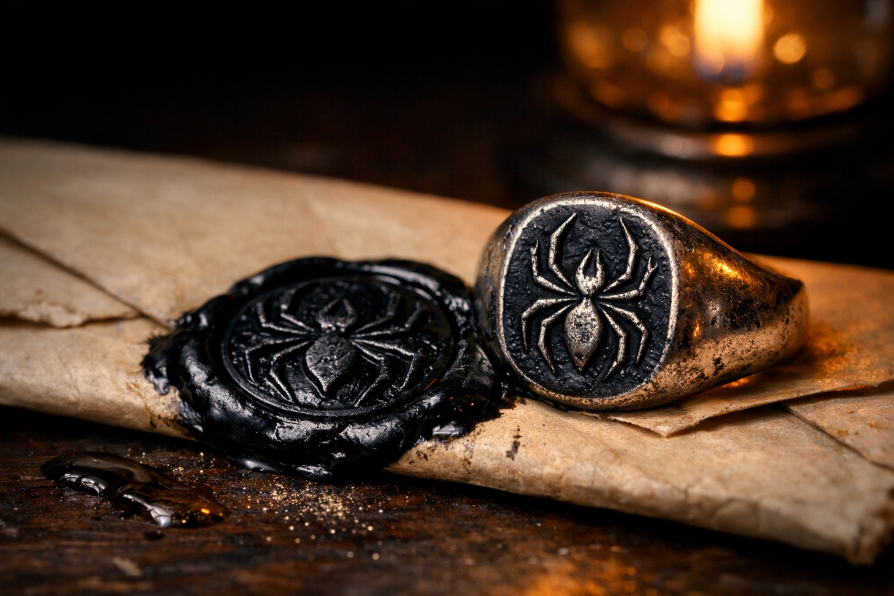

## Chapter 5 | Part 1
--- 

"Family meeting. Now. All of you."

His father called from the study without waiting for a servant. Drusniel set down his cup so quickly that water spilled across his wrist.

He found his way to the study where his parents waited, Shyntara already there, standing with her arms folded and her face carefully blank. The room smelled of old paper and weapon oil.

A dispatch lay open on the desk. His mother had brought the household keys with her.

"The Council standstill is failing. Vrinn scouts have crossed it."

"Three sightings this week," his father said. "Their delegates deny all three."

"I've moved the silver downstairs," his mother said. "And the household records. If we have to leave, they're packed."

Shyntara put a marked map beside the dispatch. "Different entry points each time. They're checking where our patrols meet."

"You're certain?" their father asked.

"I followed the last one to a Vrinn storehouse. I couldn't get inside."

"What are we going to do?" Drusniel asked.

"Move the outer patrols inside the wall. Check the ward fittings. Nothing opens after the evening bell without my order."

"Why now?" Drusniel pressed.

His father tapped the dispatch. "Our allies have refused troops. Vrinn will know by now."

"So we shorten the line," Shyntara said. "I can hold the inner gates with the guards we have."

"Make the arrangements." His father passed her the map.

"And Drusniel stays inside. No more excursions while we settle this."

Drusniel thought of the tower and the exercise he'd left unfinished. He'd nearly managed it yesterday. If he stayed here, he wouldn't know whether he could do it today.

He said nothing.

"Understood?" his father pressed.

"Understood," Shyntara said.

"Understood," Drusniel echoed.

"Report to me when the gates are secured."

The meeting ended. Drusniel retreated to his room.

Zaelar's tower would open at dawn.

His father had told him to stay close.

Drusniel flexed his hand and drew a thread of air across his knuckles. Pain tightened above his eyes. He let it go before trying for more.

---

**End of Chapter 5.1 —> 5.2: [The House Rivalry: The Fracture](/the-house-rivalry-the-fracture/)**
