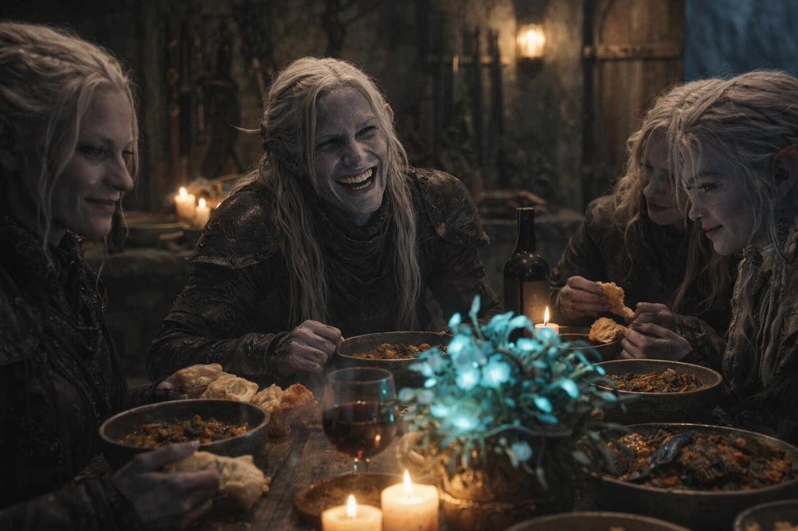
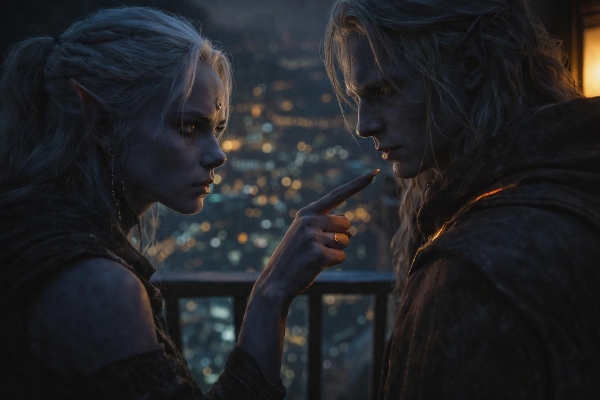

---
order: 149
title: "The House Rivalry: The Night Before"
description: "The family dinner was his mother's idea."
date: 2024-05-20
language: en
chapter: 5
subchapter: 4
storyline: drusniel
canon_phase: main
canon_sequence: D-005-004
narrative_weight: medium
category: Umbra'kor
author: Drusniel
type: Main
tags: ['#the house rivalry', '#drusniel', '#umbrakor']
thumbnail: image.jpg
featured: false
counterpart_path: site/content/posts/es/umbrakor/la-rivalidad-de-la-casa-la-noche-antes/index.mdx
counterpart_title: "La Rivalidad de la Casa: La Noche Antes"
---

## Chapter 5 | Part 4
--- 

The family dinner was his mother's idea.

"Everyone together," she said, arranging the table with precise movements. "That's what matters. Whatever else is happening, we face it as a family."

Drusniel helped carry dishes from the kitchen—actual help, not the watching he usually did. The servants had been given the evening off. Just family tonight. Just the four of them.

The dining room glowed with bioluminescent flowers, their soft light casting gentle shadows across the walls. His mother had arranged them in the old style, the way her grandmother had taught her. Tradition in the face of uncertainty.

Outside the dining room, guards walked in pairs. The gates had been reinforced. Weapons that usually stayed in the armory hung by every door.

They sat. They ate. The food was better than usual—his father's favorite dishes, the ones his mother made only on important occasions. Spiced mushroom stew with deep-earth herbs. Cave fish prepared in the old style, skin crisped and flesh tender. Fresh bread, still warm.

"Do you remember," his father said, reaching for more bread, "when Drusniel tried to convince us he'd trained a cave spider to fetch his shoes?"

Shyntara snorted. "He was eight. And the spider did fetch things. Just not shoes."

"It fetched a rat," their mother said, smiling despite herself. "Into his bed. At midnight."

"I screamed," Drusniel admitted. "I'm not proud of it."

"You screamed for ten minutes," Shyntara corrected. "The guards thought we were being attacked."

"We almost were," their father added. "The spider was the size of a dog."

"It was the size of a cat," Drusniel protested. "Maybe a large cat."

His father laughed. Drusniel looked up so quickly Shyntara caught him and smirked.

"And Shyntara's first assassination attempt," their mother said. "Tell them about that."

Shyntara's eyes narrowed. "We agreed never to discuss that."

"I never agreed to anything."

"I was twelve," Shyntara said defensively. "And the target moved."

"The target was a melon," their father said. "It was sitting on a post."

"It wobbled."

Drusniel laughed hard enough that he had to set down his cup.

"We should do this more often," his mother said softly. "Just us. No politics. No obligations."

"When this is over," his father replied.

Drusniel stole a mushroom from Shyntara's plate. She stabbed his knuckles with the blunt end of her fork.

"More wine?" his mother asked, reaching for the bottle. "We have plenty."

"Please."

She poured. His father asked for the bread. Shyntara insisted the melon had moved.

---

Shyntara found him on the balcony after dinner.

She moved quietly—assassin's habit—but Drusniel felt the air shift when she approached. His new sense, always active now. He knew she was there three seconds before her footsteps reached him.

"You felt me coming," she said.

It wasn't a question. He nodded.

"That's new." Her voice was neutral, assessing. "You couldn't do that before."

"I've been practicing."

She leaned against the railing beside him, looking out at the fungal glow of Umbra'kor's distant districts. The city stretched below them, a lattice of bioluminescent pathways and shadowed buildings. Somewhere out there, House Vrinn was planning their destruction.

"Something's wrong," she said finally. "I can feel it. And it's not just House Vrinn."

"What do you mean?"

"You've been different. Since the trial. Since..." She paused, choosing her words carefully. "Where have you been disappearing to, Drusniel? Every day. Sometimes before dawn. I've covered for you three times when Father asked."

"I've been training," he said carefully. "Privately."

"With who?"

He didn't answer.

"You're lying." Her voice was flat, professional. The voice she used on targets before they knew they were targets. "I can always tell when you lie. Your breathing changes. Your heartbeat speeds up." She turned to face him. "You've been going to the surface. I tracked you twice before I lost the trail."

Drusniel's throat tightened. "You followed me?"

"I was protecting you. You're my brother." Her jaw set. "Who's up there? What are you doing?"

*I should tell her,* he thought. *About Zaelar. About the magic. About everything.*

The words sat on his tongue, ready to spill. Months of secrets. Months of lies by omission. Months of growing power that he'd shared with no one except a voice that might not be real and a mage who asked too many questions.

But if he told her, she would tell their father. And their father would stop him. Would drag him back to the assassin's path, the acceptable life, the future where he was just another shadow in his sister's wake.

"I found a teacher," he said finally. "Someone who understands what happened to me in the trial. He's been helping me understand my magic."

Shyntara's expression didn't change. "Magic."

"I'm not broken, Shyntara. I'm different. The trial couldn't measure what I actually am." He met her gaze. "I can do things now. Real things. The power I was supposed to have—I'm finally learning how to use it."

A long silence. The distant hum of the city filled the space between them.

"You're not lying about that," she said quietly. "You really believe it."

"Because it's true."

"Maybe." She turned back to the railing. "You vanish every day. You lie about where you go. You come back stronger, and every time I ask you to stop, you defend whoever is teaching you before you defend yourself."

Drusniel said nothing.

"Whoever he is, he's made sure the thing you want most is something only he can give you." Her jaw tightened. "That makes him dangerous even if every lesson works."

"He's teaching me what I am."

"And you're hiding him from everyone who might tell you to leave."

"We don't have time for this now," she continued. "Whatever you're doing, whatever risks you're taking—put it aside until we've dealt with Vrinn. Stay alert tonight. Something feels wrong, and my instincts have kept me alive this long."

"I will. I promise."

She nodded once. Then, so softly he almost missed it: "Be careful, Drusniel. I can't lose you too."

She left without waiting for a response.

Drusniel watched the corridor until her footsteps disappeared.

---

**End of Chapter 5.4 —> 5.5: [The House Rivalry: The Warning (Cut Short)](/the-house-rivalry-the-warning-cut-short/)**

