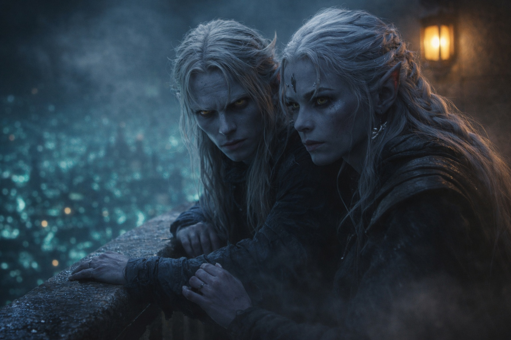

---
order: 149
title: "The House Rivalry: The Night Before"
description: "The family dinner was his mother's idea."
date: 2024-05-20
language: en
chapter: 5
subchapter: 4
storyline: drusniel
canon_phase: main
canon_sequence: D-005-004
narrative_weight: medium
category: Umbra'kor
author: Drusniel
type: Main
tags: ['#the house rivalry', '#drusniel', '#umbrakor']
thumbnail: image.jpg
featured: false
counterpart_path: site/content/posts/es/umbrakor/la-rivalidad-de-la-casa-la-noche-antes/index.mdx
counterpart_title: "La Rivalidad de la Casa: La Noche Antes"
---

## Chapter 5 | Part 4
--- 

The family dinner was his mother's idea.

"Bring the bread before it cools," she told Drusniel. "And leave that chair for your father."

He carried the dishes from the kitchen, shifting the hot bread basket between his hands. His mother had sent the servants to eat in their own quarters. Tonight they would serve themselves.

His mother had arranged luminous flowers around the serving dishes, as her grandmother used to. Their light showed through the thin rims of the cups.

Outside the dining room, guards walked in pairs. The gates had been reinforced. Weapons that usually stayed in the armory hung by every door.

His father lifted the lid from the mushroom stew and drew the dish toward him. Beside it lay cave fish with crisped skin, the way he always asked for it, and the bread Drusniel had fetched.

"Do you remember," his father said, reaching for more bread, "when Drusniel tried to convince us he'd trained a cave spider to fetch his shoes?"

Shyntara snorted. "He was eight. And the spider did fetch things. Just not shoes."

"It fetched a rat," their mother said, smiling despite herself. "Into his bed. At midnight."

"I screamed," Drusniel admitted. "I'm not proud of it."

"You screamed for ten minutes," Shyntara corrected. "The guards thought we were being attacked."

"We almost were," their father added. "The spider was the size of a dog."

"It was the size of a cat," Drusniel protested. "Maybe a large cat."

His father laughed. Drusniel looked up so quickly Shyntara caught him and smirked.

"And Shyntara's first assassination attempt," their mother said. "Tell your brother about that."

Shyntara's eyes narrowed. "We agreed never to discuss that."

"I never agreed to anything."

"I was twelve," Shyntara said defensively. "And the target moved."

"The target was a melon," their father said. "It was sitting on a post."

"It wobbled."

Drusniel laughed hard enough that he had to set down his cup.

"Next time we'll do this without letting the stew go cold," his mother said, lifting the ladle toward his father.

"When this is over," his father replied.

Drusniel stole a mushroom from Shyntara's plate. She stabbed his knuckles with the blunt end of her fork.

"More wine?" his mother asked, reaching for the bottle. "We have plenty."

"Please."

She poured. His father asked for the bread. Shyntara insisted the melon had moved.

---

Shyntara found him on the balcony after dinner.

Cool air from the balcony door disturbed the stillness behind him. He reached toward it, felt a shape approaching, and turned. The familiar ache returned above his eyes.

"You felt me coming," she said.

It wasn't a question. He nodded.

"Yesterday I thought you'd heard the kitchen latch. You didn't hear me now."

"I've been practicing."

She leaned on the railing beside him. Below, a pair of guards stopped to check a door before continuing along the wall.

"Mother told me about the requisitions."

"Did Father get the copies?"

"The annex closed before the messenger reached it. He'll try again tomorrow." She looked at Drusniel. "I covered for you at breakfast. You were gone much longer than an archive visit takes."

"I've been training," he said carefully. "Privately."

"With who?"

He didn't answer.

"I followed you twice. Both times you took the surface passages." She waited until he looked at her. "Where did you go after that?"

Drusniel's throat tightened. "You followed me?"

"I was protecting you. You're my brother." Her jaw set. "Who's up there? What are you doing?"

If he gave her Zaelar's name, his father would have guards waiting at the surface door by morning.

"I found a teacher," he said finally. "Someone who understands what happened to me in the trial. He's been helping me understand my magic."

Shyntara's expression didn't change. "Magic."

"Air. I can feel movement through it. Sometimes I can move things myself."

A long silence. The distant hum of the city filled the space between them.

"And he lets you keep coming back hurt."

"I push too hard. That's mine to fix."

"You're defending him again. I still haven't got a name."

Drusniel said nothing.

"If he stopped teaching you tomorrow, what would you do?"

"I have his notes. I can practice."

"Then practice here."

"Until we know what Vrinn is doing," she added. "Stay where I can find you tonight."

"I will. I promise."

She checked the guards below once more. "If the bell sounds, come straight to the inner hall. Don't go looking for anyone."

She left without waiting for a response.

Drusniel watched the corridor until her footsteps disappeared.

---

**End of Chapter 5.4 —> 5.5: [The House Rivalry: The Warning (Cut Short)](/the-house-rivalry-the-warning-cut-short/)**

