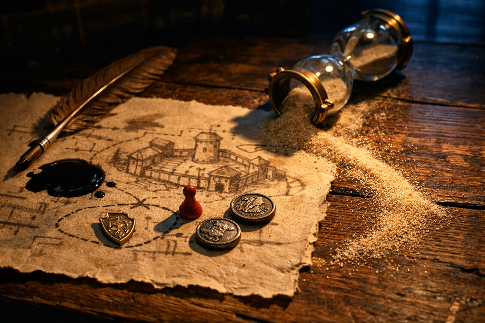

---
order: 148
title: "The House Rivalry: The Secret Meeting"
description: "Drusniel stood in Zaelar's study, chest heaving from the morning's training exercises."
date: 2024-05-19
language: en
chapter: 5
subchapter: 3
storyline: drusniel
canon_phase: main
canon_sequence: D-005-003
narrative_weight: medium
category: Umbra'kor
author: Drusniel
type: Main
tags: ['#the house rivalry', '#drusniel', '#umbrakor']
thumbnail: image.jpg
featured: false
counterpart_path: site/content/posts/es/umbrakor/la-rivalidad-de-la-casa-la-reunion-secreta/index.mdx
counterpart_title: "La Rivalidad de la Casa: La Reunión Secreta"
---

## Chapter 5 | Part 3
--- 

"House Vrinn is threatening my family."

Drusniel stood in Zaelar's study, chest heaving from the morning's training exercises. He hadn't meant to say it—hadn't planned to bring his family's problems into the tower—but the words came out anyway. The weight of the family meeting, the fear in his father's eyes, the sense of encircling danger—it had to go somewhere.

Zaelar set down the text he'd been reading. His study smelled of old paper and ink, hourglasses ticking on every surface. Three hundred of them, at least, each measuring time in different intervals.

"House Vrinn?"

"The rival house. They've been mapping our patrols." Drusniel wiped sweat from his forehead. "The voice claims Vrinn is hiring mercenaries. Urgent requisitions."

Zaelar stopped turning the hourglass in his hand. "Mercenaries?"

The way he said it—too knowing, too measured—made Drusniel pause.

"You know them?"

"I know of them. Enough to know hired blades change the problem."

"Why?"

"They are harder to predict than house assassins. Fewer customs. Fewer obligations." Zaelar moved a practice marker onto the table between them. "Suppose Vrinn came tonight. Where would you expect the first pressure?"

Drusniel looked at the marker. "You're asking about my family's defenses."

"I'm asking how you think."

"I think I'm not giving you our entry points."

Zaelar's mouth twitched once. "Good."

"If they used outsiders," Zaelar said, "what would that change?"

"Patrol recognition. Accent. Movement." Drusniel considered it. "They might use routes a drow assassin would avoid because the routes are considered dishonorable or too exposed."

"Better."

Zaelar gathered the practice markers back into a line.

"Focus on your training," Zaelar said. "Power is the answer to enemies. When you're strong enough, threats like House Vrinn become manageable."

Drusniel nodded slowly. The conversation felt wrong—too many specific questions, too much interest in tactical details—but he couldn't articulate why. Zaelar was helping him. Teaching him. Whatever his quirks, whatever his past, the magic was real.

"The exercise from yesterday," Drusniel said, pushing the unease aside. "Air sensing. I want to practice it more."

"Of course." Zaelar smiled, and it almost reached his eyes. "Let's begin."

---

The training lasted until midday. By the time Drusniel left the tower, his head throbbed and his legs felt unsteady.

On the walk home, one question stayed with him.

Why had Zaelar stopped the hourglass when Drusniel said *mercenaries*?

Drusniel counted his steps and kept walking.

---

**End of Chapter 5.3 —> 5.4: [The House Rivalry: The Night Before](/the-house-rivalry-the-night-before/)**

