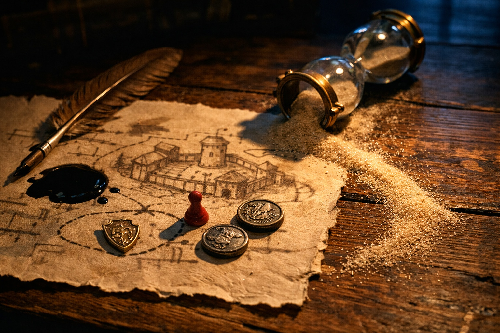

---
order: 148
title: "The House Rivalry: The Secret Meeting"
description: "Drusniel stood in Zaelar's study, chest heaving from the morning's training exercises."
date: 2024-05-19
language: en
chapter: 5
subchapter: 3
storyline: drusniel
canon_phase: main
canon_sequence: D-005-003
narrative_weight: medium
category: Umbra'kor
author: Drusniel
type: Main
tags: ['#the house rivalry', '#drusniel', '#umbrakor']
thumbnail: image.jpg
featured: false
counterpart_path: site/content/posts/es/umbrakor/la-rivalidad-de-la-casa-la-reunion-secreta/index.mdx
counterpart_title: "La Rivalidad de la Casa: La Reunión Secreta"
---

## Chapter 5 | Part 3
--- 

"House Vrinn is threatening my family."

Drusniel set his damp cloak over a chair. He'd gone to the annex before the tower, against his father's order. The public receipt ledger confirmed two urgent requisitions, but the sealed copies required a councillor's authority. He had the dates. Nothing linking them to Vrinn.

Zaelar set down his book. The desk held a row of empty hourglasses awaiting their turn; he lifted one and let the sand settle.

"What have you learned?"

"The voice says they're hiring mercenaries. I found the requisitions it mentioned. I couldn't read the orders."

"Mercenaries." Zaelar turned the glass and set it down.

"Does that tell you anything?"

"Hired blades may approach a house differently from its neighbors."

"Why?"

"They won't know its customs. They may see an opening a local would pass by." Zaelar placed a practice marker between them. "Where would you expect them to try?"

Drusniel looked at the marker. "You're asking about my family's defenses."

"I'm asking how you think."

"I think I'm not giving you our entry points."

"Keep that precaution, then. We can work without a map."

"If they used outsiders," Zaelar said, "what would that change?"

"They wouldn't know which patrols belonged there." Drusniel considered it. "They might cross exposed ground we'd dismiss as a way in."

"And air sensing could warn you whichever approach they chose."

Zaelar gathered the practice markers back into a line.

"That's something we can practice here."

"Away from the vent," Drusniel said. "And don't tell me when you move."

Zaelar drew the curtain across the window. "Choose where you'll stand."

---

By midday, sensing Zaelar's movements had left Drusniel with a headache that worsened in the light. He rested under cover before heading home.

He gave his mother the requisition dates as soon as he arrived. She asked where he'd been. He told her about the annex and kept the tower to himself.

"Your father can request the sealed copies," she said. She folded the paper into her sleeve. "Go wash. You're carrying half the upper road."

---

**End of Chapter 5.3 —> 5.4: [The House Rivalry: The Night Before](/the-house-rivalry-the-night-before/)**

