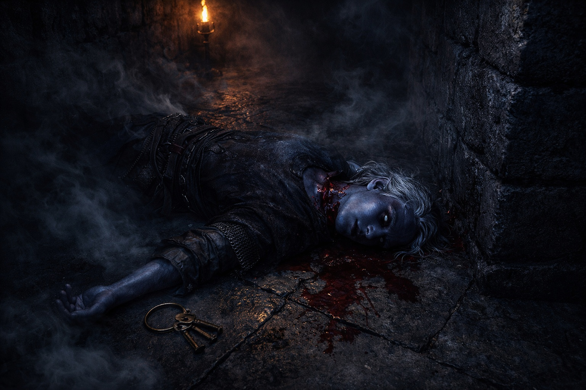

---
order: 150
title: "The House Rivalry: The Warning (Cut Short)"
description: "Shyntara's words were still circling in his head—*Be careful, Drusniel. I can't lose you too*—when he slipped out through the service entrance."
date: 2024-05-21
language: en
chapter: 5
subchapter: 5
storyline: drusniel
canon_phase: main
canon_sequence: D-005-005
narrative_weight: medium
category: Umbra'kor
author: Drusniel
type: Main
tags: ['#the house rivalry', '#drusniel', '#umbrakor']
thumbnail: image.jpg
featured: false
counterpart_path: site/content/posts/es/umbrakor/la-rivalidad-de-la-casa-la-advertencia-cortada/index.mdx
counterpart_title: "La Rivalidad de la Casa: La Advertencia (Cortada)"
---

## Chapter 5 | Part 5
--- 

He shouldn't have gone.

Shyntara's words were still circling in his head—*Be careful, Drusniel. I can't lose you too*—when he slipped out through the service entrance. The compound had gone quiet after dinner. His family asleep, the guards on their rotations, the bioluminescent flowers dimming in the dining room where they'd laughed together just hours ago.

He'd promised to stay alert. To be present.

Instead, he'd waited until the halls fell silent and taken the surface tunnels to Zaelar's tower. One more session. One more hour with the power that made the void feel smaller. Shyntara had rattled him, and when Shyntara rattled him, his hands needed something to do. The air responded better than anything else.

The session had been good. Zaelar had shown him a new compression technique, and for the first time, Drusniel had sustained a focused push for a full four seconds. Progress. Real, measurable progress that proved he wasn't broken.

He was still thinking about it when he entered the service passage back into the compound and tasted smoke.

Chemical smoke. Acrid and thick, designed to blind and confuse. Seeping through the tunnel ahead, filling the narrow passage with something that burned his eyes and his lungs and his throat.

*Something is wrong.*

He broke into a run.

The service passage opened into the lower corridors. The bioluminescent lights were dead—sabotaged, cut off at the source. Even drow eyes couldn't pierce this kind of darkness. And the air told him things he didn't want to hear: displacement patterns everywhere, too many bodies moving through the compound, the pressure signatures of violence.

*This isn't a drill. This isn't practice. This is real.*

Footsteps ahead. Multiple, coordinated, too heavy to be servants. The measured tread of professionals who'd done this before. Voices, low and clipped, communicating in whispers.

"Check the lower passages. No survivors."

His blood went cold.

*No survivors.*

*And I wasn't here. I was on the surface, playing with candle flames, while—*

A shape materialized from the smoke. Armored. Masked. Moving with the precise efficiency of someone who killed for a living. The figure turned, spotted him, and the blade came up without hesitation.

Drusniel felt the air displacement before he saw the strike—his new sense screaming *threat*—and threw himself sideways. The blade cut through the space where his head had been. Close enough to feel the wind of its passage.

He rolled. Came up low. No weapon. He'd left his bedside knife in his room, because he'd been sneaking out, because he hadn't planned on needing it, because he was supposed to be *safe in bed*.

*The air. Use the air.*

He reached for the nearest current. Smoke-choked. Thin. The ventilation system was struggling against whatever chemical agent they'd used, and panic scattered his focus. The air wouldn't gather. He could feel it, sense it, but his mind was fragmented by fear and the certain knowledge that while he'd been practicing compression techniques in Zaelar's tower, someone had come for his family.

*Focus. FOCUS.*

He tried again. Gathered what he could find, compressed it the way Zaelar had taught him, pushed—

Nothing. The air scattered like the smoke it was drowning in.

The attacker recovered. Blade rising.

Third try. Desperate. Drusniel threw everything he had into a single compressed burst, felt something tear behind his eyes—

The attacker stumbled back. Just a step. Just enough.

Warmth trickled from Drusniel's nose. Blood. He'd pushed too hard, the way Zaelar had warned him not to.

He didn't care.

Drusniel ran.

The corridor twisted ahead, choked with smoke. Somewhere above, steel rang against steel.

"Mother! Father!"

His voice echoed in the darkness. No response.

He ran toward the main stairs. His boots pounded against stone. His lungs burned with smoke.

A servant's body lay crumpled at the junction. Eyes open. Throat cut.

*Run, young master. Run.*

The words the servant had never gotten to say.

Drusniel kept moving. The stairs were ahead—and beyond them, his parents' quarters, the family wing, everyone he loved—

"Drusniel!"

Shyntara. Her voice cut through the chaos, somewhere to his left.

He turned. Tried to orient. The smoke made it impossible to see more than a few feet.

"This way!" Her hand found his arm, gripped hard. "The escape route. Mother's already—"

A scream. High and terrible. Cut short.

They both froze.

"Mother," Drusniel whispered.

"We can't help her." Shyntara's voice was steel. "The passage. Now."

"I'm not leaving—"

"She's dead." The words hit like physical blows. "Father's holding the main corridor. He ordered me to get you out."

"No. No, I can—"

Steel clashed somewhere close. Shouts. Their father's voice, roaring something Drusniel couldn't make out.

Then silence.

Shyntara's grip tightened. "Move. Now."

She pulled him forward. Through the smoke. Past the bodies. Away from the sounds of dying.

Drusniel's mind fragmented. This wasn't real. Couldn't be real. His family—his parents, the dinner just hours ago,

The escape passage appeared ahead. A hidden door, barely visible even to those who knew it existed.

Shyntara shoved him toward it. "Go. I'll follow."

"Shyn—"

"GO."

She turned back toward the chaos. Toward the attackers. Toward the screams.

Drusniel hesitated one instant too long.

The ceiling collapsed.

Stone and timber crashed down between them. Dust and smoke billowed. Drusniel threw his arms up, felt debris slam into his shoulder, his back—

When he looked up, the corridor was blocked.

"Shyntara!"

No response. Just the crackle of flames and the distant clash of combat.

He was alone.

The escape passage waited behind him. Dark. Empty. A path to survival.

And somewhere beyond the rubble, his sister was fighting. Maybe dying. Definitely gone.

Drusniel stood in the darkness, covered in dust and blood that might be his own, and felt the world he'd known collapse into ruins around him.

He ran.

Not toward the passage. Not toward safety.

Toward his parents' screams.

---

**End of Chapter 5.5 — continues in Chapter 6.1: [Blood in the Dark: The Chaos](/blood-in-the-dark-the-chaos/)**
