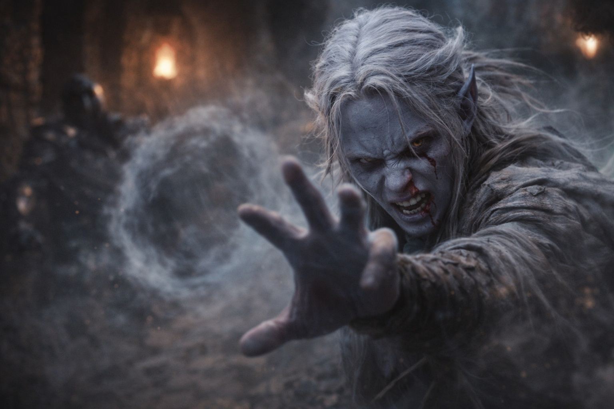
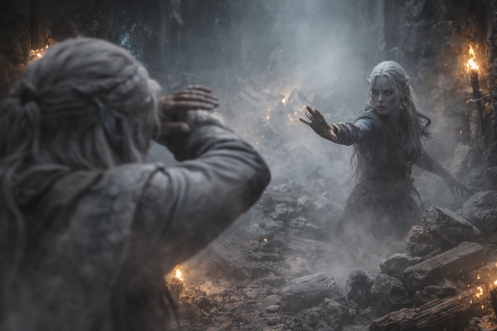

---
order: 150
title: "The House Rivalry: The Warning (Cut Short)"
description: "Shyntara's words were still circling in his head—*Be careful, Drusniel. I can't lose you too*—when he slipped out through the service entrance."
date: 2024-05-21
language: en
chapter: 5
subchapter: 5
storyline: drusniel
canon_phase: main
canon_sequence: D-005-005
narrative_weight: medium
category: Umbra'kor
author: Drusniel
type: Main
tags: ['#the house rivalry', '#drusniel', '#umbrakor']
thumbnail: image.jpg
featured: false
counterpart_path: site/content/posts/es/umbrakor/la-rivalidad-de-la-casa-la-advertencia-cortada/index.mdx
counterpart_title: "La Rivalidad de la Casa: La Advertencia (Cortada)"
---

## Chapter 5 | Part 5
--- 

One hour of instruction.

Drusniel tightened his knife belt. With the walk there and back, he would be gone most of the night. He kept thinking about the hour in the tower instead.

If Vrinn came, another hour of training might matter. Another technique might be the difference between standing uselessly behind Shyntara and actually protecting someone.

He waited until the compound quieted. The main gates were watched; he took the service passage he'd used before, lifting the latch slowly so it wouldn't strike the plate.

Zaelar was still awake. He showed Drusniel how to sustain a compressed current, and Drusniel held the push for four seconds before his breath failed. He had to sit on the tower steps afterward, waiting for the pain to ease enough to walk.

He was still thinking about it when he entered the service passage back into the compound and tasted smoke.

It left a bitter film on his tongue. Smoke rolled along the passage ceiling and caught in his eyes as he looked up.

He broke into a run.

The lower corridors were dark. Something had stripped the luminous growth from the walls. He reached out with his air sense, but movements overlapped until he couldn't separate them. His headache sharpened.

Boots struck the floor ahead of him. He heard a buckle knock against stone, then a low voice.

"Check the lower passages. No survivors."

His hand closed around the knife at his hip.
A masked figure emerged from the smoke. It turned toward him with a blade already raised.

The air shifted beside his face. He threw himself sideways, pain flashing behind his eyes as the blade passed his head.

His knife was already in his hand.

He slashed for the attacker's wrist. The assassin turned with it, caught Drusniel's forearm, and struck once at the base of his thumb. His fingers opened.

Steel skittered into the smoke.

Drusniel dropped low before the return cut.

*The air. Use the air.*

He reached for the nearest current.

Heat from the lower halls drove one current across another. Drusniel caught at the nearer one, lost it, and had to duck a second cut with his lungs already empty.

A draft pulled through the doorway behind the assassin. Drusniel waited for him to step across it.

The attacker raised his blade again.

Drusniel caught the doorway draft as the assassin stepped into it and redirected the current across the attacker's balance.

The attacker stumbled back a step.

Blood ran over Drusniel's lip. He tasted it as he dragged in a breath.

Drusniel ran.

The corridor twisted ahead, choked with smoke. Somewhere above, steel rang against steel.

"Mother! Father!"

His voice echoed in the darkness. No response.

He ran toward the main stairs. His boots pounded against stone. His lungs burned with smoke.

A servant's body lay crumpled at the junction. Eyes open. Throat cut.

He stepped over the body and ran toward the stairs to his parents' rooms.

"Drusniel!"

Shyntara. Her voice cut through the chaos, somewhere to his left.

He turned. Tried to orient. The smoke made it impossible to see more than a few feet.

"This way!" Her hand found his arm, gripped hard. "The escape route. Mother's already—"

A scream. High and terrible. Cut short.

They both froze.

"Mother," Drusniel whispered.

"The passage. Now." Shyntara pulled him away from the stairs.

"We have to get her."

"Father's holding the main corridor. He sent me for you."

"I can move the smoke. Let me try."

Steel clashed somewhere close. Shouts. Their father's voice, roaring something Drusniel couldn't make out.

Then silence.

Shyntara's grip tightened. "Move. Now."

She hauled him past a fallen guard toward a panel in the wall.

She found the catch by touch and forced the hidden door open with her shoulder.

Shyntara shoved him toward it. "Go. I'll follow."

"Shyn—"

"GO."

She turned back toward the chaos.

A pressure wave punched through the corridor.

Stone cracked overhead.

Drusniel hesitated one instant too long.

The ceiling collapsed.

Stone and timber fell between them. Drusniel raised his arms. Debris struck his shoulder and drove him against the opposite wall.

When he looked up, the corridor was blocked.

"Shyntara!"

No answer.

The escape passage was behind him.

Drusniel turned from it and ran for the main hall.

---

**End of Chapter 5.5 —> 6.1: [Blood in the Dark: The Chaos](/blood-in-the-dark-the-chaos/)**
