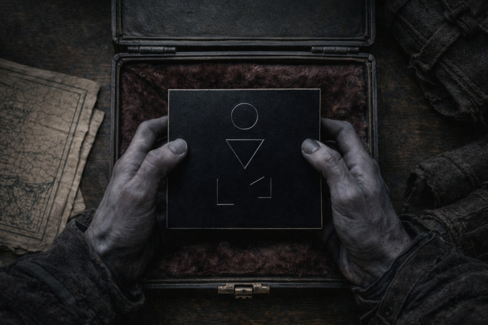

## Chapter 7 | Part 3
---

Drusniel woke to grey light behind closed shutters.

For one breath, he expected his mother's voice from downstairs.

Then he remembered.

He dressed in the surface clothes Zaelar had left for him and went down.

The metal plate waited at the center of the table.

It was smaller than his palm, dark metal warm beneath his fingers. The symbols seemed to shift whenever he tried to follow one to its end.

"What is it?"

"A tool," Zaelar said. "I call it the Null. It removes magical signature."

"Removes my magic?"

"The presence a ward detects." Zaelar turned it over. "Where the ward would find you, it finds an absence."

Drusniel stared at him.

"Show me."

Zaelar guided his thumb to one symbol.

"Press. Focus the way you do when you take hold of a current."

Drusniel pressed.

His fingers went numb around the metal. He could see the curtain moving but could no longer reach the draft that moved it.

For an instant he knew that emptiness from the trial, then nausea drove the memory away.

His thumb came off the symbol.

The draft returned to his awareness. His fingers still tingled.

Zaelar watched him.

"I want to try again," Drusniel said.

Zaelar left the plate in his hand.

Drusniel pressed the symbol a second time.

Cold ran up his wrist.

He tried to catch the draft beneath the door. Air brushed his skin, but each attempt to take hold of it deepened the cold. He stopped before his arm lost feeling.

He released the plate.

"Where did you get this?"

"Wyrmreach."

"How long have you had it?"

"Longer than you've been alive."

Drusniel turned the plate over in his hands.

"What happens if I keep trying to use my affinities?"

Zaelar waited for him to set the plate down.

"You can still use them. Your air and water affinities let you endure the Null; they do not spare you its cost. And each working gives the wards something to detect again."

"How much can I risk?"

"You've just felt the beginning of it."

"That little?"

"Yes."

Drusniel rubbed his chilled forearm through his sleeve.

The voice that called itself Annariel had not appeared once during the test.

"How long can I keep it active?"

"Briefly, by touch. Longer at the boundary: it reacts to the wards there without your thumb on the symbol. Keep it against your body." Zaelar slipped it into a padded pouch. "It will still cost you. Remember what your arm feels like now."

"And I learn the rest at sea?"

"I would rather teach you here. But neither of us can bring that sea into this room."

Drusniel glanced at the broken table. "It would finish the furniture."

Zaelar handed him the pouch.

"Szoravel will recognize its signal."

"You are certain?"

"Yes."

Drusniel put the pouch into his pack beside the provisions. The Vrinn dagger remained at his belt.

"When do we leave?"

"At dusk. Until then, you stay behind the shutters."

Drusniel nodded.

He flexed his fingers until sensation returned to the last two.

The curtain stirred again. This time he let it.

---

**End of Chapter 7.3 —> 7.4: [The Package: The Route](/the-package-the-crossing/)**
