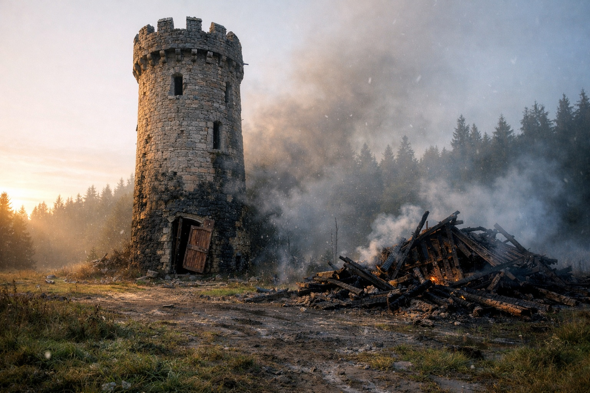

## Chapter 7 | Part 1
--- 

The tower was damaged.

Drusniel stopped beneath the last trees, hood pulled low against the whitening sky. Scorch marks blackened the lower walls. The door hung crooked on broken hinges. One outbuilding had collapsed, its timbers still smoking.

Same night. Two targets.

He stored the fact.

"Zaelar!"

The old mage appeared in the doorway. His robes were singed. A cut crossed one cheek. His eyes remained alert.

"You survived."

"They're dead."

Zaelar came down the steps. "I heard before dawn. The markets already have three versions of what happened."

"My parents. The servants. Everyone."

Zaelar looked at him for a moment, then at the tremor in Drusniel's legs. "When did you last eat?"

"I don't remember."

"Then inside."

"I need answers."

"You need enough blood in your head to understand them."

Drusniel almost argued. The tower shifted at the edge of his vision.

Zaelar caught his shoulder before he fell.

Inside, the damage continued. Glass across the floor. Books pulled from shelves. A table split along one leg. The pattern was thorough without being complete; Zaelar's locked cabinet still stood against the far wall.

Drusniel looked from the cabinet to the broken door.

"Who attacked you?"

"I don't know."

"Vrinn?"

"Perhaps." Zaelar set bread, dried meat and water on the least damaged table. "Perhaps someone who wanted me to believe Vrinn. Perhaps someone with a different reason entirely."

Drusniel stopped.

Zaelar had not given him the answer he expected.

"They came the same night."

"Yes."

"That matters."

"It probably does."

Drusniel ate because his hands had started shaking too badly to ignore.

After the first few bites he said, "I can't go back to Umbra'kor."

"No."

"The other houses will divide what remains before the blood dries."

"Probably."

"And daylight keeps me from simply disappearing into the surface."

Zaelar nodded toward the hood. "You can travel here, but not carelessly."

Drusniel drank.

"So where?"

Zaelar cleared a space among the scattered papers and unrolled a map.

"There is somewhere most houses in Umbra'kor cannot follow easily."

Drusniel recognized the coast first. Then the marks beyond it.

"Wyrmreach."

Zaelar met his eyes.

"Sit down."

---

**End of Chapter 7.1 —> 7.2: [The Package: The Mission](/the-package-the-mission/)**
