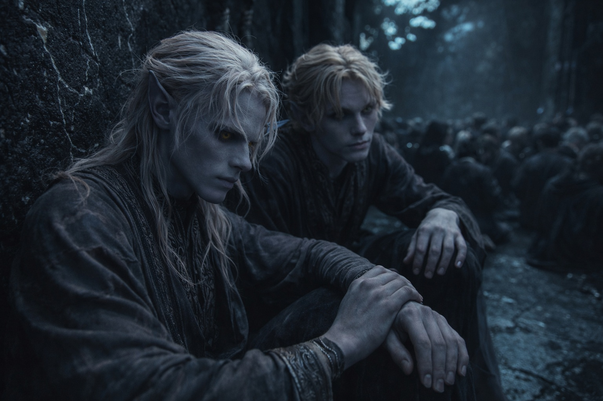
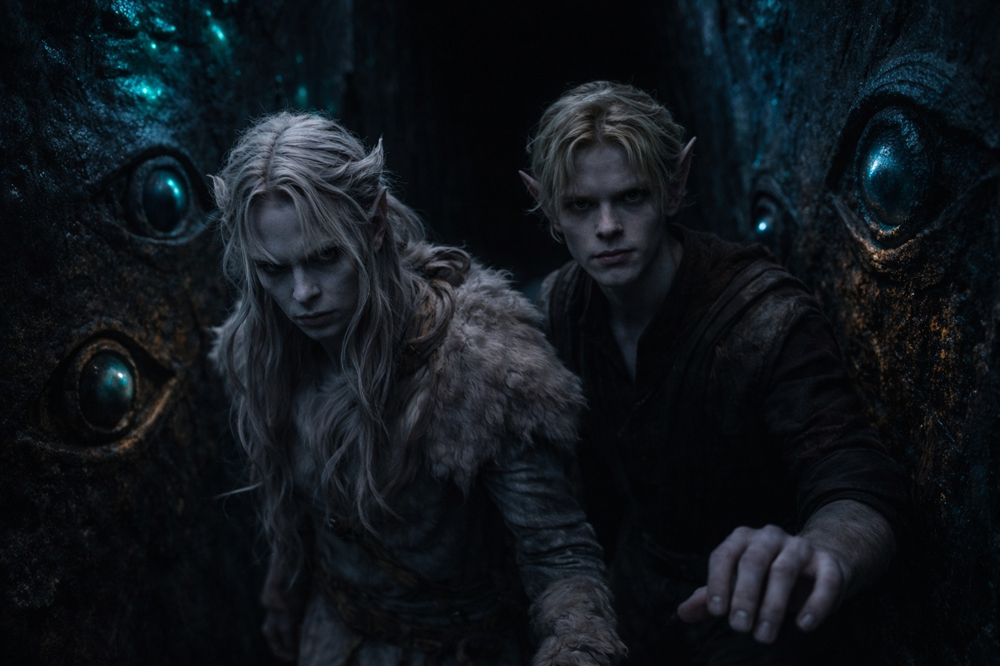

## Chapter 1 | Part 3
--- 

Drusniel pressed his back against the antechamber wall and followed the veins in the obsidian with his eyes. One long. One fractured. The obsidian was cold through his thin ceremonial robe.

Annariel crouched beside him, fingers drumming against his knee. "You're doing it again."

"Doing what?"

"The walls." Annariel's mouth curved. "Your eyes track every crack."

Drusniel forced his gaze still. He'd lost the line anyway.

The antechamber stretched before them, carved from the living rock of Umbra'kor's deepest reaches. Bioluminescent fungi clung to the ceiling in pale clusters, casting the dozen other candidates in sickly blue-green light. Most sat in tight groups, whispering prayers to Venemora. A few stood alone, eyes closed, breathing the patterns their families had drilled into them since birth.

Drusniel and Annariel sat apart from all of them.

"Shyntara followed me to the market district," Drusniel said quietly. "I had to double back through the fungal farms."

"Did she see you take the archive passage?"

"No. I made sure." He'd spent an extra hour in the spore-heavy tunnels, taking routes even his sister's trained eyes couldn't track. His lungs still burned from it. "She suspects something."

"She always suspects something. It's her job." Annariel shifted closer, dropping his voice. "We're here now. That's what matters."

Father had agreed to the trial. He hadn't agreed to Drusniel entering without temple sanction. Eleven Thel'varin mages had passed before him; every one had trained through the proper channels. The clerk at the outer door had checked their names against the register and waved them through. No one had asked for their instructors' seals yet.

"Think of a number," Annariel said.

Drusniel closed his eyes. They'd played this game long before they managed any contact in the grove.

He chose seven and held it in his mind.

"Seven," Annariel said.

Drusniel opened his eyes. "How?"

"Your thumb." Annariel nodded toward his hand. "You counted it out for me."

"That's counting." Drusniel looked at his hand. His thumb rested against his index finger. "I didn't know I was doing that."

"Try with your hands still next time." Annariel grinned. "Unless you want to keep making this easy."

Their brief contact in the grove had left them gasping. Venemora had never answered at all.

Now the Trials would make that official. One way or another.

"If they ask who taught us," Drusniel said, "what do we tell them?"

"They've already checked our names." Annariel glanced toward the inner door. "We know the forms. If the connection works, who's going to ask where we learned them?"

"Every other candidate has an instructor who can answer for them."

"And none of those instructors felt what we did in the grove." Annariel rubbed his palms on his robe. "I want to know whether we can do it again."

A priest emerged from the inner chamber, gathering his trailing robes clear of the threshold. The whispered prayers fell silent.

"Candidates." The priest waited for the last whisper to stop. "The Duskborn Trials commence. Those Venemora finds worthy shall receive her blessing and join the ranks of the Shadowed."

Those she found unworthy would leave through a different door. Drusniel had seen candidates come home that way. No one asked them about the trial afterward.

Father would have his border assignment ready.

"First trial," the priest continued. "Reach for the goddess. Let her see your devotion. Let her feel your worth."

The candidates began filing toward the inner chamber. Drusniel's legs didn't want to move.

Annariel stood and offered his hand. "Come on. If we wait any longer, I'll start thinking."

Drusniel stood.

They joined the line. Venemora's carved eyes followed them along the walls; the last cluster of fungi hung above the inner threshold.

Annariel kept hold of his hand as they reached the threshold.

"I'll find you after," Annariel said. He hadn't released Drusniel's hand. "Whatever happens."

Drusniel squeezed back. Then let go.

The priest's voice echoed from somewhere ahead, ritualized words older than the city itself:

"The trials commence. May Venemora find you worthy."

Drusniel stepped into the darkness.

Farther along the passage, pressure caught behind Drusniel's eyes. He stopped long enough for the candidate behind him to brush his shoulder.

He reached for the feeling, tried to name it.

Nothing. Just the ordinary darkness of the passage ahead.

Drusniel shook it off and kept walking.

---

**End of Chapter 1.3 —> 1.4: [The Trial: The Test of Venemora](/the-trial-the-test-of-venemora/)**
