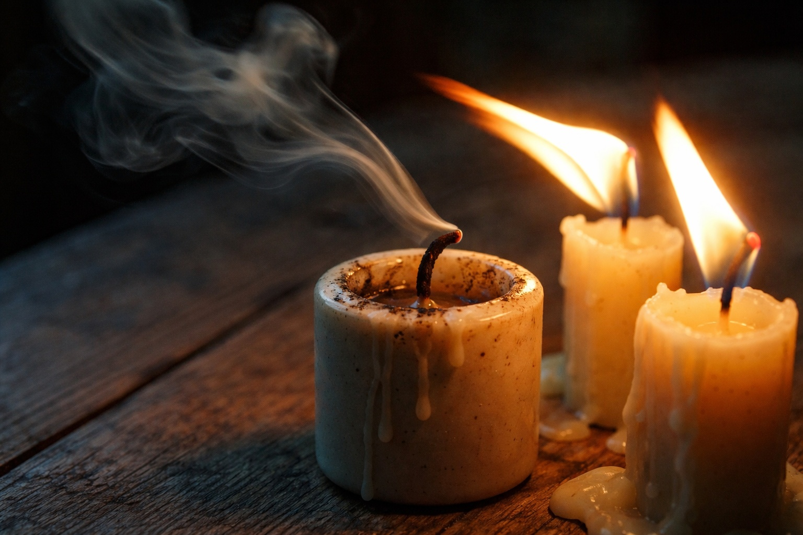

## Chapter 3 | Part 2
--- 

Zaelar's fingers closed around Drusniel's wrist. Cool, dry, stronger than they looked.

"Close your eyes," Zaelar said. "Breathe slowly. Let me do the reaching this time."

Drusniel shut his eyes but kept his free hand on the chair arm. If Zaelar tightened his grip, he would have something to push against.

"Interesting."

Drusniel's eyes snapped open. "What? What do you see?"

Zaelar watched the hollow at the base of Drusniel's thumb. His other hand hovered above it. Drusniel felt a thin ache travel toward his elbow.

"Hold still."

"Tell me what you're looking for."

"If you pull away, I'll have to begin again."

He stayed still. A candle guttered behind Zaelar, who drew a longer breath before releasing the pressure on his wrist.

Then, slowly, the surface mage smiled.

"Extraordinary," he murmured. "Truly extraordinary."

"What? What is it?"

Zaelar released him and rubbed his own fingers together before reaching for his tea.

"When you practiced before the trial," Zaelar asked, "what did you feel?"

"I felt..." Drusniel searched for words. "Pressure. Like something was almost there, just beyond reach. We could never quite touch it."

"And during the trial? Before the void?"

"The same pressure, but close enough to touch." His throat tightened. "Then it vanished."

Zaelar set his cup down. "The temple asks you to reach for Venemora. Let us put that aside for a moment."

"I don't understand."

"You have a gift, Drusniel." Zaelar rested his cup on his knee. "A rare one. Perhaps the rarest I've encountered in two hundred years of study. You have elemental affinity. Air and water, both. Strong in each."

"That's impossible," Drusniel said. "Drow don't—"

"Drow don't teach elemental magic in the temple. That isn't the same as being unable to practice it."

Drusniel's hands had gone cold. "Is that why I failed?"

"The trial measures your connection to Venemora." Zaelar leaned toward him. "You came here asking whether you could work magic. You can."

Drusniel had been reaching for days and finding nothing. Every failed attempt had made the next one harder to begin. If Zaelar was right, he'd been trying to touch the wrong thing. He wanted to try now, before the mage said something that would make it impossible again.

"That doesn't explain what happened."

"No. But it means that whatever was taken, it wasn't everything."

Drusniel rubbed the wrist Zaelar had held. Air and water. He'd imagined bringing a blessing home from the trial, making his father look up from the table and acknowledge it. He hadn't imagined learning a kind of magic he would have to hide. Still, he wanted to ask how soon he could use it, and resented himself for it.

"Air and water," he repeated slowly. "What does that mean? What can I actually do?"

"Let me show you." Zaelar stood.

He stopped beneath an iron vent in the ceiling. A draft stirred the hair above his forehead.

"Watch." Zaelar raised a hand toward the vent. "The air is already descending. I only need to change its direction."

His fingers curved. The draft shifted, and he paused to catch his breath before speaking again.

Cool air struck Drusniel's face. On the table beside him, a candle went out and left a smoke trail pointing away from the vent.

"You did that," Drusniel breathed.

"Redirected it." Zaelar lowered his hand. "There must be air to work with. Close to your body, you can shape it precisely. Farther away, you need a current that already moves where you can use it."

Drusniel stood. "Can I try?"

"Not yet." Zaelar held up a hand. "First, you need to understand what you're working with. Sit."

Drusniel sat on the edge of the chair.

"You've been straining toward something you couldn't reach. This will feel different. Give yourself time to learn it."

"How much time?"

"We'll find out as we work." Zaelar set a candle between them. "A flame will show you whether you've moved the air. There's no need to take my word for it."

"I can try," he said.

"And stop when it hurts." Zaelar drew the candle a little closer. "The effort can leave you breathless. If your head begins to ache, tell me."

Drusniel leaned forward to study the flame.

He'd spent years learning where to place his feet and how to hold a blade. Every mistake had been visible to Shyntara before he knew he'd made it. The candle offered him something he could watch for himself. He drew his chair closer.

"When can we start?" he asked.

"We already have."

---

**End of Chapter 3.2 —> 3.3: [The Surface Mage: The First Lesson](/the-surface-mage-the-first-lesson/)**
