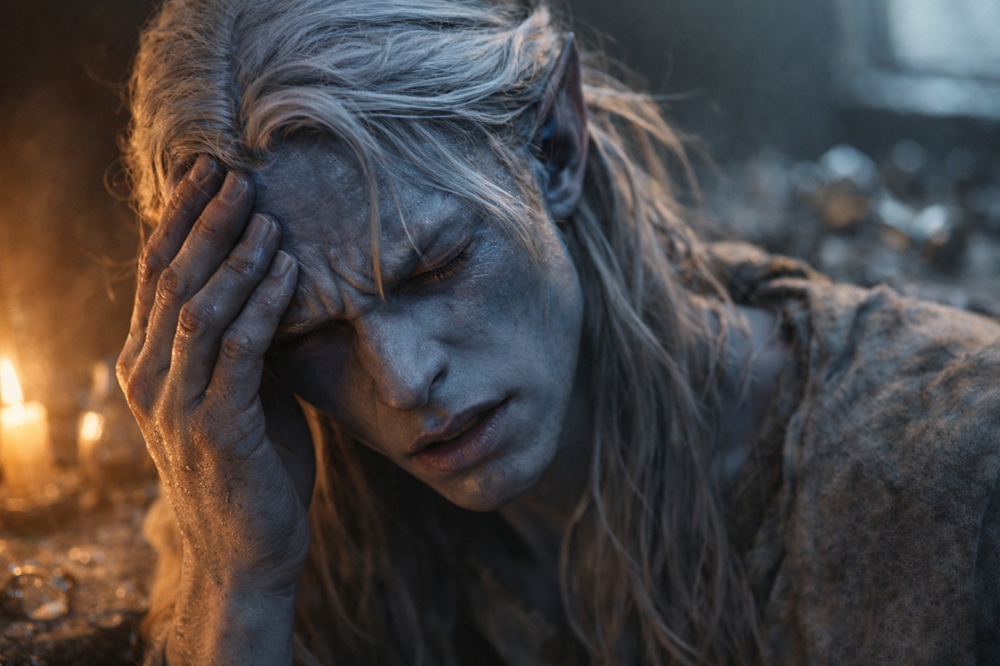

## Chapter 3 | Part 3
--- 

The candle burned. Drusniel stared at it until his eyes watered.

"Stop glaring," Zaelar said from across the room. "You're not trying to intimidate the flame. You're trying to feel the air around it."

"I'm trying."

"You're straining. There's a difference."

After an hour of breathing exercises, Drusniel's shoulders ached. He lowered them and tried again. The candle continued to stir in the draft from the ceiling vent.

He was beginning to think this was a mistake.

"Close your eyes," Zaelar said.

"That didn't work the last three times."

"Close them anyway."

He closed his eyes. Melted wax smelled sharper near the flame; the vent cooled one side of his face.

"You felt the current on your face earlier," Zaelar said. "Start there. Follow it back toward the vent."

He'd felt that coolness since entering the room and paid no attention to it. There was always air against his face. The difficulty was staying with it long enough to notice where it went, without deciding in advance where it ought to go.

The air moved. From above, through the grate, down into the room. It spread as it descended, cooling as it went. Some of it reached the candle flame, making it flicker. Some of it brushed past Drusniel's face and continued on toward the door.

He could follow the coolness farther than his skin. With his eyes closed, he found the edge where the draft spread into the room and lost it whenever he tried to hold the whole shape. The effort tightened across his forehead. He went back to the part that brushed his cheek.

"There. Now try turning its edge toward the candle."

Drusniel reached.

He found the part of the draft that passed his cheek.

And pushed.

The flame leaned left. He lost the current as he drew a startled breath.

Drusniel's eyes flew open. "I felt it."

"You moved it." Zaelar nodded toward the candle. "A little was all you needed."

He watched the flame straighten, smiling despite the ache.

"Again," he said. "I want to do it again."

"Slowly. Feel the current first. Don't—"

Drusniel was already reaching. He'd barely moved the flame; he wanted it to bend far enough that he couldn't mistake the result for an ordinary draft. This time he caught at the whole current and shoved before Zaelar could finish.

The air scattered.

Three hourglasses toppled from the nearest shelf. The candle flame guttered wildly, throwing shadows across the walls. Papers flew from a stack on Zaelar's desk. Something glass shattered against the floor.

Drusniel's chest heaved. His head throbbed. He hadn't moved, but his body felt like he'd sprinted up a flight of stairs.

"That," Zaelar said calmly, "is what happens when you command instead of suggest."

"I wasn't trying to break anything."

"Your anger scattered it." Zaelar knelt to collect the fallen hourglasses.

Drusniel pressed a hand to his temple. The headache was sharp, localized, like someone had driven a nail behind his right eye. "I was excited, not angry."

"You wanted more before you'd finished the first movement." Zaelar checked an hourglass for cracks. "The air went in every direction you pulled it."

"Then I need a smaller current."

"Precisely."

He steadied one hand against the table until it stopped shaking. Sand lay among the glass fragments by his boot. He couldn't tell which hourglass had broken. Zaelar hadn't asked him to pay for it, but Drusniel was already working out how much coin he could bring tomorrow.

"Can I try again?"

Zaelar regarded him for a long moment. Then, slowly, he nodded.

"Once more." Zaelar righted the candle. "Use the edge that already passes the flame. Leave the rest alone."

Drusniel closed his eyes. Breathed. Let the desperation settle into something quieter.

He followed the draft down from the vent until he found the edge curving toward the candle. This time he guided only that part.

*This way. Just a little.*

The flame bent and stayed there.

Drusniel opened his eyes. The candle was leaning hard to the left, its flame stretched nearly horizontal, pointing directly at Zaelar across the room.

"Better," Zaelar said. "Now let it go."

Drusniel released his grip on the current. The flame snapped upright and flickered again. His breath came faster than it should have, and the headache still pulsed behind his eye, but the exhaustion was less severe this time. More manageable.

"Enough." Zaelar looked out of the window. "Let the headache pass before you try again."

"What if I don't?"

"You may bleed. Push beyond that and you can do lasting damage." He turned from the window. "You'll learn faster if you can stand through the next lesson."

Drusniel waited for his breathing to slow. He kept watching the flame, remembering how it had held where he wanted it.

"I want to keep practicing," he said.

"Tomorrow." Zaelar's voice brooked no argument. "Your body needs rest. So does your mind. Come back at dawn, and we'll continue."

Drusniel looked toward the window. He'd been here for hours. His father had told him to stay close to home.

"I should go," Drusniel said.

"In a moment." Zaelar crossed to a bookshelf.

Drusniel stood, then had to grip the chair back until the room stopped tilting.

---

**End of Chapter 3.3 —> 3.4: [The Surface Mage: The Wyrmreach Mention](/the-surface-mage-the-wyrmreach-mention/)**
