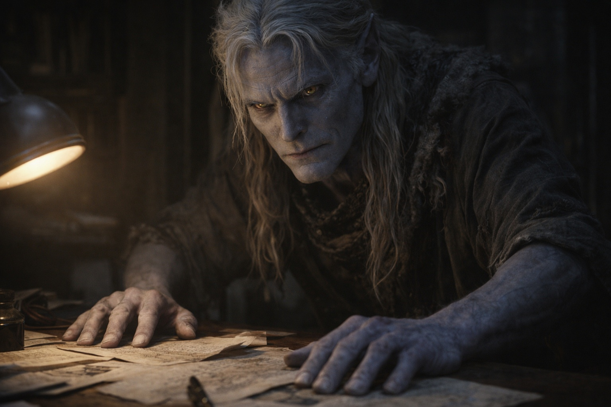
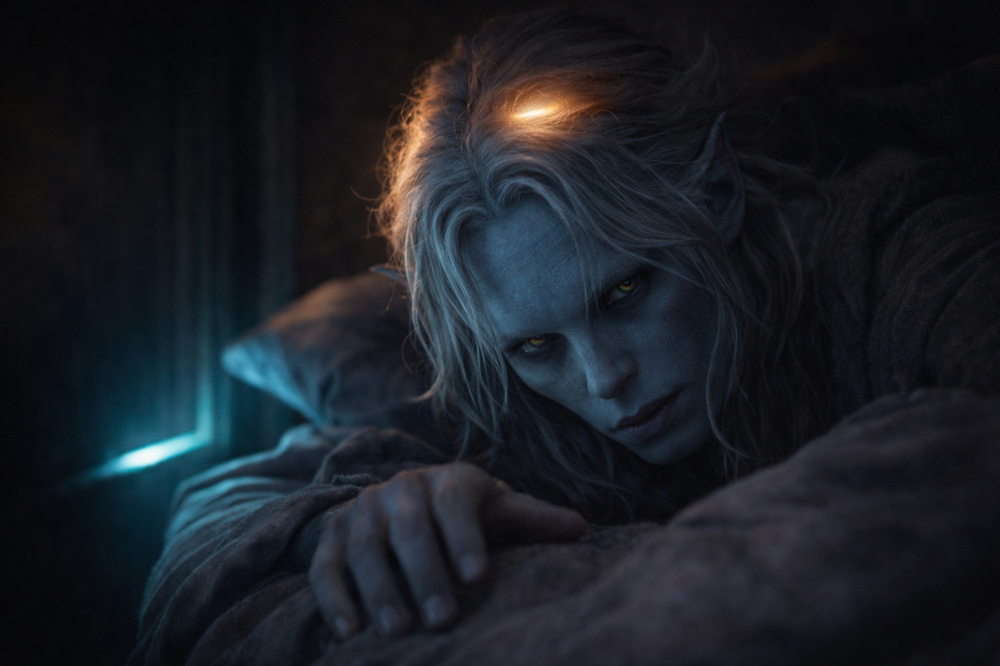

## Chapter 3 | Part 5
--- 

The compound was in chaos when Drusniel arrived.

By the time he reached the compound, the evening lamps were lit. Servants hurried past him carrying water and folded bandages. His father's voice carried from the study.

He found his mother in the main hall, directing servants with quick gestures.

"You're back." She caught his sleeve. "Where have you been?"

"Walking. What's happened?"

"Later." She gripped his arm and steered him toward the family quarters. "Your father needs to speak with you. Both of you—where's Shyntara?"

"I don't—"

Shyntara appeared at the far end of the corridor, moving with the quick efficiency of someone who'd already assessed whatever threat had arrived. "I'm here. What is it?"

Their mother's jaw tightened. "The study. Now. Both of you."

---

His father stood over a map in the study. A lamp smoked beside his elbow; he hadn't trimmed the wick.

His father's eyes kept returning to the door. He waited for the latch to fall before speaking.

"Close the door," he said.

Shyntara did. The click echoed in the narrow room.

"There's been an incident." Their father's voice was flat, deliberately neutral. "Contacts in the outer districts were attacked last night. Three dead. The rest scattered."

"Which contacts?" Shyntara asked.

"Informants. People who kept us aware of the enemy house's movements." He met her gaze. "We're blind now. Whatever they're planning, we won't see it coming."

*Your family's position may be more fragile than it appears.*

"What do we do?" Drusniel asked.

His father looked up from the map.

"We stay vigilant. We trust no one outside these walls." His gaze hardened. "And we do *not* leave the compound alone. Understood?"

"Understood," he said.

His father assigned the remaining watches. Drusniel listened until the lamp beside the map guttered. He caught himself wondering if he could bend its flame too.

When his father finally dismissed them, Drusniel retreated to his room and closed the door.

---

That night, the presence returned.

The contact woke the ache behind his eyes. He rolled onto his back and answered.

*Drus. How did it go?*

He reached back toward the warmth. *I found him. Zaelar. He tested me.*

*And?*

*Air and water. He says I can work with both.* Drusniel hesitated. *He showed me how to move a flame.*

*You see? There was more in you than they measured.*

*He's offered to teach me more.*

*That's wonderful.* The presence radiated approval. *I'm so proud of you. This is exactly what you needed.*

*You're not going to ask what the training was like?*

A pause. Longer than it should have been.

*Tell me everything,* the voice said finally. *I want to hear all of it.*

Annariel would have asked what it felt like before Drusniel finished the first sentence.

*I broke something on the second attempt.*

*That sounds frustrating.*

*It was,* Drusniel agreed. He didn't elaborate.

*You'll improve with practice. Keep going.*

*I need to rest.*

*Of course. I'm glad you found him, Drus.*

The presence withdrew.

Alone in his room, he listened to the new patrol pass beneath his window.

He'd meant to describe the flame, how it had held sideways in the air. The voice hadn't asked. Now he was glad he hadn't told it everything.

He would return to the tower. Before the lesson, he would ask to move the candle away from Zaelar's vent.

If he could do it there too, at least that much would belong to him.

---

**End of Chapter 3.5 —> 4.1: [Forbidden Knowledge: The Growing Power](/forbidden-knowledge-the-growing-power/)**
