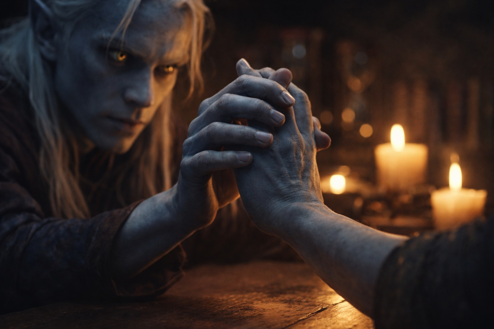

## Chapter 3 | Part 1
--- 

The tower was older than it had looked from the hillside.

Rain had worn hollows into the doorstep. Drusniel caught the jamb as his wet sole slipped. Above him the tower rose four stories, its windows dark and its door open.

He tried to follow a fracture through the stonework. A patch of newer mortar interrupted it, and he couldn't find where it continued.

The walk from the ridge had taken two hours. He'd stopped at unfamiliar sounds, then lost the tower behind a fold of land and doubled back. A bird called overhead. He ducked before he could stop himself.

But the tower felt different. Contained. Almost familiar.

Drusniel stepped inside.

The entry hall was lit by candles in iron brackets. His eyes adjusted quickly. Books crowded the walls, their titles in scripts he didn't recognize, and a sharp smell from an uncorked jar caught in his throat. He looked for anyone else in the hall before stepping clear of the door.

And everywhere, hourglasses.

They sat on shelves, on tables, on windowsills. Some were as small as his thumb, others large enough to hold a fist. Red sand ran beside white, each stream narrowing toward a different-sized opening. He checked the nearest pair. They had been turned at different times; one was almost empty while the other had barely begun.

"You've had a difficult walk."

Drusniel spun toward the voice.

A drow stood at the top of a spiral staircase. Tall and gaunt, with white hair past his shoulders, he wore simple dark robes. His eyes caught the candlelight as he descended, violet shifting toward silver.

"I am Zaelar." He spoke as if they had an appointment. "And you must be Drusniel."

The name landed wrong. Drusniel hadn't introduced himself. Hadn't spoken at all.

"How do you know my name?"

Zaelar reached the foot of the stairs. "I take an interest in the trials. Your name was on the register."

Two cups stood beside a steaming pot on the table. Drusniel looked from them to Zaelar.

"You were expecting me," Drusniel said slowly.

"I thought you might come." Zaelar indicated the table. "Sit, if you wish. You can see the door from here."

Drusniel sat.

Zaelar poured the tea. "Drink it slowly. The surface herbs can be bitter until you're used to them."

"I'm fine."

"Then we can begin with what brought you here." Zaelar took the other chair.

Drusniel warmed his hands on the cup without drinking.

"Your trial ended without a connection," Zaelar said. "Did it feel like an ordinary failure to you?"

"No." Drusniel tightened his grip on the cup. "Something was there. Then it wasn't."

"An interruption." Zaelar nodded. "There are ways to sever a connection. Failure doesn't always begin with the candidate."

Those were the words Drusniel had wanted someone to say since the trial. He felt himself leaning forward and stopped. The mage hadn't examined him yet. He hadn't even finished asking what had happened.

"Can you tell whether that happened to me?"

"I can examine what remains. It would be a place to start."

The last grains fell in a red hourglass on the nearest shelf.

Then Zaelar reached over and flipped it. The sand began to fall again.

"You measure everything," Drusniel said.

"Experiments," Zaelar said. "Some take longer than others." He left the glass within reach. "But first, I need to understand what you are."

"What I am?"

"What kind of magic lives inside you." Zaelar extended his hand, palm up. "May I?"

Drusniel glanced at the open door. He could withdraw his hand if the mage hurt him. It was a poor precaution against someone who knew enough to sever a blessing; he knew that. He moved the tea aside anyway. He hadn't walked all this way to leave before finding out whether anything remained.

Drusniel reached out and placed his hand in Zaelar's palm.

---

**End of Chapter 3.1 —> 3.2: [The Surface Mage: The Assessment](/the-surface-mage-the-assessment/)**
