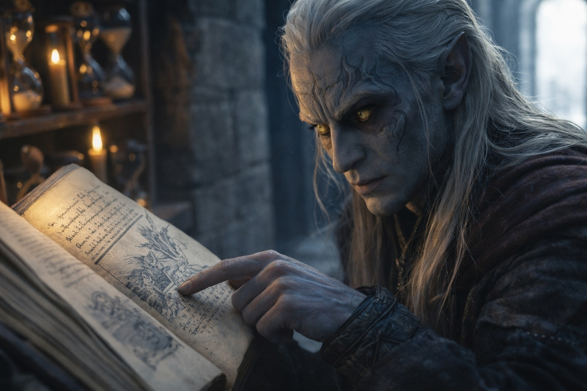

## Chapter 3 | Part 4
--- 

Zaelar waited while Drusniel recovered his balance. The chair's carved edge had left a red mark across his palm.

"There's a place I want you to know about," he said.

Drusniel turned. The gray light from outside cast long shadows across the entry hall. The hourglasses on their shelves caught the light and glittered.

"What?"

Zaelar ran a finger along the books. "There are places where your affinities would be valued."

"Valued how?"

"Where people would have a use for what you can do." He opened a book to a marked page. "Wyrmreach, for one. There are teachers there who work with elemental gifts."

Wyrmreach.

Drusniel knew the name from stories told to keep children away from the surface exits. None ended with the traveler coming home.

"Wyrmreach is a death sentence," he said. "No one survives the crossing."

"Few are equipped to attempt it." Zaelar closed the book. "Air affinity would give you a way to sense movement before you could see its source. In those waters, that could matter."

"You're saying I could survive it."

"I'm saying very few could. And you might be one of them."

"Why would I do that?" The question came out sharper than he intended. "I don't want to go to Wyrmreach. I want answers about what happened to me. I want to know who blocked my trial and why."

"You needn't go anywhere now. I wanted you to know that this tower isn't the limit of what you can learn."

"I'm not going there."

"Then we'll leave it there." Zaelar poured the cold tea left in the pot. "Though your family's position may be more fragile than it appears."

"What do you mean?"

"Vrinn has been testing your house's routes. You know that already." He sipped his tea. "A failed trial is not the only thing that can close a future."

"You know about the rival house?"

"I keep informed. You may one day need somewhere beyond their reach."

Drusniel's jaw tightened. "I'm not running away."

"Then don't." Zaelar set down the cup. "But keep the possibility. Training will take months. A great deal can change in that time."

"I should go," Drusniel said again.

"Take the hollow below the ridge on your way back." Zaelar pointed through the window to a bright gap in the clouds. "Wait under cover if the sun gets through. Return tomorrow at dawn, and we'll continue."

"Air and water," Drusniel said. "Why would one person have both?"

"I've found earlier cases in the old texts. Very few. Some of those people reached places others couldn't."

"Which places?"

"I'll show you the accounts when you've rested." Zaelar opened the door. "You'll want time to read them."

Drusniel pulled his hood low before stepping outside.

"Tomorrow," he said.

"Tomorrow."

The door closed behind him.

He found the hollow Zaelar had indicated and waited beneath a rock overhang while sunlight crossed the path ahead. The stone sheltered his face but not his boots; he drew his feet back as the bright edge advanced. By the time the clouds closed again, his headache had eased.

His father had warned him about Vrinn. Zaelar knew about the dispute too, though Drusniel hadn't mentioned it. He could ask how tomorrow. For now he needed to reach the tunnel before another break in the clouds left him stranded. He left the overhang and kept the next patch of shade in sight.

---

**End of Chapter 3.4 —> 3.5: [The Surface Mage: The Return](/the-surface-mage-the-return/)**
