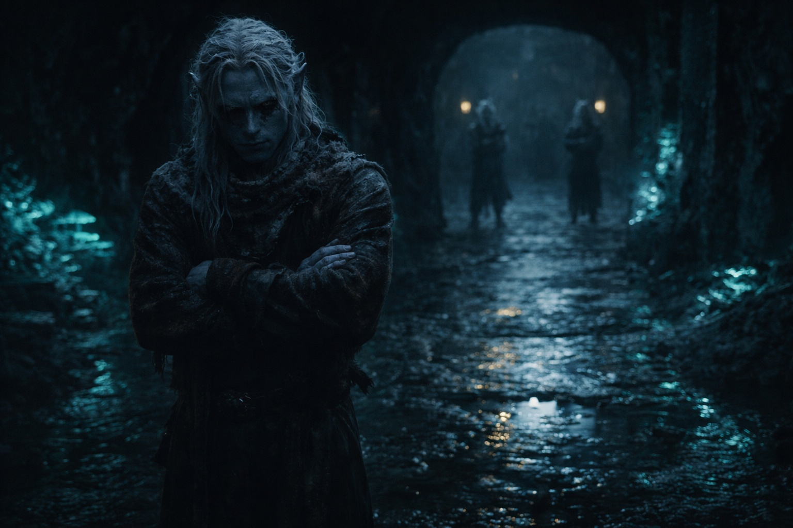
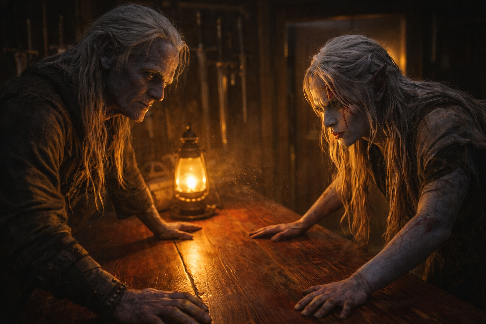

## Chapter 1 | Part 6
--- 

His father was waiting at the compound gate.

Drusniel saw him from fifty paces away, a dark silhouette against the bioluminescent glow of the family estate. Arms crossed. Stance wide. The posture of a man who had been expecting bad news and received it.

The walk from the trial chamber had taken an hour. Drusniel had traced every crack in every wall he passed—obsidian veins, bioluminescent seams, the imperfections that made each tunnel distinct. The patterns meant nothing except that his mind needed something to hold.

His father didn't move as Drusniel approached. Didn't speak. Just watched with eyes that had evaluated a thousand targets and found most of them wanting.

Drusniel stopped three paces away. Proper distance for addressing the head of House Thel'varin.

"So." His father's voice was flat. "The trial."

Not a question. He already knew.

"I failed."

The word tasted like ash. Drusniel forced himself to hold his father's gaze. Assassins didn't look away. Even failed ones.

His father's expression barely changed. Drusniel saw resignation in it. Perhaps he was inventing that too.

"Come inside," his father said. "Your mother is waiting."

The compound felt smaller than Drusniel remembered. Training yards, pale gardens, the main house—all the same, but tonight it pressed in on him. A cage with its door swinging open.

His mother stood in the entry hall. Her face was carefully blank, the way it always got when she was processing something she didn't want to feel. Drusniel's gaze found the doorframe—old wood, familiar grain, a crack he'd traced since childhood. Still there. Still the same.

Shyntara stood beside her, arms folded, eyes sharp.

"Drusniel." His mother crossed to him and touched his face. Her hands were cool. "You're home."

"Mother, I—"

"It's done." She cut him off gently. "You're home. That's what matters."

His mother turned away before he could say Annariel's name. His father was already watching him with that evaluating stare.

"The assassin path," his father said, "was always your true calling. Magic was a distraction. Now that's settled."

Drusniel's hands clenched at his sides. "Something went wrong in there. The trial—I felt it working. Then it just—"

"It didn't work." His father's voice hardened. "That's what failure means. You gambled time you should have spent training, and you lost. Now that's done. We move forward."

"I'm not—"

"Where have you been sneaking off to?"

Shyntara's voice cut through the tension. She hadn't moved from her position by the wall, but her eyes had locked onto Drusniel with predatory focus.

"What?"

"Before this. The past few months." She pushed off the wall and approached. "You've been disappearing. Coming home with spore burns on your clothes. Taking routes through the fungal farms that don't lead anywhere I know of." She stopped an arm's length away. "Where have you been, brother?"

Drusniel's heart hammered. His eyes found the wall behind Shyntara—a crack running diagonally toward the ceiling. He traced it. Traced it again.

"Nowhere. Training."

"Training." Shyntara's mouth curved. Not a smile. "In the fungal farms. Alone."

"I needed space. To practice the trial forms." The lie came easier than it should have. "Away from..." He gestured vaguely at the compound. "All this."

Shyntara held his gaze for a long moment. Then she looked away.

"Children." Their mother's voice carried an edge of warning. "Enough. Tonight is not the night for this."

"She's right." Their father moved toward the corridor that led to his study. "There are other matters to discuss. Come. Both of you."

Drusniel followed, grateful for the escape from Shyntara's scrutiny. His sister fell into step behind him. He could feel her attention on his back like a blade's edge.

His father's study was a narrow room lined with weapons. Knives of every design hung from pegs on the walls—curved, straight, serrated, smooth. Trophies from three generations of successful contracts. Drusniel had learned to identify each one by sound before he turned twelve.

"Close the door," his father said.

Shyntara did.

Their father stood behind his desk, hands flat on the scarred wood surface. His jaw worked silently for a moment. When he spoke, his voice was lower than before. Careful.

"What I'm about to tell you doesn't leave this room. Your mother knows. No one else."

Drusniel exchanged a glance with Shyntara. Her expression had shifted—still sharp, but focused now on their father instead of him.

"House Vrinn," their father said. "Contracts diverted. Territory tested. Their people have started appearing near our routes. None of it is an attack. All of it is pressure."

Shyntara leaned forward. "What do we do?"

"No one leaves alone. Double the night watch. Review the eastern routes."

Drusniel listened to patrol schedules and defensive positions. Shyntara answered without hesitation. By the time he understood one route, they had moved to the next.

"Stay close to home," his father said finally, meeting Drusniel's eyes. "All of you. Whatever happened at the trial—forget it. Your family needs you here."

He almost said it then. Almost told them that something had been *wrong*, that he'd felt the blessing approaching before it vanished. But his father was already turning away. Already moving on.

He could not make himself ask them to believe him now.

Drusniel stood in his father's study while the conversation moved around him.

His best friend was inside the training halls. Whatever had happened to his magic remained unnamed. The future he'd chosen for himself no longer existed.

He traced the blade-marks on the study walls while his family planned for House Vrinn.

---

**End of Chapter 1.6 —> 2.1: [Voices in the Dark: The Empty Days](/voices-in-the-dark-the-empty-days/)**