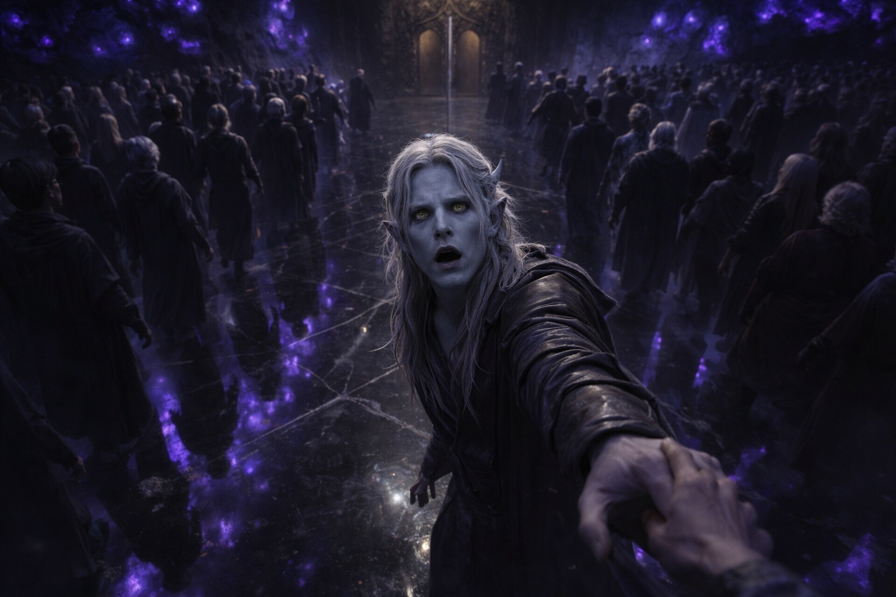
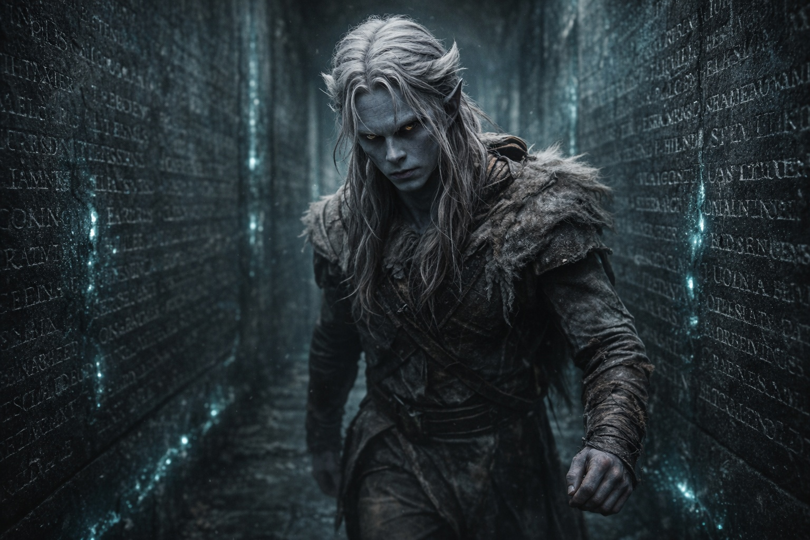
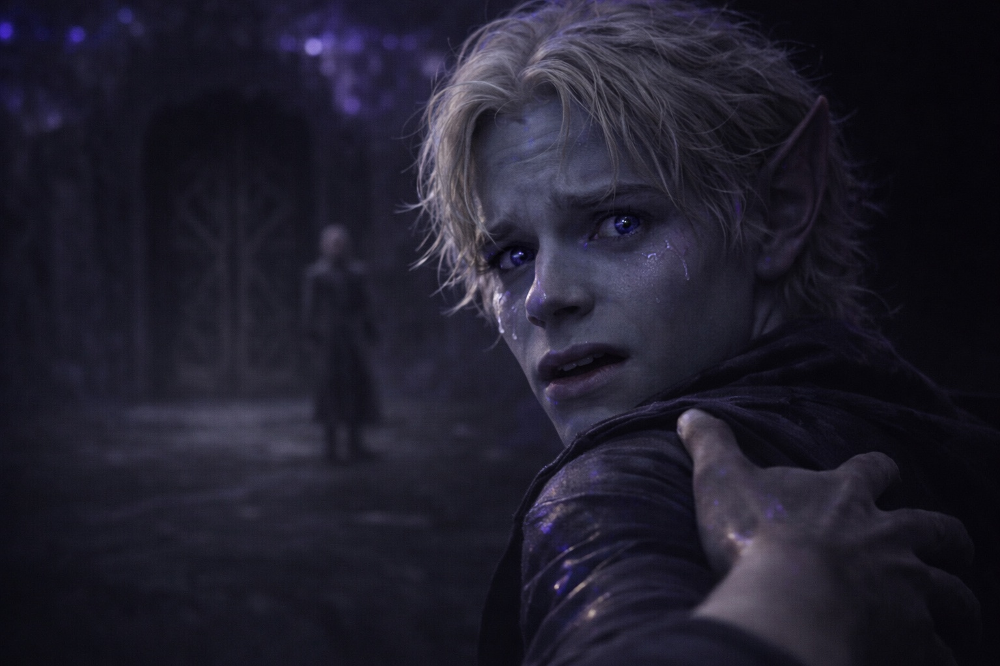
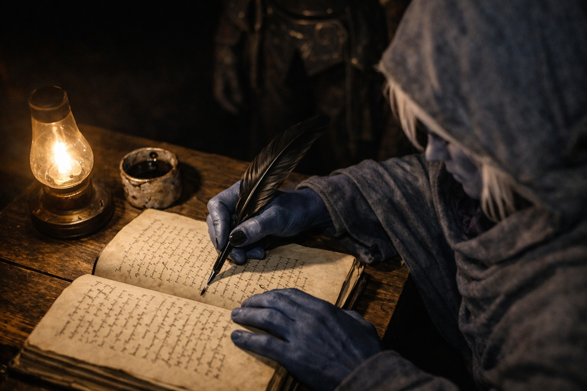
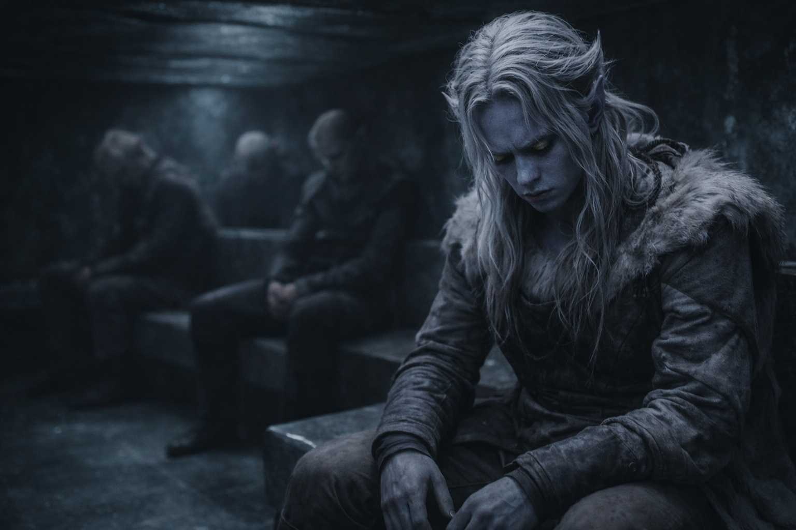

## Chapter 1 | Part 5
--- 

At the foot of the platform, Drusniel stopped.

Successful candidates passed him on their way to one door; failures went toward another. His mind kept reaching for the absence, probing it like a tongue finding a missing tooth.

"Failed candidates, clear the aisle." The ancient mage didn't look up from her slate. "You're blocking the line."

Annariel's voice cut through the ringing in his ears. "No. Something's wrong. We—"

Annariel stopped before he could mention the grove. Admitting where they'd learned the forms would give the mages something else to judge. Drusniel watched the ancient mage lift her eyes from the slate. She was listening now.

"The trial does not repeat." A younger mage stepped between them. "Move along."

"Let him try again."

"Passed candidates, this way." The mage gestured toward a door Drusniel hadn't noticed before, dark wood carved with Venemora's symbols, leading deeper into the mountain. "Your training begins immediately. No outside contact for the duration."

No contact. Months of isolation. Drusniel had known this, had accepted it as the price of success. He'd never imagined watching Annariel walk through that door without him.

"Failed candidates." The ancient mage finally looked up. Her eyes passed over Drusniel without interest. "Exit through the shame hall. Your families will be notified."

The shame hall. Drusniel had heard stories about its walls, lined with the names of every candidate who had failed since the city's founding. He'd once asked Annariel how they found room for new ones. Neither of them had considered that they might have to find out.

His name would join them now.

Annariel broke free of the mage's attention and crossed to Drusniel in three quick steps. His hand found Drusniel's arm, grip desperate.

"It worked," Annariel whispered. "I saw your face. You felt it, didn't you? Before something took—"

"Candidates." The younger mage's voice hardened. "Separate. Now."

Annariel's fingers dug into his arm.

"I'll find you," Annariel said. "After training. However long it takes." He swallowed. "We'll find out what happened. I promise."

The mage's hand closed on Annariel's shoulder. Pulled.

Annariel stumbled backward. He kept talking as the mage steered him toward the door, but Drusniel could no longer hear the words.

*I'll find you.*

The dark door opened. Other successful candidates filed through, their faces bright with triumph, with relief, with futures unfolding before them. Annariel looked back once.

The door closed.

Drusniel watched the door until the next group of candidates hid it from view.

The fungi overhead pulsed their sickly light. The ancient mage called another name. Candidates shuffled past him like he'd already become invisible.

"Failed candidates." A servant touched Drusniel's elbow. "This way."

He followed the attendant into a corridor so narrow that his sleeve brushed the wall.

The shame hall.

Names covered every surface. Carved deep into black stone, filling every available space from floor to ceiling. Some were centuries old, their letters worn smooth by time. Others looked fresh. Thousands of drow who had reached for Venemora and found nothing.

Drusniel walked between them. His footsteps echoed.

Maybe Annariel had always been stronger. Maybe their practice had worked for him and not for Drusniel.

But there had been that pressure. That approach. Annariel's face when it vanished.

The shame hall ended in a small chamber where gray-robed clerks waited with ledgers. One of them looked up as Drusniel approached.

"Name?"

"Drusniel. House Thel'varin."

The clerk wrote something down. Didn't look up again. "Your family has been notified. Wait here."

Drusniel sat on the cold bench beside a girl who kept wiping her face on her sleeve. No one offered her a cloth. He had nothing clean to give her. Farther along sat a boy staring at his hands and an older drow who watched the clerk without speaking. There was room between them, but no one moved closer.

None of them looked at each other. None of them spoke.

Drusniel closed his eyes.

The absence was still there. Whatever had happened, it did not feel like the clerk's neat word for it: failure.

*I'll find you*, Annariel had said.

Drusniel held onto the words while the clerk scratched another name into the ledger.

---

**End of Chapter 1.5 —> 1.6: [The Trial: Shadows in the Hall](/the-trial-shadows-in-the-hall/)**
