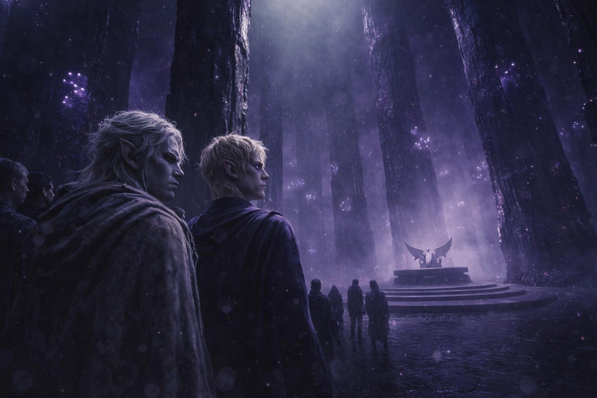
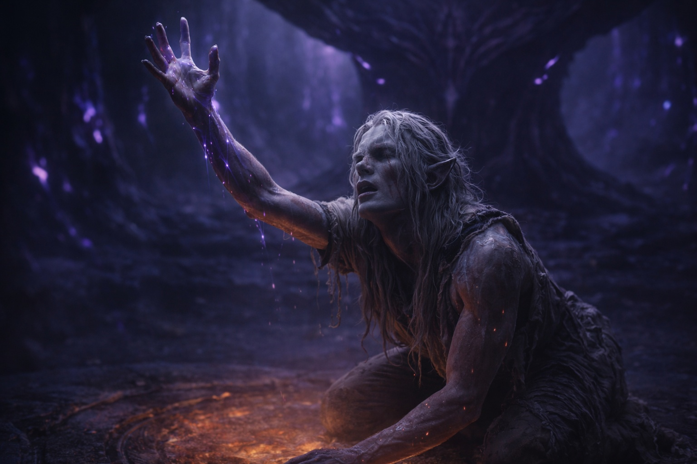

## Chapter 1 | Part 4
--- 

The chamber doors opened with a scrape that set Drusniel's teeth on edge.

The trial chamber sprawled before them. Obsidian columns rose toward a ceiling lost in darkness, their surfaces carved with prayers whose language Drusniel couldn't read. Purple fungi grew in the grooves, obscuring whole lines. At the chamber's heart, a circular platform of black stone waited beneath an altar shaped like folded wings. He could see no sign of an exit for the successful candidates. Annariel had said it would be somewhere behind the altar.

Venemora's altar. Where the goddess would either claim them or turn away.

Three mages waited near the altar in robes the color of dried blood. The oldest, a drow with close-cropped white hair, consulted a slate.

"Annariel," she called, not bothering with his house name. "Step forward."

Annariel squeezed Drusniel's arm once, quick and hard. Then he walked toward the platform with his shoulders back and his chin raised. Playing confident. Drusniel knew better. He'd seen Annariel's hands shaking in the antechamber.

Annariel had held their last contact longer than Drusniel could. Perhaps that would be enough.

Annariel knelt on the platform. Closed his eyes.

Drusniel held his breath until his chest hurt.

The air above the altar shimmered. Annariel's shoulders sank with his next breath, and sweat ran from his temple into his collar.

"Adequate connection," one of the mages murmured to another. "He'll do."

Annariel opened his eyes with tears running down his face. He looked straight at Drusniel. All those nights in the grove, and it had worked.

Annariel rose on unsteady legs. His eyes found Drusniel's across the chamber. A brief nod. *Your turn.*

"Drusniel of House Thel'varin," the lead mage called. "Step forward."

He crossed the cold floor, careful not to slip on the polished stone.

He stopped where Annariel had knelt and closed his eyes. He would make the attempt standing.

*Reach*, he told himself. *Just like we practiced. Feel for her blessing.*

He reached.

There it was: the pressure he'd felt in the ritual spaces, now close enough to reach. His breath shortened as he stretched toward it.

The blessing moved closer. He stretched toward it, certain he could touch it this time.

*Nothing.*

He grasped and found nothing. The blessing had been there, a heartbeat away, and now the place where it waited was gone. He reached past it, searching for resistance, and touched smooth absence. He could remember where he had been reaching, but could no longer direct himself there. Trying harder only brought him back to the same blank place.

Drusniel reached again, harder. There had to be something left. He had felt it a moment ago.

The void was larger now.

He searched for the familiar pressure until his temples hurt. There was nothing to reach toward anymore.

He tried a third time.

Nothing at all. Not even the void, now. Just the ordinary emptiness of a mind that had never touched magic.

He opened his eyes.

The ancient mage checked her slate and moved a finger to the next name.

"No connection," one of the other mages noted. "Mark it. Another from the martial houses."

"Consistent with the averages," the third mage said, already looking past Drusniel to the next candidate.

Drusniel's ears rang. He rubbed his numb hands against his robe.

"Failed." The lead mage didn't even look up from her slate. "Next candidate."

Failed. But he had felt it approaching.

He turned toward Annariel by the far wall, waiting for his legs to steady.

Annariel's mouth was open. He took a step forward, then stopped when the mage beside him raised a hand.

Drusniel stepped off the platform. The failed candidates shifted to make room for him.

He looked back once. Annariel was still staring.

Had Drusniel imagined Venemora's approach? Desperation could imitate many things. Annariel's face made that explanation harder to accept.

The lead mage called the next name.

Drusniel kept walking.

---

**End of Chapter 1.4 —> 1.5: [The Trial: The Separation](/the-trial-the-separation/)**
