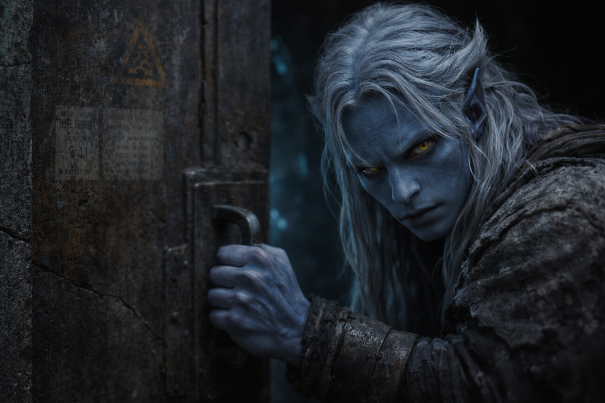
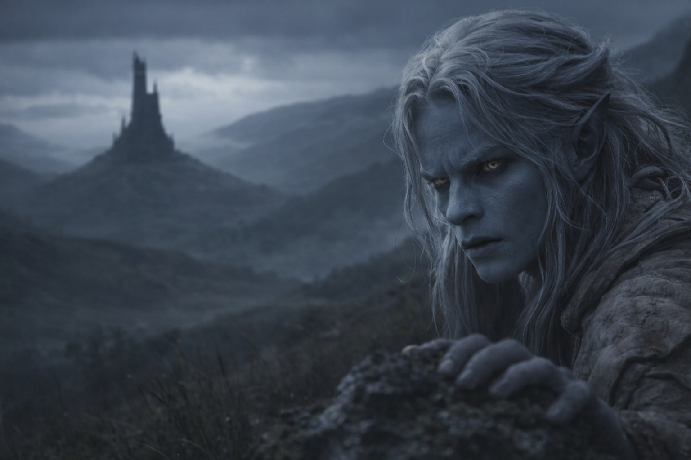

## Chapter 2 | Part 4
--- 

Drusniel waited until the third hour past midnight.

The compound was quietest then—guards changed shifts, servants slept, and his father retreated to his study to review reports until dawn. Drusniel had learned the rhythms of this place over eighteen years. He knew which corridors were watched and which were forgotten. Which doors creaked and which swung silent.

He dressed in dark clothes and packed water, food for a day, a knife, and the heaviest hooded cloak he owned. Nothing he couldn't abandon if he had to run.

The surface passages weren't secret, exactly. Everyone in Umbra'kor knew they existed—carved tunnels leading from the underground city to the world above, where sunlight killed and surface-dwellers walked in the burning light. Most drow never used them. Most drow never wanted to.

But Drusniel knew where they were. His family's status gave access to certain maps, certain information. Years ago, out of curiosity, he'd memorized the routes. A useless skill, he'd thought then.

Not useless anymore.

He moved through the compound like a shadow. Past his parents' quarters, where his father's lamp still burned behind closed doors. Past Shyntara's room, where silence suggested sleep—or pretended to. Past the servants' wing, the kitchens, the training halls where he'd spent so many hours pretending to become an assassin.

At the compound's edge, a service corridor led to the outer tunnels. Drusniel paused at the threshold.

Something had happened in the trial. Or he had failed and needed to know why it had felt otherwise.

If Zaelar understood how magic could be blocked—or broken—he might know the difference.

The service corridor stretched before him, lit by sparse fungal clusters. At its end, a door marked with faded symbols—warnings about surface exposure, protocols for decontamination. Drusniel had never opened it.

He was opening it now.

The handle was cold under his palm. He paused, eyes finding a hairline crack in the stone beside the hinges. Follow it. Let the moment pass.

He could turn back.

His grip tightened on the handle. Going home would leave the only testable lead untested.

He opened the door.

Cool air rushed past him—different from the compound's stillness, carrying the faint scent of things that grew without fungal light. The tunnel beyond was darker, the bioluminescence sparse. Drusniel stepped through.

The door closed behind him. Drusniel walked.

The tunnel climbed gradually, winding through rock that grew cooler as he ascended. His ears popped with pressure changes. His eyes adjusted to darkness, then adjusted again as faint light began to appear ahead—not fungal glow, but something harsher. Grayer.

Drusniel had never seen surface light. He'd heard it described: painful, blinding, capable of burning drow skin within minutes of direct exposure. But this light was filtered, diffused. Dawn, perhaps, or heavy cloud cover.

The tunnel ended at another door. This one was heavier, reinforced, marked with more warnings. Drusniel ignored them. He pressed his palm to the release mechanism.

The door swung open.

And for the first time in his life, Drusniel stepped onto the surface.

---

The world above was nothing like he'd imagined.

He'd expected pain. Burning. The sensation of skin crisping under hostile light.

Instead, he found gray. Gray sky, gray stone, gray trees with leaves the color of ash. The light was muted, filtered through clouds so thick they seemed to press against the earth itself. Dawn light, he realized. Not the killing sun of midday.

Drusniel stood at the tunnel's mouth and breathed air that tasted of rain and growing things. Cold air. Wet air. Air that moved on its own, carrying scents he had no names for.

There was no ceiling. His eyes kept trying to find one.

He looked back. The tunnel entrance was set into a rocky hillside, nearly invisible unless you knew where to look. Beyond it, far below, the caverns of Umbra'kor waited—his family, his compound, the life he was leaving behind.

He turned north.

The voice had given him one useful detail: a black tower beyond the second ridge.

The gray light stung his eyes, but not unbearably. His skin prickled with the unfamiliar exposure, but it didn't burn. Dawn, he reminded himself. Not midday. He had hours before the light became dangerous—assuming the clouds held.

If the clouds broke, the cloak would buy him minutes. He kept moving.

He followed the northern ridge he remembered from the maps. The first rise showed only trees, rocks, and more hills. He walked on, keeping the pale east behind his left shoulder.

Only after the second rise did the tower break the horizon.

Dark stone. Sharp angles. Standing alone on a hill like a finger pointing at the clouds.

Zaelar's tower.

Drusniel stopped long enough to fix its position against the ridge.

*There.*

He started toward the tower.

Behind him, the tunnel entrance faded into the hillside.

The voice had failed his test.

Zaelar had not yet failed one.

Drusniel kept walking.

---

**End of Chapter 2.4 —> 3.1: [The Surface Mage: The Tower](/the-surface-mage-the-tower/)**