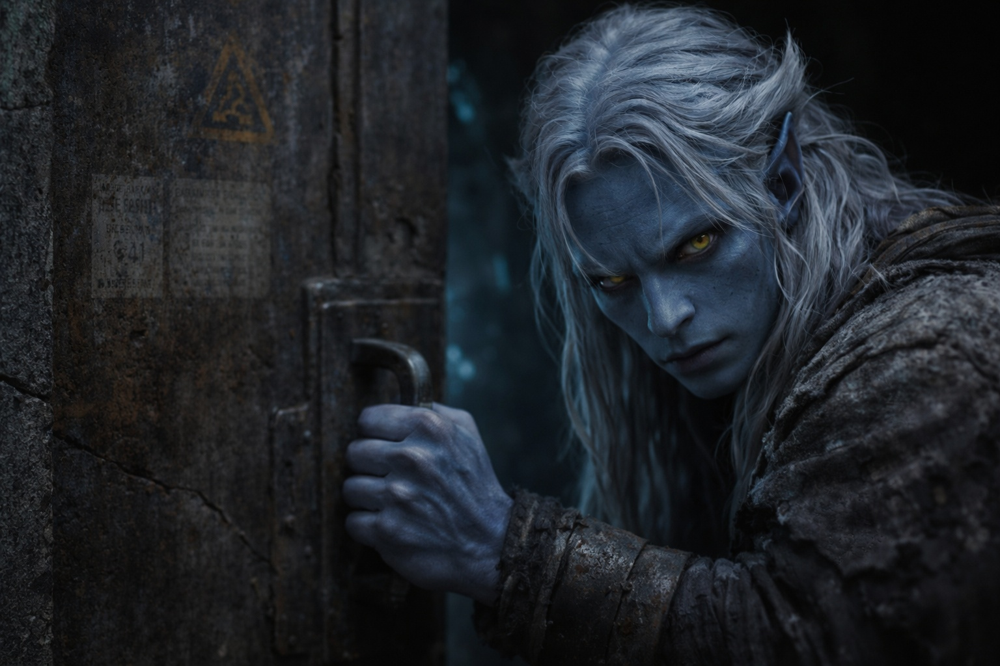

## Chapter 2 | Part 4
--- 

Drusniel waited until the third hour past midnight.

At the guard change, he heard the relief patrol's boots pass beneath his window. He would wait until they reached the courtyard before lifting the latch. His father's study lamp would burn until dawn; he would take the corridor on the other side of the house.

He dressed in dark clothes and packed water, food for a day, a knife, and the heaviest hooded cloak he owned. Nothing he couldn't abandon if he had to run.

The surface passages appeared on his father's maps. He'd memorized them years ago without expecting to use them.

He passed Shyntara's door without touching the loose board outside it. At the kitchens he stopped to listen, then crossed to the service wing.

At the compound's edge, a service corridor led to the outer tunnels. Drusniel paused at the threshold.

Something had happened in the trial. Or he had failed and needed to know why it had felt otherwise.

If Zaelar understood how magic could be broken, Drusniel would ask him what he'd felt.

The service corridor stretched before him, lit by sparse fungal clusters. At its end, a door marked with faded symbols—warnings about surface exposure, protocols for decontamination. Drusniel had never opened it.

The handle was cold under his palm. He listened once more for footsteps.

He opened the door. Cool air rushed past him, carrying a damp, leafy smell he couldn't place. He stepped into the tunnel and pulled the door shut.

The tunnel climbed through cooler rock. His ears popped, and he swallowed to clear them. Ahead, gray light spread across the floor beyond the final bend.

Drusniel had never seen surface light. He'd heard it described: painful, blinding, capable of burning drow skin within minutes of direct exposure. But this light was filtered, diffused. Dawn, perhaps, or heavy cloud cover.

The tunnel ended at another door. This one was heavier, reinforced, marked with more warnings. Drusniel ignored them. He pressed his palm to the release mechanism.

The door swung open.

And for the first time in his life, Drusniel stepped onto the surface.

---

The world above was nothing like he'd imagined.

He kept his hands inside his sleeves, waiting for the light to hurt.

Clouds covered the sky. Beneath them he could distinguish stone and trees, but little color. He loosened his grip on the cloak.

Cold air filled his mouth. It smelled of wet leaves, stronger whenever the wind turned toward him.

There was no ceiling. His eyes kept trying to find one.

He looked back and fixed the entrance in his memory: a split boulder above the lintel, loose shale to its left.

He turned north.

The voice had given him one useful detail: a black tower beyond the second ridge.

The gray light stung his eyes. He pulled the hood forward and kept to the hollows between the ridges.

If the clouds broke, the cloak would buy him minutes. He kept moving.

He followed the northern ridge he remembered from the maps, keeping the paling sky to his right.

Only after the second rise did the tower break the horizon.

It stood alone on a hill, its dark walls unbroken by any lighted window.

Zaelar's tower.

Drusniel stopped long enough to fix its position against the ridge.

*There.*

He started toward the tower.

Behind him, the tunnel entrance faded into the hillside.

---

**End of Chapter 2.4 —> 3.1: [The Surface Mage: The Tower](/the-surface-mage-the-tower/)**
