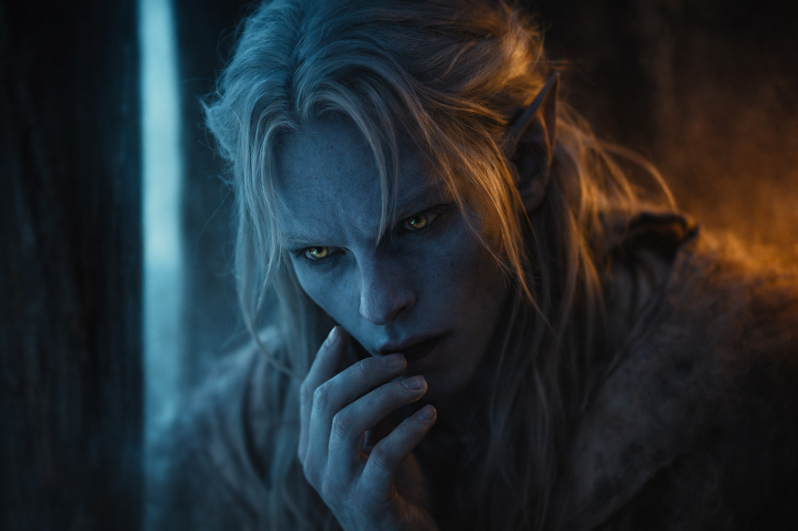
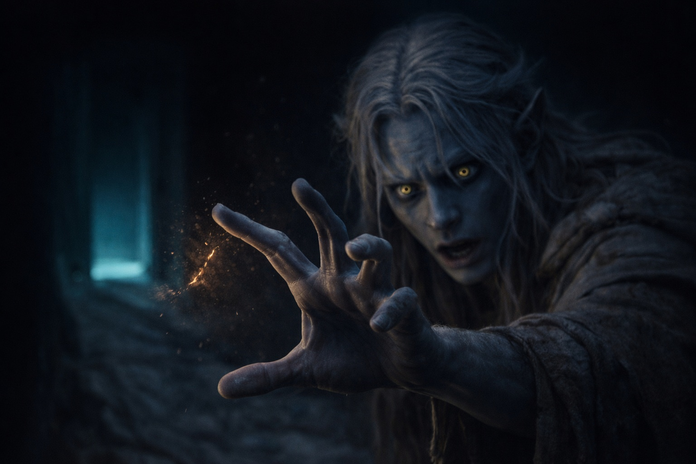
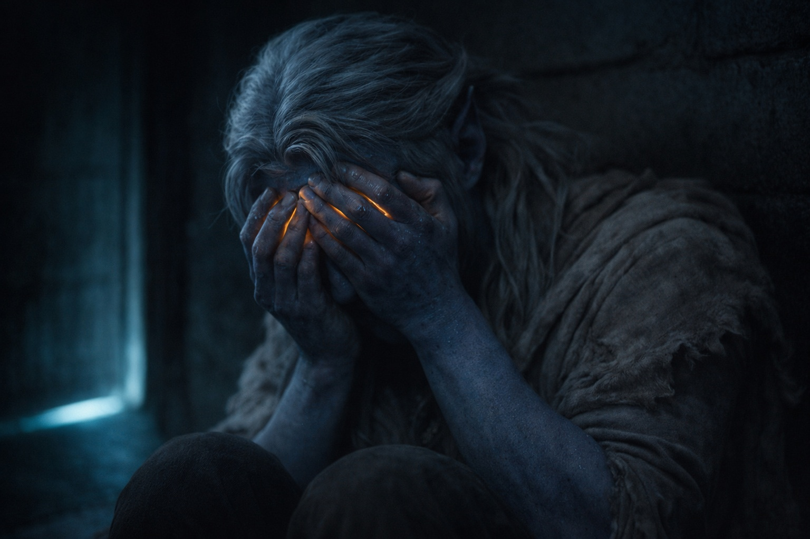

## Chapter 2 | Part 2
--- 
 
The presence held. Drusniel sat up, pulling the sheet free of his legs.

*Drusniel? Can you hear me?*

The words arrived without sound. In the grove they'd managed impressions, a direction of attention, scarcely more. Now he could understand whole sentences.

*Annariel?* He shaped the thought carefully. *How? I thought they isolated you.*

A pause. The presence flickered, as if gathering strength.

*No visitors. No letters.* The voice grew clearer. *But you're here. I can reach you.*

Drusniel's eyes burned. He pressed the heels of his hands against them. If he answered too quickly, Annariel would hear how badly he'd needed this, and he couldn't bear that either. He waited until he could shape a thought without it breaking apart.

*You found a way.*

*I found a way.* Warmth held through the connection, undiminished by the distance between them. *You don't have to go through this alone. Tell me how you are.*

Drusniel almost laughed. How he was. What answer could he give that wouldn't sound like a complaint about Annariel's success? He was glad his friend had passed. He had to be able to say that, at least.

*I'm not hurt,* he sent carefully. *If that's what you mean.*

*And the trial? That moment when the connection stopped?*

Drusniel went still. *You felt it too?*

*You reached for her and something interfered.*

*You believe me?* Drusniel hadn't meant to ask it that way.

*I thought I imagined it,* he sent. *I thought maybe I wanted it so badly that I convinced myself it was real.*

*You didn't imagine it. Don't let them persuade you otherwise.*

Drusniel drew his knees up. His head throbbed harder as he held the connection, but he couldn't bear to let it end yet. He could talk to Annariel. Tomorrow would still bring his father's orders and the servants avoiding his eyes, but he could talk to Annariel tonight.

*What do I do?* he asked. *Father's sending me back to drills. He won't even hear what happened.*

*Then ask someone who will listen.*

*The mages won't listen. Neither will my family. Who's left?*

*The training halls aren't the only place to learn.*

*Where else?*

*There's a mage on the surface who teaches outside Venemora's rites. He studies how connections work. How they can be broken.*

Drusniel's heart stuttered. The surface. Where drow didn't go. Where sunlight killed.

*You want me to go to the surface?*

*I want you to have answers. Zaelar might give you some.*

Zaelar. The damaged scroll in the grove. The exile who had found another path to power.

*I've heard that name,* he sent slowly. *Rumors. Bad ones.*

*Then ask about those too. You don't have to trust him to ask a question.*

The words warmed him despite himself. The surface was dangerous. So was a mage Umbra'kor spoke about only in whispers.

*I'll think about it,* he sent.

*Think about it.* The presence weakened. *We'll speak again.*

*Annariel—*

*You're not alone in this, Drus.*

Then the presence was gone.

He pressed his forehead into the pillow until the ache behind his eyes began to ease.

The surface. He'd never been above ground. The stories said sunlight could kill a drow in minutes. That the air itself was wrong, too thin, too bright.

He would need a cloak, water, and a route back before the sun cleared the ridges. He found himself going over the maps he'd seen in his father's study.

He hadn't agreed to go. He was only remembering the way.

---

**End of Chapter 2.2 —> 2.3: [Voices in the Dark: The Seed of Doubt](/voices-in-the-dark-the-seed-of-doubt/)**
