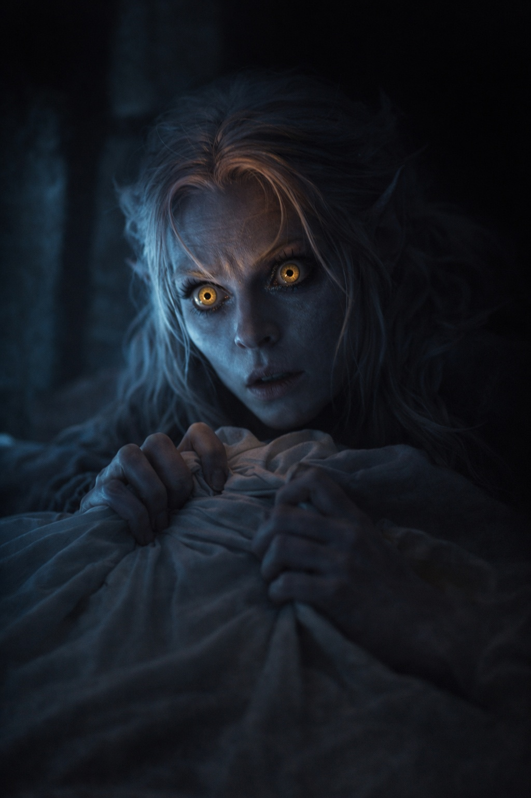

## Chapter 2 | Part 1
--- 

Three days after the trial, Drusniel stopped leaving his room.

His mother left food outside his door. By the time he remembered to eat, the broth had cooled to a skin. His father said nothing. Shyntara knocked twice on the first day, then stopped.

He preferred it this way.

The training room adjoined his quarters, a private space his family had built for honing knife work and silent movement. Drusniel used it for something else now. He stood in the center of the bare stone floor and reached.

He wasn't reaching for Venemora or her blessing. He simply reached, the way he and Annariel had practiced for years, feeling for that familiar pressure at the edge of awareness.

Nothing.

He reached again. Harder.

The same smooth absence met him. He held the attempt until his shoulders began to shake, then had to let go.

Drusniel's eyes tracked a hairline fracture in the stone floor. It forked twice before vanishing beneath the training mat.

Each attempt brought him back to the trial: the approaching pressure, then Annariel staring at him across the chamber.

What had changed?

On the fourth day, he ventured into the compound's corridors.

A servant passed him in the hall. The woman's eyes slid over Drusniel like he wasn't there, then away. She quickened her pace. Drusniel heard her whisper to another servant at the corridor's end: "That's the one who—"

The sentence died unfinished. They both hurried away.

He returned to his room. Closed the door. Reached again.

Nothing.

---

On the fifth day, Shyntara caught him in the training room.

The opening door sent a draft across his bare ankles. He knew she was there and kept his back to her.

"You need to eat," she said.

Drusniel didn't turn around. "I ate."

"Half a roll. Yesterday." Her footsteps crossed the stone floor. "And you need to sleep. Father says you pace at night. He hears you through the walls."

*Father.* Who had always preferred the future this failure left him.

"I'm fine."

"You're not." Shyntara stopped behind him. Close enough that he could feel her presence, the warmth of another body in the cold room. "Drusniel. Look at me."

He turned. She was looking at him as she had when he'd broken his wrist at twelve, checking for an injury he wouldn't admit to. He'd hidden that injury for half a day before she noticed he was eating with his left hand. This time there was no swelling he could show her, no bone she could set.

"I felt it working," he said. "Shyn, I felt it."

"Show me where it hurts." She looked down at his hands. "If there's an injury, we can—"

"There's nothing to show." He stepped back before she could touch him. "That's the problem."

"Then tell me what happened. From the beginning."

"You heard Father. East terrace tomorrow. We've lost enough training time."

Shyntara's eyes narrowed.

"I brought you food, Drusniel. Not a training schedule." She turned toward the door. "Eat it before it gets cold."

She paused at the threshold, one hand on the frame.

Then her shoulders squared, and she was gone.

The door closed behind her.

He lifted the lid from the bowl. She'd brought a spoon too. He'd have to eat something before she returned to see whether he'd touched it.

---

On the sixth night, something changed.

Drusniel lay awake with the bedding twisted around his legs. His body ached from days of reaching and sleeping in fragments between bouts of pacing. The food had tasted of little, even warm. Earlier he'd tried to summon enough anger to go down to his father's study, but he hadn't got farther than putting on his shoes. He couldn't remember when he'd last slept until morning.

He closed his eyes.

And felt it.

A flicker. A warmth at the edge of awareness. Distant, but unmistakable.

*Presence.*

He opened them again.

The warmth returned when he reached for it. His headache sharpened.

Impossible. The mages had isolated Annariel. No outside contact. That was the rule.

But he knew this pressure from the grove, or thought he did.

He reached again, careful not to push it away.

The presence reached back.

And then, impossibly, a voice in his mind:

*Drusniel?*

His breath caught. His hands trembled against the bedsheets.

He knew that voice.

*Annariel?*

---

**End of Chapter 2.1 —> 2.2: [Voices in the Dark: The Distant Voice](/voices-in-the-dark-the-distant-voice/)**
