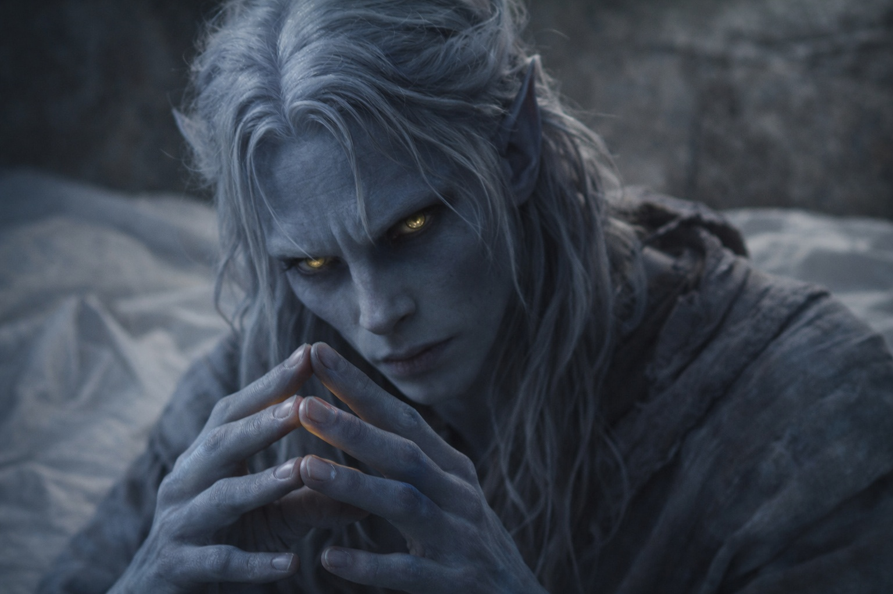
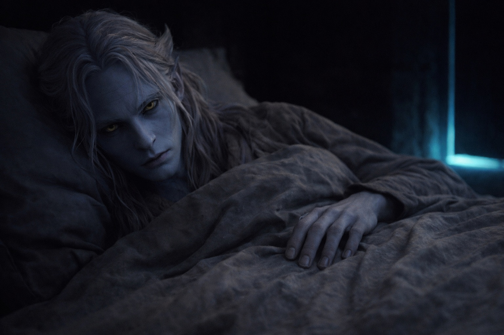

## Chapter 2 | Part 3
--- 

The messages came more frequently over the next two days.

Not constantly—the connection seemed to require effort on both ends. But each night, the presence would flicker at the edge of Drusniel's awareness. Each night, he would reach toward it, and each night, "Annariel's" voice would fill the silence.

They talked about the trial. About Drusniel's isolation. About his family's awkward attempts at normalcy. The presence was warm, concerned, sympathetic in all the right ways.

Zaelar kept returning to the conversation.

*The mages here talk about blocked candidates,* the voice said on the second night. *It's rare, but it happens. When someone powerful enough doesn't want a candidate to pass.*

Drusniel lay in darkness, staring at the ceiling. *Blocked. You mean deliberately.*

*Think about it.* The presence pulsed with urgency. *Who would benefit if you failed? Who might see you as a threat?*

*I'm not a threat to anyone. I'm nobody.*

*You're not nobody.* A pause. *You're smarter than most of the people who passed, Drus. You always have been. Maybe someone noticed. Maybe they saw a candidate who asked too many questions, who didn't just accept what he was told.*

Drusniel's thumb touched his fingertips once, then stopped.

*You think someone deliberately blocked me?*

*I don't know for certain. But it's possible. And Zaelar might know how to tell.*

It was the third time in two nights that the conversation had curved back to the surface mage. Drusniel noticed the pattern. Filed it away.

---

On the third night, he tested something.

The presence arrived as usual—a warmth at the edge of awareness, followed by words pressed into his mind like fingerprints.

*How are you feeling?*

Drusniel didn't answer right away. Instead, he did what he and Annariel had done a thousand times in the grove. He tapped his thumb against his fingers. One, two, three. Slow and deliberate.

The old game. *Read me.*

A pause.

*You're worried about your family,* the voice said. *That's natural. The political situation is dangerous.*

Drusniel's stomach tightened. Wrong answer.

Three taps meant fear. Annariel had known that for years.

The voice had guessed.

*Drus?* The presence flickered with concern. *Are you alright?*

*Fine.* He kept his thoughts carefully neutral. *Just tired.*

*You should rest. We can talk tomorrow.*

*No, I—* He hesitated. Pushed down the doubt. *Tell me more about Zaelar. What else have you heard?*

The presence continued, as if the question had never happened.

*He's powerful. That much is clear. The mages here speak of him in whispers—some say he was exiled from Umbra'kor decades ago. Others say he left by choice.* A pause. *I don't know which is true. I only hear fragments, pieces of conversations I'm not supposed to overhear. But they say he understands magic the way a smith understands iron. Not just how to use it—how it works. How it breaks.*

*If someone blocked your connection to Venemora, Zaelar might know the method. The signatures. He might be able to identify who did it.*

Drusniel closed his eyes. The failed test stayed with him. So did Zaelar.

*There's something else,* the voice said carefully. *I didn't want to say it before. I wasn't sure you were ready.*

*Say it.*

*I keep thinking about the way they watched you,* the voice said. *You asked questions other candidates didn't. You reached without sanction. If someone interfered, maybe it wasn't because you were weak.*

*Then why?*

*Because you were inconvenient. Because you might have become something they couldn't place.*

He knew what the words were offering him.

That did not stop him wanting them to be true.

*You were always meant for more than what they allowed you,* the voice continued. *Something took that from you. Don't you want to know what?*

Drusniel's thumb brushed his fingertips, then stilled.

*And if you're wrong?*

A pause.

*Then Zaelar tells you so. Find him. Ask him yourself. Then decide whether any of this is true.*

That sounded more like Annariel. Or like something that had learned how Annariel should sound.

*Where?*

*North of the old surface exits. The mages mentioned a black tower beyond the second ridge.*

The voice could be lying about who it was. That did not make Zaelar imaginary.

One claim could be tested.

*I'll find him,* Drusniel sent.

*Good. Ask your own questions.*

The presence faded.

Drusniel tapped three times against his fingertips.

No answer.

---

**End of Chapter 2.3 —> 2.4: [Voices in the Dark: The Decision](/voices-in-the-dark-the-decision/)**