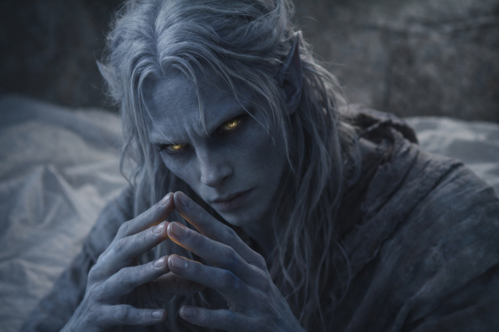
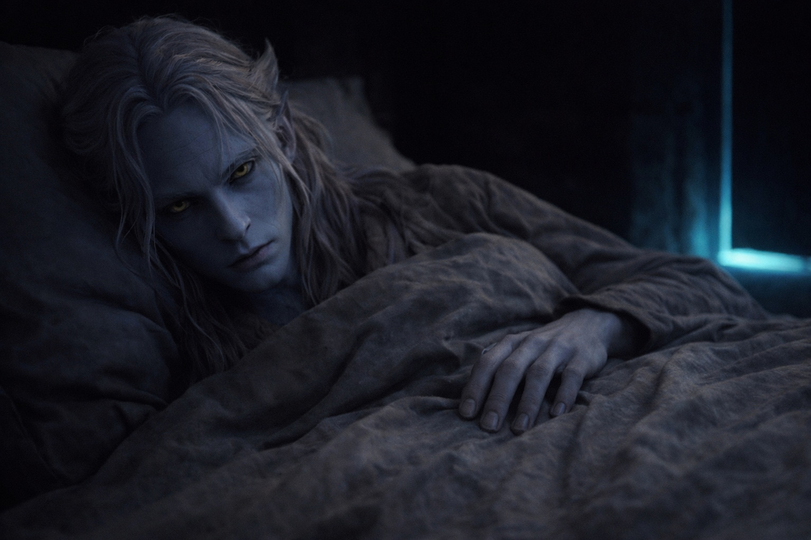

## Chapter 2 | Part 3
--- 

The messages came more frequently over the next two days.

They were brief enough that the headache faded before morning. Drusniel began waiting for the familiar pressure before trying to sleep.

He spoke about the trial and his family. The presence listened.

Zaelar kept returning to the conversation.

*A powerful mage could block a candidate,* the voice said on the second night. *Passing the trial isn't only a question of ability.*

Drusniel lay in darkness, staring at the ceiling. *Blocked. You mean deliberately.*

*Think about it.* The presence pulsed with urgency. *Who would benefit if you failed? Who might see you as a threat?*

*I'm not a threat to anyone. I'm nobody.*

*You're not nobody.* A pause. *You're smarter than most of the people who passed, Drus. You always have been. Maybe someone noticed. Maybe they saw a candidate who asked too many questions, who didn't just accept what he was told.*

*You think someone deliberately blocked me?*

*Zaelar could tell you how it's done.*

It was the third time in two nights that the conversation had returned to Zaelar.

---

On the third night, he tested something.

The presence arrived while he was rubbing the ache from his temples.

*How are you feeling?*

Drusniel touched his thumb to three fingertips and sent the rhythm through the connection. In the grove, they'd used it when footsteps passed nearby and neither dared speak. Three taps meant fear.

The old game. *Read me.*

A pause.

*You're worried about your family,* the voice said. *That's natural. The political situation is dangerous.*

Annariel knew that signal. Drusniel almost repeated it, then stopped. If he explained what the three taps meant, he would never know whether the next answer came from memory or from what he'd just supplied.

*Drus?* The presence flickered with concern. *Are you alright?*

*Fine.* He kept his thoughts carefully neutral. *Just tired.*

*You should rest. We can talk tomorrow.*

*Tell me more about Zaelar. What does he teach?*

The presence continued, as if the question had never happened.

*Elemental work. Air, water. Things the temple doesn't allow you to try.*

*If someone blocked your connection, he'd recognize the method.*

*You reached without sanction,* the voice continued. *If someone interfered, perhaps it wasn't because you were weak.*

*Then why?*

*Perhaps they didn't want another candidate who asked questions.*

Drusniel wanted that to be the reason. He'd seen how the mages looked past him, already occupied with the next name. It hurt less to imagine they'd feared him. He lay still until he could separate what he'd seen from what he wanted.

*And if you're wrong?*

*Then Zaelar tells you so. Find him. Ask him yourself. Then decide whether any of this is true.*

*Where?*

*North of the old surface exits. A black tower beyond the second ridge.*

He could look for a tower without giving the voice anything more.

*I'll look at the maps,* Drusniel sent.

*Good. Decide for yourself.*

The presence faded.

He waited for the pressure to leave his mind before fetching his cloak.

He would leave tonight. He hadn't told the voice that.

---

**End of Chapter 2.3 —> 2.4: [Voices in the Dark: The Decision](/voices-in-the-dark-the-decision/)**
