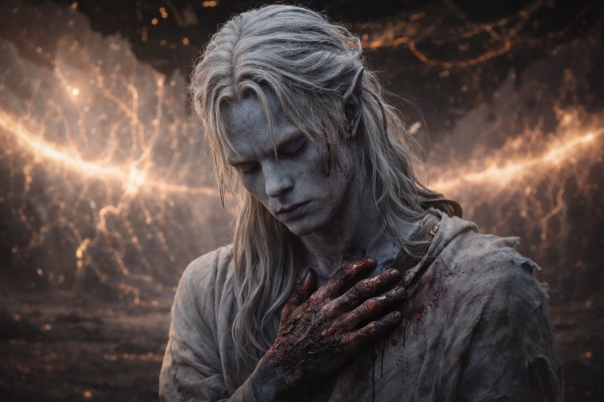
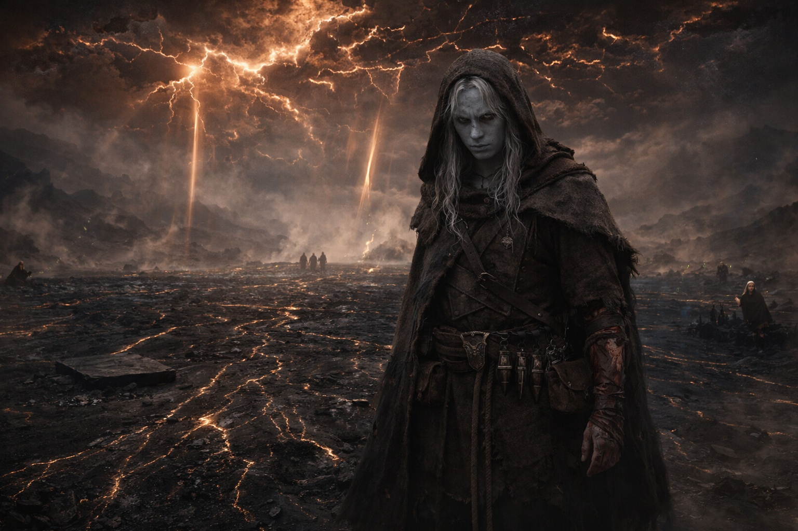

---
order: 329
title: "Ash and Silence: The Body"
description: "Alive, then. Ruined."
date: 2024-11-11
language: en
chapter: 44
subchapter: 1
storyline: drusniel
canon_phase: main
canon_sequence: D-044-001
narrative_weight: high
category: Wyrmreach
author: Drusniel
type: Main
tags: ['#ash and silence', '#drusniel', '#wyrmreach']
thumbnail: image.jpg
featured: false
counterpart_path: site/content/posts/es/wyrmreach/ceniza-y-silencio-el-cuerpo/index.mdx
counterpart_title: "Ceniza y Silencio: El Cuerpo"
---

## Chapter 44 | Part 1 | The Body

---

Breathing hurt.

That seemed like information. His mind, which had been trained by years of cataloguing and which did not know how to stop, reached for the pattern it always reached for and began assembling the data: lungs working, shallow, the left side producing a sound on intake that suggested rib damage. Hands burned, the skin tight across both palms where the artifact's overload had traveled through him. Nose crusted with blood that had dried in the cold. Blood in his ears, partially dried, the left ear producing a tone that might be damage or might be residual noise from the cascade. Burns along both forearms following the paths where the barrier's energy had used his veins as circuitry.

Alive, then. Ruined, but alive.

He was still kneeling. The barrier's floor beneath his knees was cold in the way that stone is cold when the system that heated it has stopped. The energy veins that had pulsed beneath the surface were dark, the network that had sustained the barrier for a thousand years now a collection of empty channels in dead rock. His knees hurt. That was also information. The pain was in the joints, the dull ache of a body that had been in the same position too long, which meant time had passed, which meant the immediate aftermath was no longer immediate.

He tried to stand. The attempt produced a sound from his ribs that was informative in the way that sounds from ribs should not be informative. He stayed on his knees. Tried again. This time his left leg cooperated enough to get one foot flat on the ground, and from there it was a matter of leverage and tolerance and the willingness to accept that the process would hurt in ways he could not prevent.

He stood. The barrier's damaged interior opened around him in every direction, the vast space that had been engineered to contain and maintain and protect, now cracked and dark and still. The dome overhead, fractured. The amber-rust sky visible through the wounds in the ceiling, the light filtering through in shafts that hit the dead floor and illuminated nothing. The air tasted wrong. Not bad. Not toxic. Wrong, in the way that water from a different well tastes wrong even when it is clean. The contamination was in the air and the contamination was the entity's presence, distributed, environmental, permanent, and his adapted lungs processed it the way they processed everything the Voice's investment had calibrated them to process.

He looked at his hands. The burns followed the circuit paths. Both palms, both forearms, the precise routes that the barrier's energy had taken when it used him as the conduit between the artifact and the interface. The burns were symmetrical, which was the kind of detail his mind grabbed because his mind grabbed details when there was nothing else to hold. The skin was tight, blistered in places, the obsidian-dark surface showing the damage as variations in texture rather than color.

His crystals were dark. Four of them, at his belt, the adaptive modifications the Voice had paid for and the barrier had activated and the overload had consumed. Dark. Not dim. Not conserving. Dark the way the energy veins in the floor were dark, the emptiness of components that had served their function and been exhausted by the service.

The dead artifact lay where he had placed it. On the floor. Dead stone on dead stone. He looked at it and felt nothing, which was the correct response to looking at a fulfilled tool and which was also the absence of something he could not name, some connection between himself and the object that had guided him for weeks, that had hummed against his spine, that had conducted through him and been conducted through, and that was now a piece of mineral with no more significance than any other piece of mineral.

He reached for his magic.

The habit was older than the Voice, older than the Beacon, older than Wyrmreach. He had reached for his air and water affinities since he was a child, the dual configuration that had made him unusual in Umbra'kor and valuable to the barrier and useful to every mechanism that had needed a conduit. He reached inward, to the place where the affinities lived.

The place was there. The affinities were not. The interior architecture of his magical capacity remained, the channels and pathways and the structural framework that a mage developed over years of practice, all of it intact, all of it present, all of it empty. He was a building with the furniture removed. The rooms existed. Nothing occupied them.

He could not tell if the magic was gone or depleted. The distinction mattered in theory. In practice, the distinction was the difference between a well that has gone dry and a well that has been filled in, and from where he stood, looking down into the darkness, the difference was academic. He reached. Nothing answered. He reached again, because the habit would not stop reaching, and nothing answered again, and the nothing had the quality of permanence.

His thumb tapped. Against his thigh. One, two, three, four. The count. The habit that survived when the others didn't. One, two, three, four. Lungs working. Ribs damaged. Hands burned. Magic gone. One, two, three, four. Four facts in a body that was running an inventory on itself because the body's owner had trained it to inventory everything and the training did not stop for catastrophe.

He looked at the barrier's damaged interior. The scale was what registered. Vast. Engineered for a purpose that had operated for a thousand years and had been disrupted in seconds. The floor stretched in every direction, dark veins in dark stone, the pattern that had once been a living network now a fossil of a system that had worked. The dome above, cracked along fault lines that followed the cascade's path, each crack a record of the sequence that had broken the world. The amber-rust sky through the cracks, settled, permanent, the new color of everything.

He was alive because the Voice's investment had been calibrated to keep him alive through the event the investment was intended to cause. The crystal adaptation that had cost him debts he could not repay had protected him from the decompression, the magical field collapse, the entity's presence. He was alive by design, the design of a system that needed its tool to survive the operation.

The system had no further need of the tool. The tool was still standing. That was the oversight. The system, the Voice, the artifact, the barrier, all of it had been calibrated to the act and the act was done and the tool's continued existence was a loose end that no one would tie off because the entity that tied off loose ends had collected its debts and closed the account.

He stood in the damaged interior. Burns on his arms. Blood in his ears. Ribs that informed him about their condition with every breath. Four dark crystals at his belt. A dead artifact on the floor. A gap in his head where the Voice had lived. A gap in his chest where the magic had been.

One, two, three, four.

He was alive. He did not know why that qualified as information rather than oversight.

---

**End of Chapter 44.1 —> 44.2: [Ash and Silence: The Silence](/ash-and-silence-the-silence/)**

