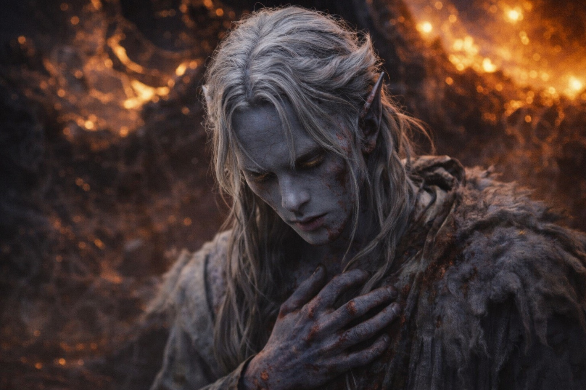
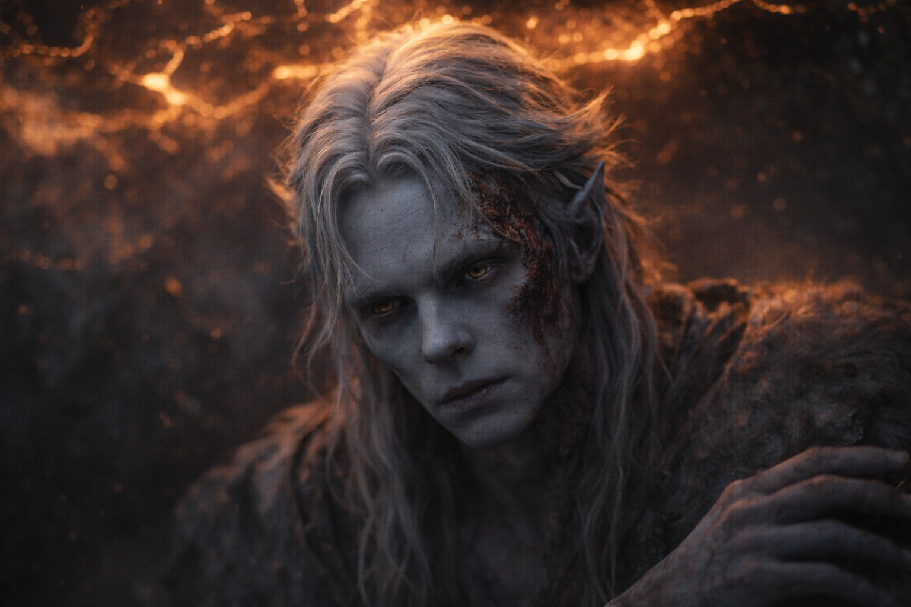
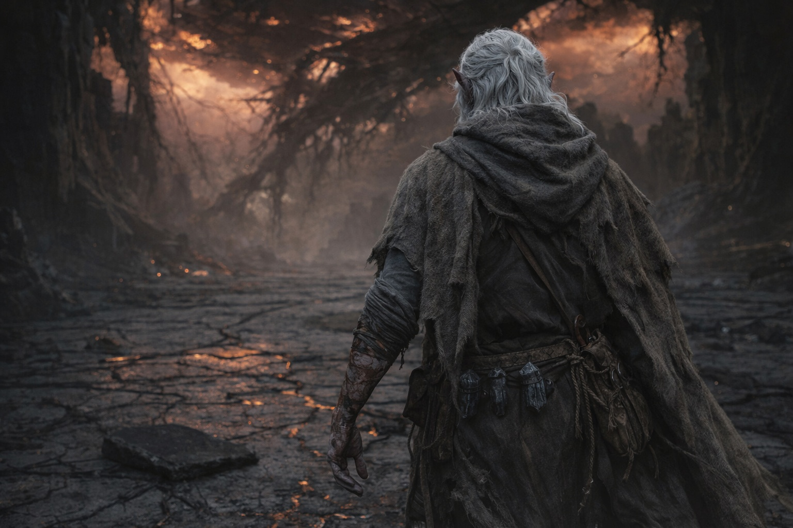
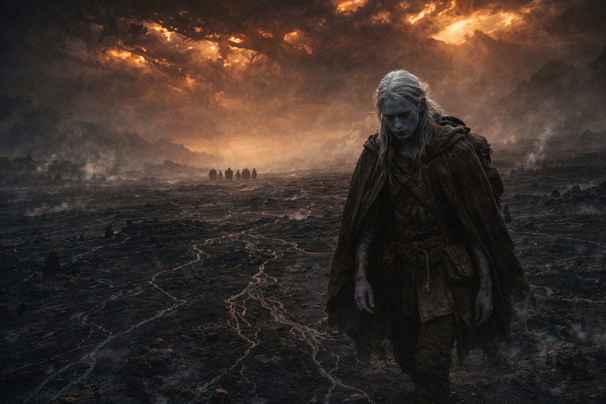

---
order: 330
title: "Ash and Silence: The Silence"
description: "The Voice had never been kind. But it had been present."
date: 2024-11-12
language: en
chapter: 44
subchapter: 2
storyline: drusniel
canon_phase: main
canon_sequence: D-044-002
narrative_weight: high
category: Wyrmreach
author: Drusniel
type: Main
tags: ['#ash and silence', '#drusniel', '#wyrmreach']
thumbnail: image.jpg
featured: false
counterpart_path: site/content/posts/es/wyrmreach/ceniza-y-silencio-el-silencio/index.mdx
counterpart_title: "Ceniza y Silencio: El Silencio"
---

# Chapter 44.2 | Ash and Silence: The Silence

---

He reached for the Voice.

The reaching was not a decision. It was the same reflex as breathing, the same involuntary action as the thumb-tap against his thigh, the kind of movement that the body performs because it has performed it so many times that the pattern has worn a groove deeper than thought. He had been reaching for the Voice since the Nightmare Sea. Since the first debt. Since the cold presence had settled behind his sternum and stayed there, uninvited, procedural, constant. He reached for it the way his hand would have reached for a wall in a dark room, the instinct to find something solid in the space where solid things had always been.

Nothing.

Not the silence of the volcano crossing, where the Voice had contracted to a point of cold density and waited. Not the silence of the barrier approach, where the Voice had gone quiet because the debts were about to be called and the mechanism was preparing to execute. Those silences had been full. Those silences had contained something. The first had been expectant. The second had been deliberate. Both had been the silence of a presence that chose not to speak, which is the opposite of absence.

This silence was a room after everyone has left.

The architecture was still there. The space behind his sternum where the Voice had lived, the mental corridors it had occupied, the places where its cold procedural presence had pressed against his thoughts and reshaped the way he processed the world. All of it intact. All of it empty. The Voice had not damaged the room on its way out. It had not burned the furniture or torn the walls. It had simply collected its belongings and closed the door, because the lease was over and the tenant had no further reason to stay.

He reached again. The same reflex. The same groove in the pattern. And the pattern found nothing, and the nothing echoed in the empty space, and the echo was worse than the absence because the echo told him the space was large enough to have contained what it contained, which meant the space was large enough to be empty in a way that felt structural.

The debts were paid. He understood that with the clarity that his analytical mind provided on every subject it touched. The Voice had invested: lungs held at the Nightmare Sea, companions fed during the crossing, passage through the mountains, the crystal adaptation that had remade his body into something compatible with the barrier. Each investment had accumulated interest. The interest had been collected in the act. The artifact's contact with the barrier interface had been the return on the entire portfolio, and the return had been sufficient, and the account was closed, and the Voice had no further claim on him because the Voice operated on the logic of transaction and the transaction was complete.

He should have felt free. The word presented itself, the analytical mind testing it the way it tested every available concept. Free. Unbound. Released. The debts paid, the obligations fulfilled, the mechanism that had driven him across Wyrmreach and through the barrier zone and into the act no longer operative. He was, for the first time since the Nightmare Sea, a person with no debts to anyone.

The freedom felt like the missing wall. He reached for it and found nothing to hold, and the nothing was not liberation. The nothing was the absence of structure, and he had been leaning against that structure for so long that the removal left him off-balance in a way that had nothing to do with his damaged ribs.

He tried to speak to it.

Not out loud. Inward, the way communication with the Voice had always worked, the silent address that was less language and more orientation, the turning of attention toward the presence that lived behind his sternum. He turned. The presence was not there. He spoke anyway, to the empty space, the way a person speaks to a room where someone they know used to sit, not because they expect an answer but because the habit of addressing that space is older than the knowledge that the space is empty.

Nothing answered. The nothing was total. Not hostile, not warm, not cold, not procedural. Just nothing. The absolute vacancy of a location that had been occupied and was now not.

The Voice had never been kind. He held that fact in his mind and examined it the way he examined every fact, with the precision of a person who needed to understand things in order to survive things. The Voice had been cold. Procedural. Transactional. It had spoken in declarations, not conversations. It had named his debts with the indifference of a ledger. It had called those debts with the efficiency of a mechanism designed to call debts. It had never explained. Never comforted. Never offered what it was not owed or given what was not paid for. The Voice had been the occupant of his mind the way weather is the occupant of a sky: present, powerful, indifferent to the landscape it moves across.

And he missed it.

That was the cost. Not the burns, not the gone magic, not the dead crystals, not the blood or the ribs or the ruin of his body. Those were costs that could be catalogued and measured and understood. This was the cost that his analytical mind could not file because the cost was the absence of the thing that had shaped the way he filed. He missed the cold presence behind his sternum. He missed the procedural voice that named his debts. He missed the structure of obligation, the architecture of transaction, the knowledge that something occupied the space behind his thoughts and that the something had plans for him and that the plans, however cold, however transactional, however ultimately destructive, were at least plans.

He had been a person with a purpose. The purpose had been the Voice's purpose, given to him through the medium of debt, but it had been a purpose, and it had organized his days and his direction and his decisions, and without it he was a person standing in a damaged building with no direction and no purpose and no voice in his head telling him where the direction should point.

One, two, three, four. His thumb against his thigh. The count that was his. That had always been his. That had nothing to do with the Voice or the artifact or the barrier or the system. One, two, three, four. The minimum structure a person could maintain when all other structure had been removed.

He walked.

Not in a direction. Not toward anything. Just walked, because standing still in the damaged interior was worse than moving through it, and the body that had been inventoried and found ruined still had legs that worked and the legs wanted to move because moving was better than existing in one place with the silence that filled the space where the Voice had been.

The barrier's interior was vast. He walked through it. Past the dead artifact on the floor, which he did not pick up, because the artifact was a fulfilled tool and picking it up would be carrying a stone for the sake of carrying a stone.

Past the fractures in the dome where the amber-rust sky poured through. Past the dark energy veins in the floor that had once pulsed with a thousand years of Drow maintenance and now held nothing.

The silence walked with him. It would always walk with him. That was the dependency's final lesson, delivered after the dependency had ended, in the space where the dependency had lived: you do not miss what you need. You miss what was there.

---

**End of Chapter 44.2 — continues in Chapter 44.3: [Ash and Silence: The Stillness](/ash-and-silence-the-stillness/)**

