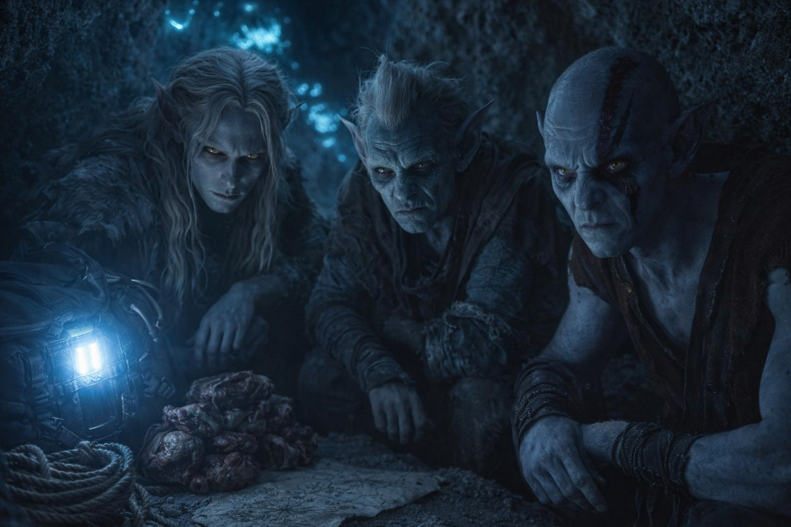
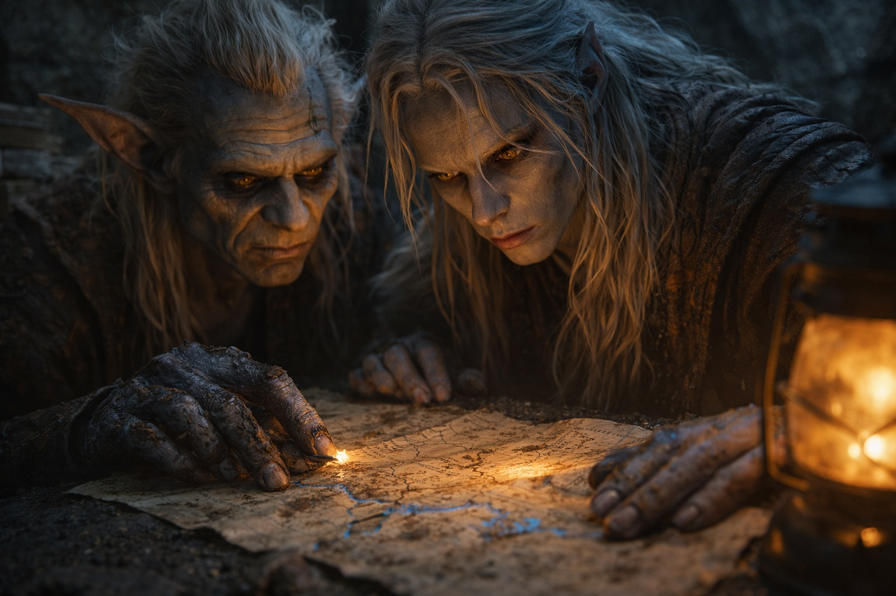
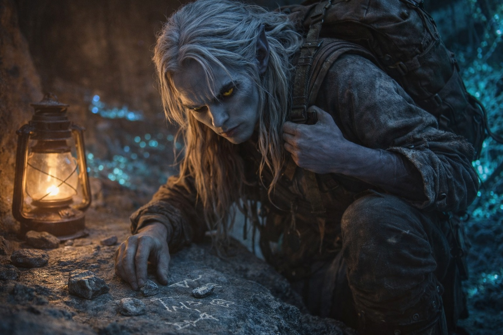

## Chapter 19 | Part 2

--- 

"Tell me about the eastern territories."

Srietz paused his inventory, ears twitching at something in Drusniel's tone. "Srietz assumes this is not casual curiosity."

"We're walking into them. I want to know what's waiting."

Srietz put down the supplies. He looked toward the cave mouth before answering.

"The eastern territories are contested." Srietz spoke slowly, choosing words with unusual care. "Three lords fight for dominance. Have fought for—" He stopped. "Srietz does not know how long. Long before Srietz came to Wyrmreach."

"Lords." Drusniel let the word sit between them. "What kind of lords?"

"The powerful kind. The kind that—" Again, that hesitation. "Srietz survived by not asking certain questions. Knowing too much makes you valuable. Valuable things get collected."

Elion stirred from where he'd been resting against the cave wall. "He's not going to answer directly."

"Srietz cannot answer what Srietz does not know." But there was something in the goblin's voice—an evasion dressed as ignorance. "Srietz knows they are old. Srietz knows they are territorial. Srietz knows the lands they fight over contain something valuable. Black crystals. Volcanic resources. Things Srietz never understood but others killed for."

"The volcano." Drusniel remembered the distant glow he'd glimpsed from the caravan's upper decks, before everything went wrong. "They're fighting over the volcano."

"Near it. Around it. For reasons Srietz never learned." Srietz's voice had gone flat—the tone he used when costs were being calculated. "The roads through contested territory are dangerous. But they exist. Szoravel is on the other side of them."

"How do you know?"

"Because Szoravel's position is—" Srietz searched for words. "Strategic. Protected. The drow mage sits where the lords cannot easily reach. Where their conflict creates a kind of safety." He paused. "Srietz does not understand how. Only that it is so."

If Srietz was right, Szoravel had found a way to live between three hostile territories. Drusniel needed to know how.

"Is there a safer route?"

"No." The answer was immediate. "The eastern territories are the only path to Szoravel. The question is not whether to cross them, but how."

"And how do we cross them?"

"Carefully." Srietz's ears flattened. "The lords watch their borders. They have scouts, servants, things that report unusual movement. Three travelers will be noticed. Three travelers with—" He glanced at Elion. "With unusual abilities will be noticed more."

Elion's expression didn't change. "I can hide what I am."

"Can Elion hide what happens when he changes?"

Drusniel remembered the cracking in the cave. Elion had barely survived the return journey.

"We travel without changing," Drusniel said.

"Until something chases us." Srietz looked at Elion. "Then we need somewhere to hide while he recovers. Not in the road. Not where scouts can see."

"You're saying we can't depend on outrunning them."

"Srietz could not keep up last time. Neither could Drusniel."

They would have to cross the contested roads on foot. Drusniel looked at Elion, who was still resting against the wall.

And still, it was the only path forward.

"Szoravel," he said. "You said they're protected. Do you know by what?"

"No. Only that the protection exists. Srietz has heard traders mention the drow mage. They speak of them with—" He searched for the word. "Caution. Not fear. wary respect. Szoravel helps those who can pay. Szoravel has knowledge others lack. Szoravel is dangerous but not predatory."

*Protected. The word should have been comforting. It wasn't.*

"We leave when Elion is ready." Drusniel made the decision without waiting for consensus. "We move fast, stay quiet, and hope the lords are too busy fighting each other to notice three travelers passing through."

Srietz nodded slowly. "Srietz will find the safest path. Srietz will mark the places where they kill travelers." He paused. "Srietz will try to trust that this is worth the risk."

"And if it's not?"

"Then Srietz chose badly. It happens more often than Srietz would like." He picked up the rations. "We take enough food to turn back."

Drusniel looked east, toward territories he couldn't see but could almost feel. Three lords. A contested war. A protected mage.

And somewhere in all that chaos, answers. Maybe.

It would have to be enough.

---

**End of Chapter 19.2 —> 19.3: [Direction: The Gloomy Town](/direction-the-gloomy-town/)**
