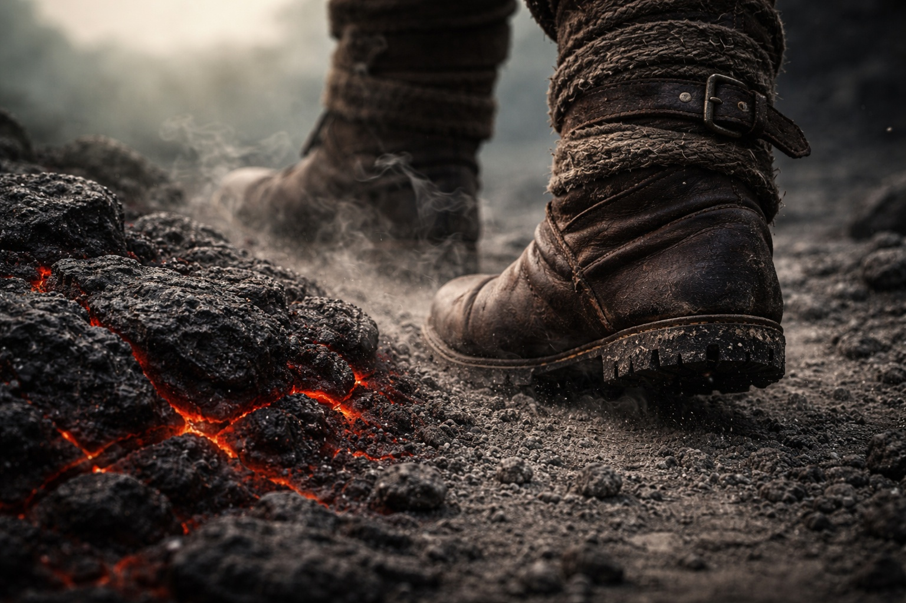

## Chapter 19 | Part 5

--- 

Drusniel woke to the smell of sulfur.

The darkness had thinned while he slept, fading from black to the sickly grey-green that passed for morning here. He sat up and found Srietz already finished packing, the goblin crouched over their supplies with his hands folded, waiting.

"How long have you been ready?"

"Forty-seven minutes." Srietz shouldered his pack. "Srietz let you sleep. Tired people miss things. Then Srietz has to run."

Elion emerged from behind a rock formation, rolling his shoulders. He'd taken the final watch and still moved better than either of them. The hollowness had left his face overnight, replaced by sharp attention.

"The path east is clear for the first league," Elion said. "After that, I couldn't see."

"Couldn't or wouldn't?"

"Both." He didn't elaborate.

They walked.

Within a hundred paces, the volcanic glass gave way to black stone, then loose soil that crunched underfoot. Dull red lines in the ground brightened and faded. Drusniel stepped over one.

He counted his steps. Old habit. The numbers helped him think.

At six hundred and twelve steps, Srietz spoke.

"Srietz wishes to register a formal objection."

"To what?"

The goblin pointed at the horizon.

Red light reached into the clouds above the volcano. From the caravan it had seemed distant. Now Drusniel could feel its heat on his face.

"Walking toward that," Srietz said, "contradicts every survival calculation Srietz has ever made."

"Noted."

"Srietz expected more resistance to the objection."

"Would resistance change anything?"

"No." The goblin's ears flattened. "Srietz is walking anyway. Group calculations are... complicated."

Elion matched Drusniel's pace, close enough to speak quietly. "I spent thirty years in Wyrmreach. Thirty years avoiding those lands." He nodded toward the glow. "The stories say things live there that don't live anywhere else. Things the lords keep as pets. Things the lords *are*."

"We're not invited."

"No."

"We're going anyway."

"Yes."

A ridge of black stone blocked the path. They climbed it in silence and stopped at the top.

The contested lands spread below them.

Black crystals covered the lower slopes. Some were no larger than a fist; others stood as tall as a man. Their facets reflected the red light in patches of violet. Steam rose between them. The air tasted of sulfur and copper, and Drusniel's teeth ached. He remembered that ache from the barrier and the Voice. He kept his hands away from the nearest crystal.

Three territories carved the landscape below. Three lords ruled them. And beyond all of it, Szoravel waited.

"Fast and low," Drusniel said. "We stay quiet. We don't stop."

"And when something finds us?" Srietz asked.

"We deal with it then."

The goblin made a sound that wasn't quite agreement.

Drusniel turned toward them. Elion had brought food when none of them could go farther. Srietz had stayed to help him recover. Now both were waiting for Drusniel to lead them down.

"Thank you," he said.

"Srietz will accept gratitude after survival. Not before."

Elion's mouth twitched. "He means you're welcome."

"Srietz meant what Srietz said." A pause. "But Srietz does not object to the translation."

Drusniel looked back one last time. The gloomy town had vanished behind the horizon. The caves were gone. The caravan's wreckage lay somewhere far to the west, bones and cargo scattered across a road they'd never walk again.

Nothing back there worth returning to.

He faced east again.

Szoravel waited on the other side. Answers or traps or both.

Only one way to find out.

They walked into the contested lands together, three figures descending toward the red light, and the black crystals hummed as they passed.

---

**End of Chapter 19.5 —> 20.1: [The First Fragment: The Search](/the-first-fragment-the-search/)**
