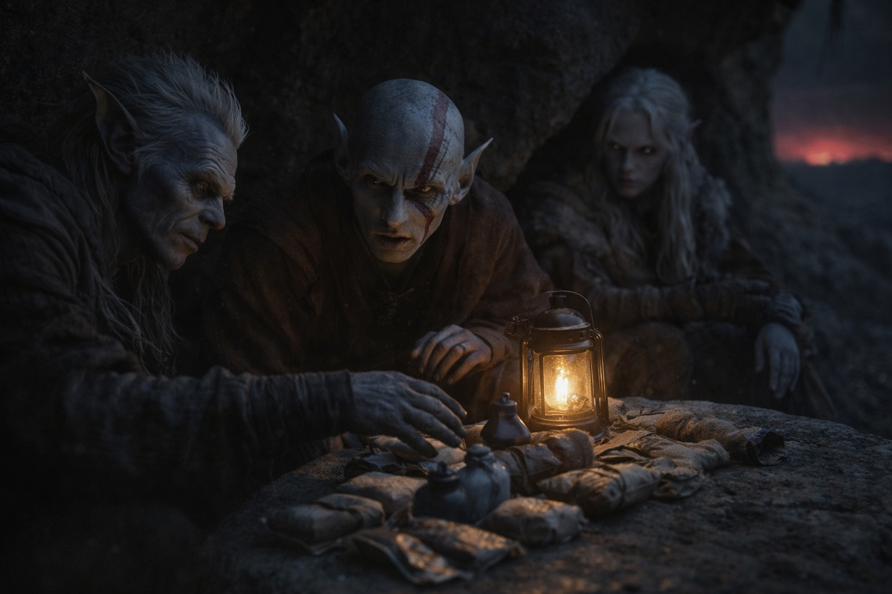
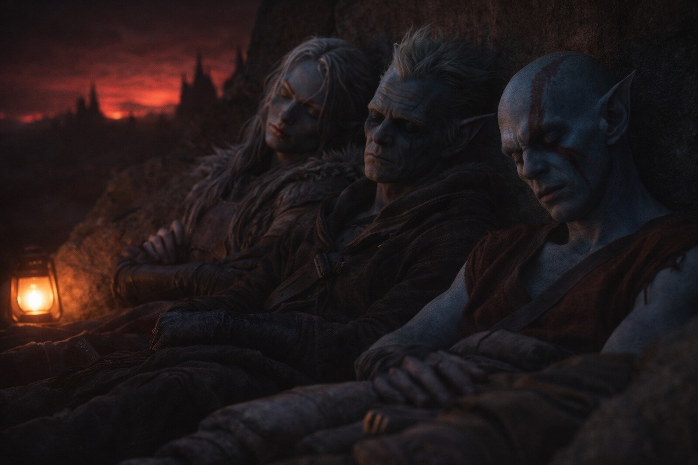

## Chapter 19 | Part 4

--- 

They found shelter in a hollow between two volcanic spires, the rock still warm from whatever fires burned beneath. Srietz declared it defensible. Elion said nothing, which Drusniel had learned to interpret as agreement.

The sky dimmed. Red light from the contested lands showed above the eastern ridge.

"Watch rotation," Srietz said, unpacking dried meat and water. "Three hours each. Elion, then Srietz, then Drusniel."

Drusniel looked up. Srietz had used Elion's name.

Elion turned toward the goblin.

"Acceptable," Drusniel said.

Elion sat at the mouth of the hollow, watching the approach. Srietz counted their supplies into rows. Drusniel leaned against the warm stone.

He could not sleep. He kept trying to remember Zaelar's exact words about Szoravel.

"Your breathing changed."

Elion's voice, low. The shapeshifter hadn't moved from his post.

"I'm fine."

"I didn't ask." A pause. "But you're not."

Drusniel watched the red glow pulse. "I'm following instructions from something I don't understand, toward someone I've never met, through territory that kills travelers for sport. What part of that should make me fine?"

"None of it." Elion shifted his weight, a controlled motion. "I've spent thirty years avoiding those lands. Heard the stories. Saw what came out of them, the few times anything came out at all."

"And you're still here."

"I'm still here."

Drusniel watched him check the path again.

"I don't trust you," Drusniel said. The words came out harder than he intended. "I don't trust anyone. Haven't for a long time."

"I know."

"That doesn't bother you?"

Elion turned toward him. "You can watch me tomorrow. For now, get some sleep. I want to get through those lands alive too."

"Srietz can hear both of you," the goblin said. "Neither is sleeping. Does Srietz have to keep all three watches?"

"Go to sleep, Srietz."

"After watch. Not before." The goblin's silhouette moved past them, taking position beside Elion. "The shapeshifter will brief Srietz on observed threats."

"There aren't any."

"Srietz will verify."

Drusniel closed his eyes. The stone warmed his back, and he could hear Srietz questioning Elion about the path.

Tomorrow, they'd walk into it.

Tonight, they rested. Three people in a hollow, watching the dark, waiting for dawn.

Drusniel slept before Srietz finished asking.

---

**End of Chapter 19.4 —> 19.5: [Direction: The Dawn](/direction-the-dawn/)**
