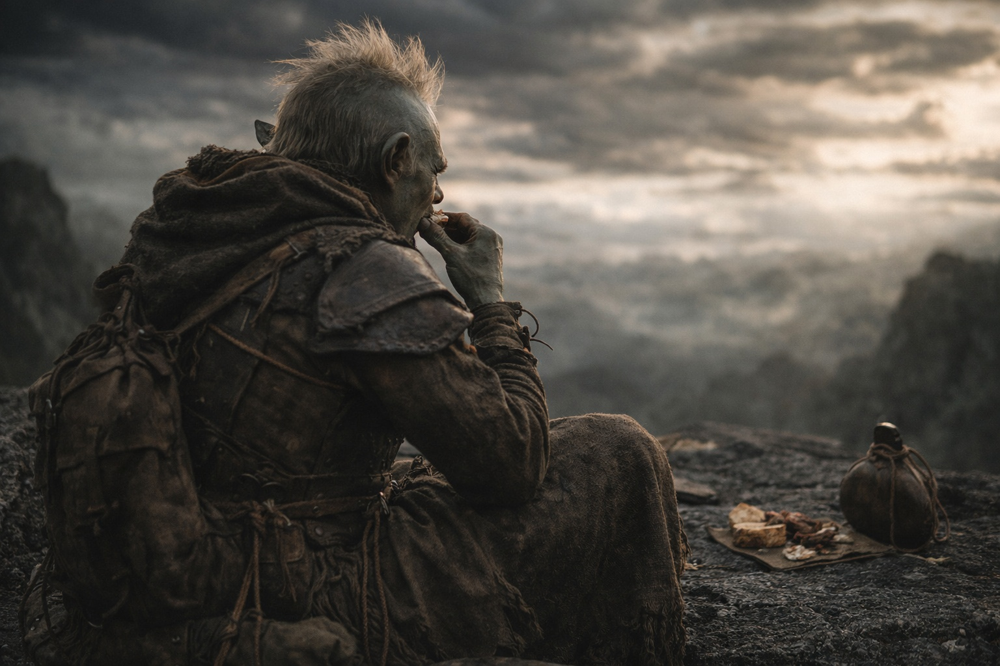
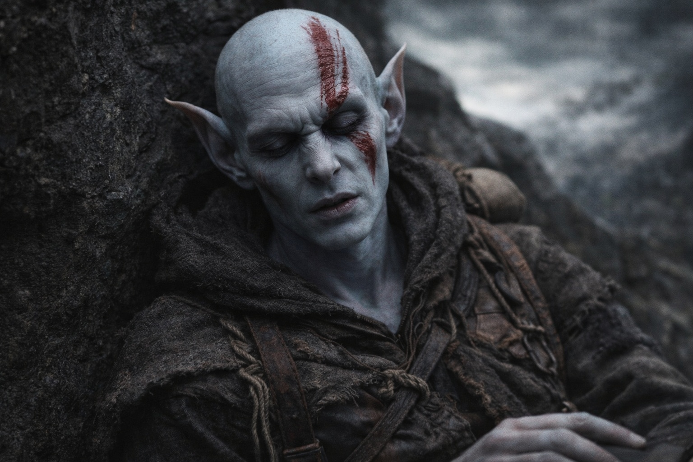
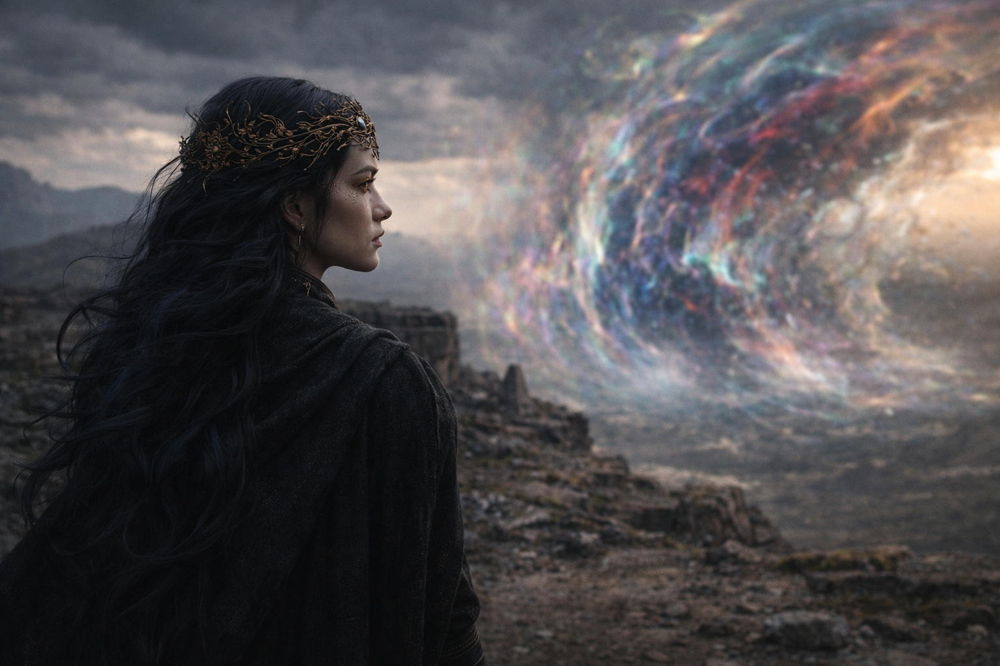

# Chapter 39.1 | Duty Without Delay: The Morning

---

He knew before he opened his eyes.

The knowing was not thought. It was bone. It was the particular certainty that arrives when the body has finished calibrating for something the mind hasn't agreed to yet, the way a person knows they're sick before the symptoms declare themselves, the way a sailor knows the weather will turn before the sky changes. Drusniel lay on the dark stone with his pack under his head and the Null against his hip and the four crystals humming their low steady frequency at his belt, and he knew that today was the day the way he knew his own name: without evidence, without argument, without the possibility of being wrong.

He opened his eyes. The sky was the color of a wound that hadn't decided whether to scar or open. The distortion overhead had descended during the night, the unnamed colors now close enough that he could see individual bands of light that his brain processed as visible but his vocabulary refused to categorize. The air had a weight to it, a pressure that his adapted lungs handled and his unadapted mind registered as the atmospheric equivalent of being watched.

Srietz had made breakfast.

Two portions. One for Drusniel. One for himself. The goblin was sitting six paces away with his back to the group, eating with the mechanical efficiency of someone who was treating food as fuel rather than experience. He didn't turn when Drusniel sat up. Didn't speak. Didn't offer the running commentary that usually accompanied every meal, every moment, every breath Srietz took in the vicinity of other people. The goblin who narrated the world in third person, who built walls of words between himself and every feeling that threatened to be direct, was eating breakfast in silence.

He set the second portion in front of Drusniel. Dried meat. Hard bread from the last of their supplies. Water from a skin that had frozen overnight and been thawed against his body. He placed it without a word, without looking at him, without the elaborate performance that usually accompanied everything Srietz did.

That was the goodbye.

Drusniel ate every bite. The food tasted like what it was. He chewed slowly because chewing slowly was the only thing he had control over this morning that didn't carry weight.

Elion sat against a stone twenty paces away, his eyes unfocused, his head tilted at an angle that suggested he was listening to something that no one else could hear. The Sage. Whatever intelligence lived inside the shapeshifter had been taking more of his attention for days, pulling him inward, away from the group, away from conversation, away from the physical world and into whatever interior landscape the Sage occupied. His body was present. The rest of him was somewhere else, somewhere urgent, somewhere that had nothing to do with breakfast.

Nyxara was facing the barrier.

She stood at the eastern edge of their camp, human-shaped, her gold eyes fixed on the distortion that covered the sky and reached down to touch the ground where the barrier's influence was strongest. She was not looking at Drusniel. She didn't need to. She had been facing this direction since they'd made camp, since before they'd made camp, since the march began. Her body was still in the way that very large things are still when they choose to be, the controlled immobility of something that could move mountains deciding to stand in one place.

"Today," she said. Her voice carried across the camp without effort. Not loud. Present. The way her voice always was when she was stating something that didn't require agreement.

"Yes," Drusniel said.

He didn't know how he knew. But the knowing was so deep it felt like bone. The Voice behind his sternum was quiet, had been quiet since the ledger reading, but the silence had texture now, the texture of a held breath, of a machine waiting for the final input before executing the program. The debts were counted. The mechanism was set. The only missing piece was the action, and the action was waiting for the morning, and the morning had arrived.

The barrier was visible. Not as a wall or a shimmer or a theoretical line on Xandor's maps that existed a world away. As a place where the world stopped making sense. The sky there was a color he didn't have a name for. The ground there pulsed with a rhythm that his crystals matched, the four black stones at his belt vibrating in sympathy with the barrier's heartbeat the way tuning forks vibrate when the note they're calibrated to is struck.

Drusniel looked at Srietz. The goblin was still eating, still facing away, still maintaining the silence that was louder than anything he'd ever said. His ears were flat against his skull. His hands moved with the precision of someone who was controlling every motion because the alternative was losing control of everything.

Drusniel looked at Elion. The shapeshifter's eyes were focused on nothing. His lips moved. Whatever the Sage was telling him, it was taking all of him to hear it.

Drusniel looked at Nyxara. She was facing the barrier. Waiting. Not for him. For the mechanism. For the timing that was wrong and would not become right and had to proceed anyway because the debts were real and the path was open and the morning had arrived.

He stood. His body felt the same. His mind felt the same. Everything was the same except the knowledge that today was the last day this version of himself would exist, and that knowledge settled into his chest beside the debts and the Voice's silence and the crystal adaptation that hummed its steady confirmation that he was ready, that he fit, that the system recognized him.

He put the Null in his pack. Adjusted the straps. Felt the weight against his spine the way he'd felt it for weeks, the familiar pressure of an artifact that had been calibrated for exactly this journey, carried by exactly this person, to exactly this place.

His thumb tapped against his thigh. One, two, three, four. The count that replaced the fractures. The habit that had grown in the space where the old habit died.

One, two, three, four. He walked toward Nyxara. Toward the barrier. Toward the morning that wasn't morning, under a sky that had no name.

---

**End of subchapter — continues in Chapter 39.2**
