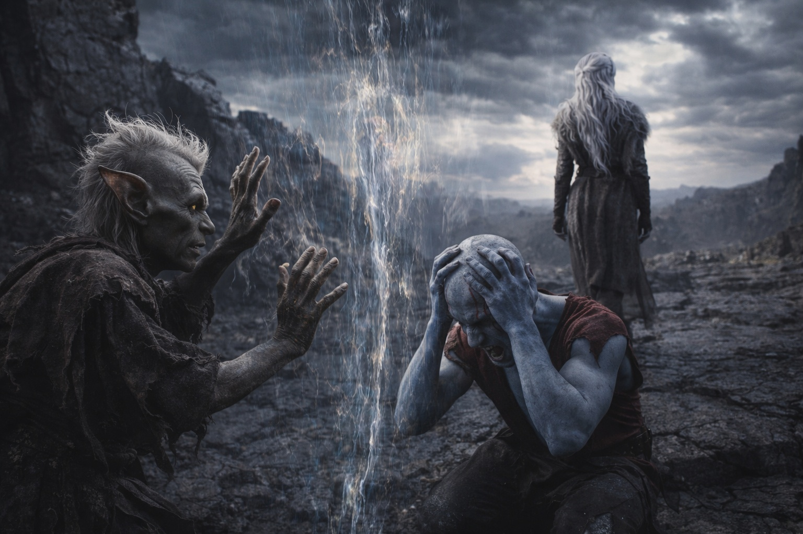
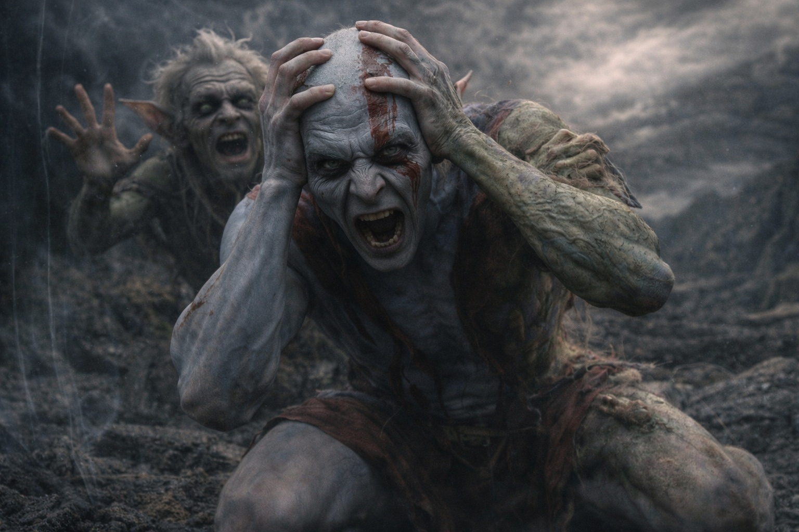
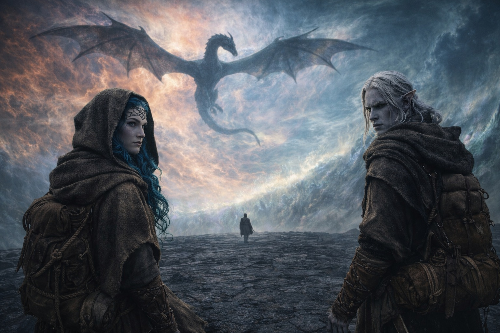

## Chapter 39 | Part 3 | The Ones Behind

---

He heard Srietz before the barrier rejected him.

The goblin's voice carried across the dark stone with a clarity that the distorted air should not have allowed, as if the barrier's influence was bending sound toward Drusniel specifically, letting him hear the consequences he was walking away from.

"DRUSNIEL!"

Not "Srietz thinks." Not "Srietz believes." Not the elaborate third-person construction that had accompanied every feeling the goblin had ever expressed in Drusniel's presence, the careful scaffolding of distance that turned emotion into observation and observation into something manageable. Just the name. Two syllables. Raw, stripped of every defense the goblin had built in the years since the numbers stopped protecting him from the world.

Drusniel's feet kept moving. The debts in his chest pulled. The barrier ahead pulsed with the rhythm his crystals matched.

"Stop. STOP."

The footsteps behind him. Running. Srietz running on short goblin legs across dark stone, closing the distance with the desperate efficiency of someone who had calculated the mathematics of this moment and found the numbers inadequate. The sound of boots on stone too small for the urgency they carried.

Drusniel heard the rejection before he heard the impact.

A sound like a membrane stretched taut being pressed from the wrong side. A vibration in the air that had density, that occupied space, that said: this far and no further. Not violent. Not angry. The barrier's influence didn't hurt. It refused. The way a locked door refuses. The way gravity refuses to let things fall upward. Simply, comprehensively, without negotiation.

Srietz hit the boundary of the barrier's rejection zone and stopped moving forward. His feet kept running for two more steps, finding purchase on nothing, his body held in place by a force that was not force but rather the absence of permission. Then he was standing. Then he was pushed. Gently. Backward. Two feet. Three. His hands out, pressing against something invisible that pressed back with the patient certainty of a physical law.

"No." Srietz's voice. Small. Then loud. "NO."

He pressed against the invisible boundary. His hands flat against the air. His huge yellow eyes locked on Drusniel's receding back. He pushed. His body was refused. He pushed again. Refused again. The barrier did not increase its resistance. It didn't need to. The first refusal was sufficient.

Elion tried.

The shapeshifter had been absent, pulled inward by the Sage, but the sound of Srietz's raw voice had dragged him back to the physical world. He ran toward the barrier's edge with the uncoordinated urgency of someone whose body and consciousness were in different places. He reached the rejection zone and the Sage inside him screamed.

Drusniel heard it. Not as sound. As resonance. The Sage screaming through the barrier's influence, the two systems colliding in Elion's skull with a frequency that dropped the shapeshifter to his knees. Elion clutched his head. His body shifted, involuntary, form rippling, the Sage and the flesh fighting over which one would control the pain response. He stayed down. The Sage won. The Sage, older and more familiar with the barrier's signature than any of them, knew what crossing would cost.

Only Drusniel could approach. His crystal-adapted blood, the investment the Voice had made, the modification that had converted his biology from incompatible to compatible. He fit here. The others did not. The adaptation was not a gift. It was a gate, and the gate opened for him alone because he alone had been built to pass through it.

"DRUSNIEL!" Srietz again. His voice cracking on the second syllable. "Come back."

Drusniel heard it. Filed it in the same place he filed everything he couldn't afford to feel right now, the same overcrowded vault where he kept the things that would destroy him if he looked at them directly. The Voice had removed the pause. There was no room for pausing.

"Srietz will find another way." The third person returning, the shield slamming back into place, but cracked, the mortar between the words visible, the construction shaking. "There has to be another way."

There was no other way. Drusniel knew it. Srietz knew it. The numbers had always said it.

Above, Nyxara circled. Dragon-shaped against the unnamed sky, wings spanning the distortion, her gold eyes watching from altitude. She was not directing. Not guiding. Not helping. She was witnessing the way a mountain witnesses a storm: present, enormous, unable to intervene in the particular cruelty of scale meeting consequence. She had pushed the timeline. She had brought him here. She was not making him walk. The Voice was making him walk. The Voice and his beliefs and the debts that were real.

Drusniel kept walking. The barrier's distortion thickened. The air gained weight. Sound stuttered, arriving in fragments, the voices behind him arriving in pieces that his brain assembled a half-second late.

"...percent," he heard. Srietz's voice. Distant. Broken by the distortion. "Ninety-seven percent mortality."

The number. The number Srietz had carried since before they met, the calculation the goblin had run on every scenario, every risk, every decision point since the beginning. Ninety-seven percent. The probability that what Drusniel was walking toward would kill him. Srietz had always known the number. He had stayed anyway. He had counted the cost and stayed and now the cost was arriving and the number was the same number it had always been and staying had not changed it.

"...crying," the distortion carried. Fragments. "...goblins..."

Drusniel didn't look back. Not because he didn't want to. Because looking back required a will he no longer had access to, a pause the Voice had removed, a space between one step and the next where choice could live. The debts pulled. The barrier waited. Behind him, a goblin pressed his hands against an invisible wall and counted a percentage that had been true since the beginning.

One, two, three, four. His thumb on his thigh. The count still his. The only thing still his.

The voices faded. The distortion swallowed them. Drusniel walked alone toward the barrier, carrying the debts and the artifact and the sound of his name spoken without protection, and the sound stayed with him after the voice that made it was gone.

---

**End of Chapter 39.3 —> 39.4: [Duty Without Delay: The Path Opens](/duty-without-delay-the-path-opens/)**