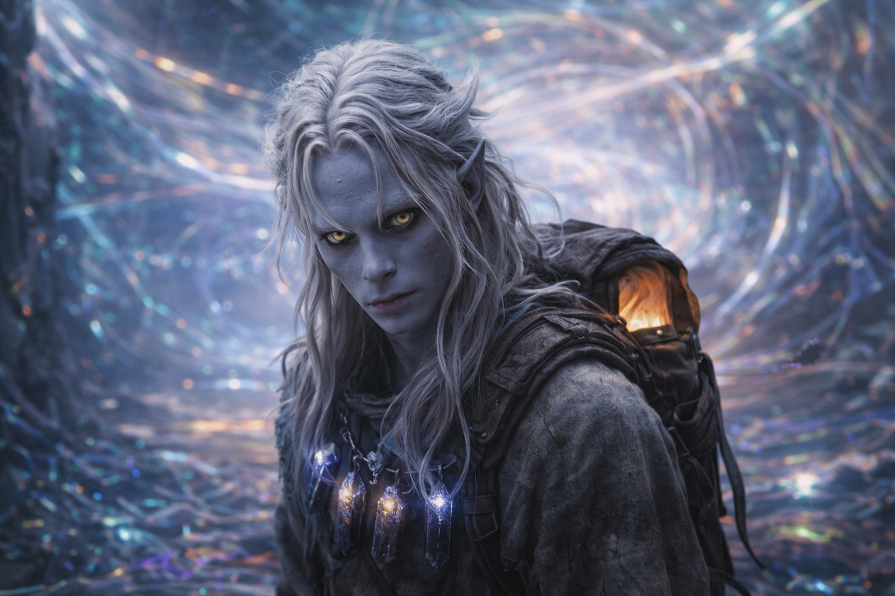
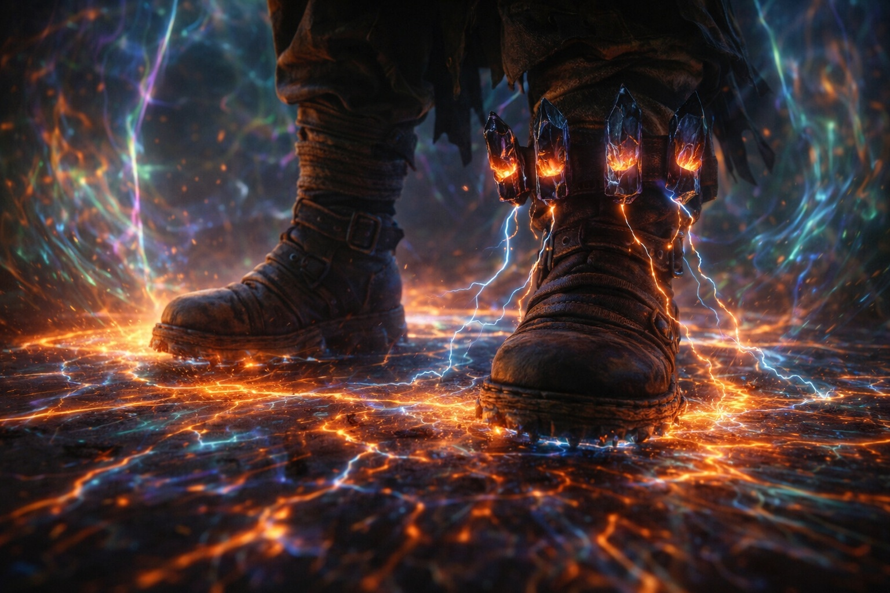
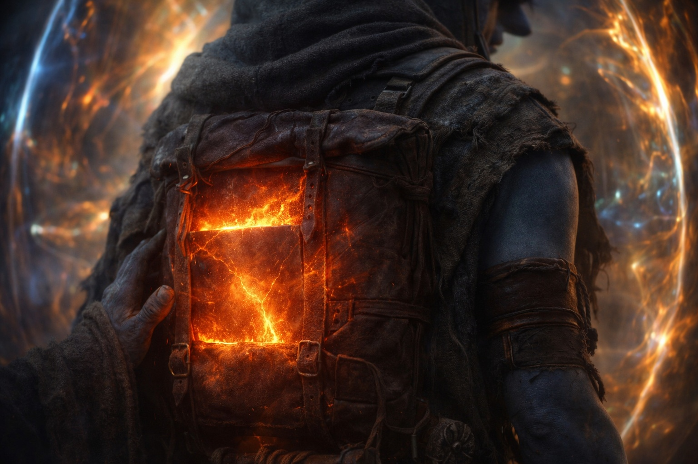
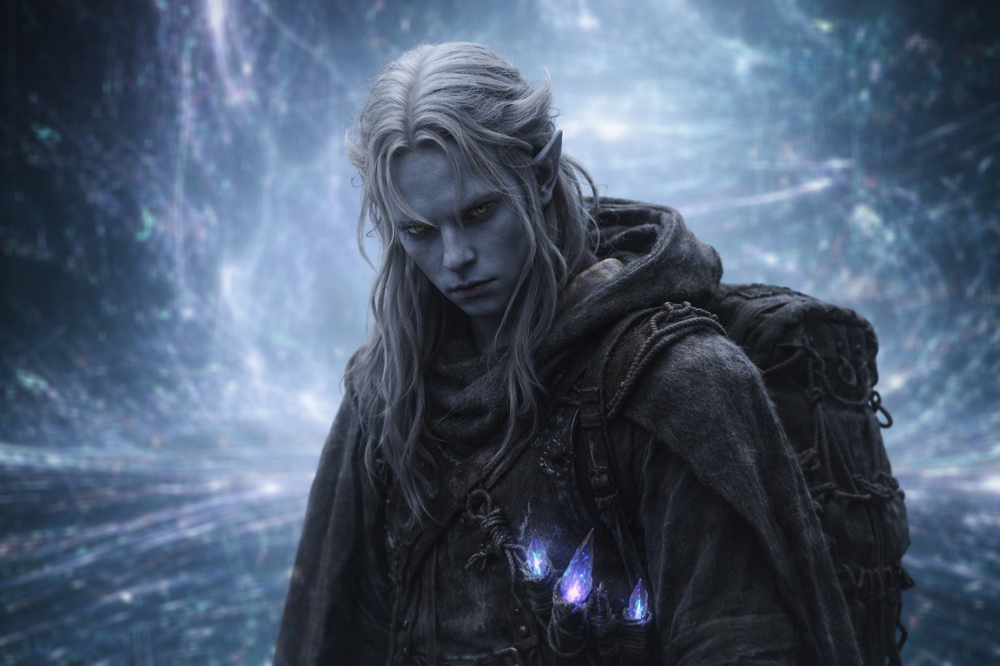

# Chapter 39.4 | Duty Without Delay: The Path Opens

---

The Voice went silent the way a conductor steps back from the stage before the orchestra begins.

Not retreat. Not withdrawal. Completion. The Voice had said what it needed to say. The debts were called. The mechanism was running. There was nothing left to execute verbally that the body was not already executing physically, and the Voice did not waste words the way the Voice did not waste anything. It contracted behind his sternum into the dense quiet of a finished instrument, present, weighted, done.

Drusniel walked in silence for the first time since the morning.

The barrier's influence zone was not what he expected. He had imagined violence: pressure, resistance, the kind of opposition that the fold had shown the west-side group. Instead, the zone received him. The air thinned and then thickened and then became something that was neither thin nor thick but rather present in a way that air usually wasn't, as if the atmosphere here had a texture that his adapted lungs could process and his unadapted mind catalogued as the respiratory equivalent of walking through velvet.

The ground pulsed. Not with the barrier's heartbeat, not as something separate from the landscape. The ground was the heartbeat. Each step landed on a surface that responded to his weight with a vibration that traveled through his boots, up his shins, into the crystals at his belt, and the crystals sang back. His four black stones and the ground having a conversation in a language that predated his involvement, the adaptation in his blood translating between systems that recognized each other the way old mechanisms recognize the components they were calibrated for.

The Null warmed against his spine. Not the steady warmth of proximity it had carried for weeks. Heat. Purpose. The Nexus component inside the artifact responding to the barrier system the way a key responds to a lock, not with intention but with shape, the geometry of the component aligning with the geometry of the mechanism it was built to interface with. The warmth spread through his pack, through his shirt, into his skin, and his adapted body processed it without flinching because his adapted body had been built to process exactly this.

Light bent. Not gradually. The light ahead of him curved like water around a stone, the photons following paths that his understanding of physics said were impossible and his eyes said were happening. Shadows fell in directions that had no corresponding light source. Colors existed here that he had seen in the distorted sky but never at ground level, bands of unnamed hue that occupied the space between things the way sound occupies the space between ears. His mind catalogued each phenomenon with the clarity of a consciousness that had decided, since it could not control the body, to document everything the body walked through.

The sky was gone. Not hidden by cloud or blocked by terrain. The sky above the barrier zone was something else. A ceiling that wasn't a ceiling. A dome of light and pressure and color that existed at a height his eyes couldn't determine because the concept of height had stopped applying. The barrier's operating space didn't have a sky. It had an interior.

Sound stuttered. His footsteps arrived at his ears a half-second after his feet struck the ground, the audio lagging behind the physical the way a translation lags behind the original. Wind, if there was wind, reached him in fragments: a gust that lasted for a quarter of a breath, then nothing, then another quarter-gust from a different direction, as if the atmosphere was being processed through something that could only handle it in pieces.

He catalogued it all. Every detail. Every distortion. Every wrong thing. Because cataloguing was the only act he had left that the debts hadn't claimed, and because somewhere behind him Srietz was counting, and if Drusniel survived this, the goblin would want numbers, and the least Drusniel could give him was an accurate inventory of the impossible.

The threshold was not visible.

It was felt. One step: the world behind him existed. He could sense the dark stone plateau, the rejection boundary, the dragon circling, the two figures watching. The world he had crossed to reach this place was real and present and separated from him by distance and distortion but still there.

Next step: it wasn't.

The separation was complete. Not gradual. Binary. He was inside the barrier's operating space. The world behind him existed in the same way that yesterday existed: as fact, as memory, as something that was true and absolutely unreachable from where he stood.

He was alone with the artifact and the silence where the Voice had been.

The Null hummed against his back. The crystals at his belt pulsed in time with the ground beneath his feet. His adapted body moved through the barrier's interior with the ease of something that belonged here, the ease that was the adaptation's final cost: he fit. He fit in the place between worlds. He fit in the mechanism that held back what should be held back and maintained what should be maintained. He fit, and fitting was not comfort, it was function, it was being the right shape for the wrong time.

He stopped walking. Not because the debts released him. Because the debts had brought him to the place they were owed, and his feet recognized the destination the way a river recognizes the sea.

Drusniel stood in the barrier's operating space. The Null against his spine. The crystals singing. The silence where the Voice had been. He looked at the interior of the barrier system and saw the mechanism that Szoravel had died trying to protect, the mechanism that the Voice had spent his entire journey preparing him to reach, the mechanism that his dual affinities and crystal adaptation and Nexus-carrying status made him uniquely qualified to activate.

At the wrong time. At the time the Voice had chosen, not the time the system required.

He named what he was losing. Not aloud. Inside, in the space the Voice had vacated, in the silence that was his now. He named it the way a dying man names his regrets: completely, without omission, without mercy.

The duty of the Drow who maintained the barrier for a thousand years. He was about to violate it. Not by failing. By acting when the timing was wrong, by being the conduit for a renewal that the system would interpret as intrusion, by triggering the defense mechanism that the ancient builders had constructed for a world where timing was controlled. He knew this. He had known it since Xandor's analysis. He had known it since the Voice first spoke. He was walking into the catastrophe with his eyes open.

Srietz's voice saying his name without distance. He was losing the world where that voice could reach him.

The breakfast placed without a word. He was losing the world where someone cared enough to feed him on the morning of the worst day.

The thumb-tap count. One, two, three, four. He was losing the version of himself that needed to count, the version that had built habits to manage fear, the version that was still a person making choices rather than a component executing function.

He named them all. Every loss. Every cost. The naming was not comfort. It was accuracy. The least he owed the things he was about to destroy was the precision of knowing their names.

"I am here," he said. Not to the Voice. Not to Nyxara. To the barrier. To the duty. To the thousand years of Drow sacrifice that had maintained this edge between worlds. "I am here, and I am too early, and I am sorry."

The barrier didn't answer. It just began.

---

**End of Chapter 39 — continues in Chapter 40.1: [The Open Path](/the-open-path-the-walk/)**
