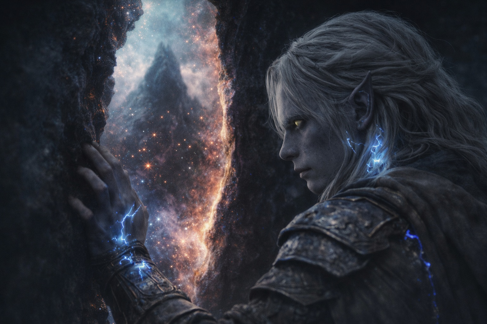

# Chapter 42.1 | The Act: Contact

---

The Null touched the interface.

Heat. Immediate. The artifact's temperature spiking from warm to incandescent as the Nexus component made contact with the barrier's maintenance port, the two systems interfacing the way a plug interfaces with a socket: precisely, mechanically, with the efficiency of components that had been manufactured for this connection. Light ran along the artifact's surface. White. Then gold. Then a color that existed outside the spectrum his eyes were calibrated for, a frequency his crystals processed as information and his optic nerve processed as pain.

The light traveled up his wrists. Through his skin. Along his arms. Following the crystal adaptation like a circuit following copper, the modification the Voice had installed becoming the conduit through which the barrier's system received the artifact's data. His veins glowed. Not metaphor. The adapted blood in his forearms became visible through his obsidian skin, lines of light tracing the path from the artifact in his hands to the crystals at his belt to the barrier's pulsing ground beneath his feet.

The system read.

Compatible bearer. Dual affinity. Crystal-adapted. Nexus-carrying. The data arrived in him not as words but as states: checkboxes closing, classifications filing, the administrative process of a mechanism receiving an expected input and verifying it against a thousand-year-old list of criteria. Each verification landed in his body as a vibration, a frequency his crystals matched, a confirmation his adapted biology processed as belonging.

Then the timing check.

The system reached for the degradation window the way a clerk reaches for a calendar. The check was not dramatic. It was bureaucratic. A process verifying a schedule. And the schedule said: not now. The window had not opened. The seasonal alignment was wrong. The degradation cycle had not reached the threshold that authorized maintenance intervention.

The verification stalled.

Drusniel felt it as a cessation. The steady flow of confirmations stopping. The system holding, recalculating, running the check again because the first result must have been an error. No authorized bearer would approach at the wrong time. The builders had not imagined this contingency as real. The system ran the timing check a second time. A third. Each check returned the same result.

Not in the window.

The reclassification was not dramatic. It was not a decision. It was a conditional statement executing: IF bearer compatible AND timing wrong THEN reclassify as threat. The logic had been written into the system's architecture a thousand years ago by builders who considered the scenario theoretical, who had not installed an override because they could not conceive of a circumstance in which the correct bearer would arrive at the wrong time carrying the correct tool with the correct intention.

The reclassification hit Drusniel the way the compatibility had hit him: as a state change. But this state did not feel like belonging. It felt like a blade inserted between his ribs and turned ninety degrees. His status in the system shifting from component to intrusion, from maintenance to threat, from the thing the mechanism served to the thing the mechanism needed to eliminate.

The barrier's defense protocol activated.

The response was opening.

The barrier didn't break. It worked. It did exactly what it had been designed to do when faced with a threat at the point of contact: it opened a gap. The logic was simple. The gap would allow what was sealed behind the barrier to address the threat directly. The sealed thing would eliminate the intruder. The gap would close. The system would reset. This was the defense mechanism. This was how it had always been designed to work.

Light ran along the artifact, up his wrists, and into the place where the interior dome met the convergence point. The gap opened. Not wide. Not dramatic. Just a seam in the world, neat as a cut, precisely located at the point where Drusniel stood with the artifact fused to the interface. The seam ran vertically, floor to dome, splitting the barrier's fabric with the surgical precision of a system executing its designed response.

Through the seam, he felt the mountain.

Through the seam, the mountain felt everything else.

---

**End of subchapter — continues in Chapter 42.2**
