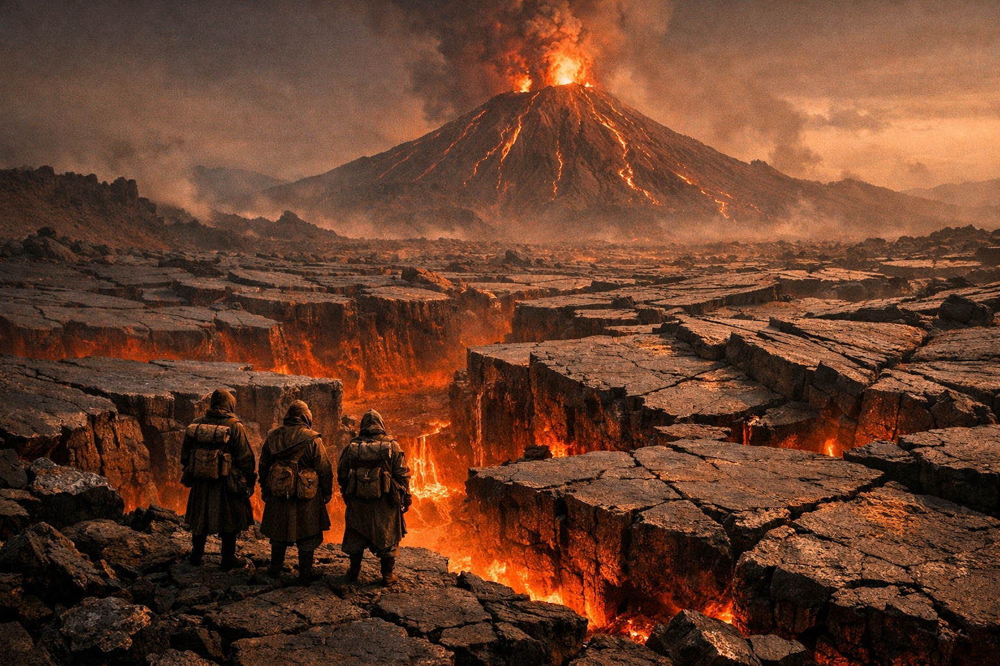
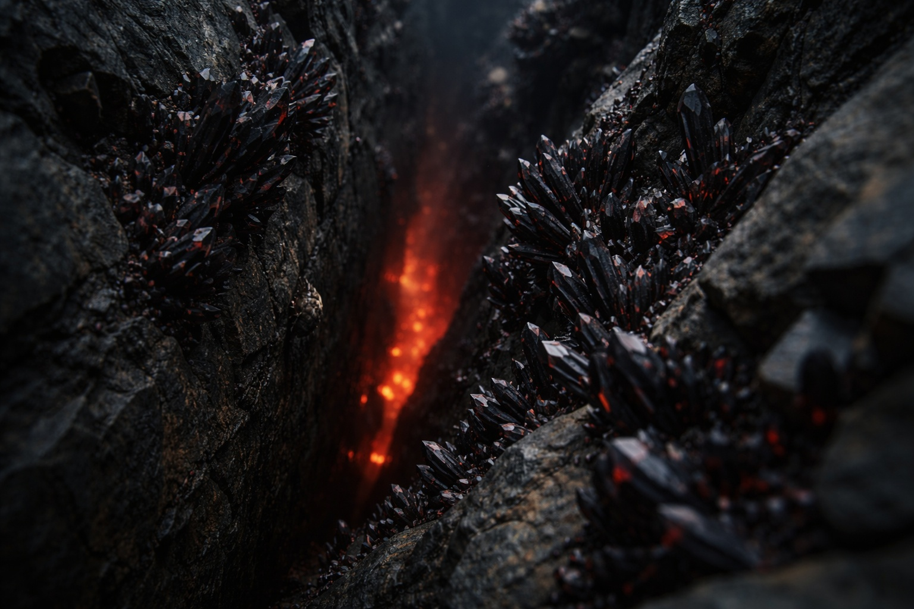
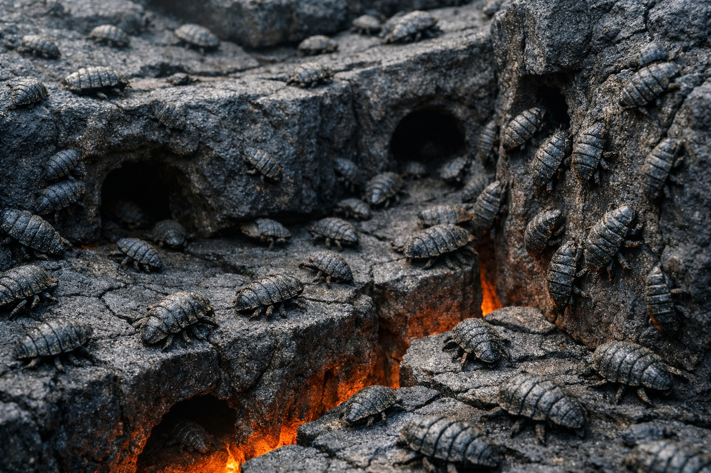

## Chapter 25 | Part 1 | Beyond the Crystal Fields

---

The crystal fields ended. What replaced them was worse.

Three days northeast of Nyxara's border, the basalt changed. The flat gray plates they'd been walking broke apart into something older, heaved and split by forces that hadn't finished working. Massive shelves of volcanic rock jutted from the ground at broken angles, some of them wider than buildings, their surfaces cracked into polygonal tiles by centuries of thermal cycling. Between the shelves, gaps dropped into darkness that pulsed with dull orange light. The heat came up from those gaps in slow waves that carried the smell of hot metal and something sharper underneath, a chemical bite that dried the throat and left a taste like licking a coin.

The central volcano dominated the horizon. It had been visible for two days as a smudge against the dark sky, a column of smoke and slow fire that never stopped moving. Now it was close enough to show detail. Lava veins tracing its flanks in branching lines. Periodic eruptions of superheated gas that lit the smoke column from within, bright enough to cast faint shadows across the plate-fields even at this distance. The summit glowed with a permanent orange haze that looked almost like dawn, if dawn were angry and had no intention of arriving.

They needed to cross the plate-fields. Szoravel was on the other side, past the volcanic zone, in territory that the eruption cycles hadn't managed to destroy. The volcano sat between them and their destination like a lock in a door they hadn't found the key for.

Drusniel stopped at the edge of the first major gap and looked down. Fifteen feet to the bottom, where the rock narrowed into a seam that glowed the dull red of cooling iron. The gap was four feet wide at the surface, narrowing as it dropped. Black crystal deposits clustered along the walls of the seam, growing from the stone in angular formations that caught the red light and held it, facets winking like buried coals.

More crystals than he'd seen in Nyxara's territory. Thicker growths, wilder, unfarmed. These hadn't been cultivated or harvested. They grew where the heat and pressure allowed, dense clusters of black mineral branching from every crack where the temperature differential was steep enough. Closer to the volcano, the deposits would be even thicker. Nyxara harvested from the edges of these fields, the safer periphery where workers could extract without dying. Here, the crystals grew unchecked.

A shape moved in the gap below.

Small, fast, armored. A Scorchshell, its ridged carapace nearly invisible against the dark stone, skittered along the vertical wall of the seam with a speed that made Drusniel's eye track half a second behind. It vanished into a hole no wider than his fist, a tunnel bored through the basalt at an angle that suggested it continued deeper.

Then another crossed the gap at surface level, darting from under one plate shelf to the shadow beneath another. A third clung to the underside of the shelf Drusniel stood on, upside down, its segmented legs gripping the stone with a mechanical certainty that had nothing to do with effort. He could see its mouthparts working, scraping mineral deposits from the rock face, feeding.

He scanned the terrain ahead. Scorchshells everywhere. Dozens visible once he knew what to look for, their dark shells blending with the basalt until motion gave them away. They flowed across the plate-fields the way water flowed downhill, finding every crack, every tunnel, every passage between the broken shelves. Some of them were the fist-sized specimens he'd first noticed during Nyxara's crossing. Others were larger, the size of his forearm, their shells scarred and thick with accumulated mineral deposits. They used the tunnel network beneath the plates as highways, appearing and disappearing through holes that riddled the basalt like worm-tracks in old wood.

*The small ones.* The thought surfaced before he could examine it. The cave writings from the tunnels, scratched fast by someone who'd survived the deep places. *Follow the small ones through the fire roads. They know the paths that cool.*

He didn't say it out loud. The connection was there, lodged in the part of his mind that collected fragments and waited for patterns to emerge, but it wasn't ready yet. The cave writings had been instructions, practical and urgent, left by someone who'd navigated volcanic terrain and lived. And here were the small ones, the creatures that knew the underground passages, that moved through the fire roads without burning.

It wasn't a plan. Not yet. It was a splinter of recognition that he turned over and set aside.

"Srietz has completed a preliminary assessment." The goblin crouched at the edge of a gap three feet to Drusniel's right, peering at the terrain ahead with the focused intensity of someone pricing damaged goods. A leather notebook lay open on his knee, filled with tight, angular marks that served as Srietz's personal shorthand. "Srietz has counted the visible plate-shelves between this position and the far side of the field. Two hundred and nineteen. Average gap width: four to seven feet. Average gap depth: ten to twenty feet. Substrate temperature at depth: sufficient to cook meat in under a minute."

He closed the notebook and tucked it into his vest.

"The direct crossing requires approximately four hours at aggressive pace, assuming no plate shifts, no eruption events, no equipment failure, and no errors in judgment. Srietz assigns a survival probability of three percent." The goblin paused. "Srietz would very much like to find another way."

"Three percent," Elion repeated. The shapeshifter stood on a raised shelf ten feet away, scanning the field with the systematic attention of someone reading a landscape for routes the way a hunter reads it for prey. His amber-orange eyes moved in slow sweeps, pausing, moving, pausing again. The red markings on his face looked darker in the volcanic light. "You're being generous."

"Srietz is rounding up."

Elion dropped from the raised shelf and landed in a crouch. He'd spent the last hour ranging ahead, covering ground in forms better suited to the terrain. His grey skin was filmed with sweat and a fine volcanic dust that gave it a reddish cast.

"No path around. East wraps into the volcano's active zone. Lava channels, fresh flows, gas vents thick enough to drop you before you smell them. West loops into broken terrain that could take weeks to navigate, and the plates get worse, not better. Wider gaps, less stable shelves, deeper drops." He straightened. "The field we're looking at is the narrowest crossing point. That's why the crystals grow thickest here. The heat differential is concentrated."

Drusniel looked at the volcano. The smoke column leaned northeast, pushed by winds they couldn't feel at ground level. Periodic tremors ran through the stone beneath his boots, barely perceptible, like standing on the chest of something breathing.

Szoravel was past that. Past the plate-fields, past the volcanic zone, in territory that the eruption cycles hadn't managed to ruin. The last known settlement of any significance before Wyrmreach's deep interior. If the information they'd gathered was accurate, if Srietz's contacts and Nyxara's oblique references pointed true, Szoravel was where Drusniel would find what he needed for the next leg of the journey.

But first, the field.

He walked the edge of the first gap for thirty feet, watching the Scorchshells. They moved in patterns that weren't random. Traffic flow. Certain tunnels drew more activity than others, certain routes across the surface were used repeatedly while parallel paths sat empty. The creatures knew which plates were stable and which weren't, which gaps led to passable tunnels and which dropped into dead ends or active vents. Generations of navigation encoded in behavior, in routes passed from one population cycle to the next.

A cluster of Scorchshells emerged from a tunnel mouth near his feet and fanned across the surface of the nearest shelf, moving fast, fanning out, then converging on a mineral deposit twenty feet away. They fed for perhaps a minute before retreating back to the tunnel mouth in the same formation, disappearing underground in a tight stream that took less than ten seconds.

The creatures had organized these routes, and the routes hadn't changed in the time he'd been watching.

The cave writings pressed against the back of his thoughts. *Follow the small ones through the fire roads. They know the paths that cool.* Whoever had scratched those words into stone hadn't been writing poetry. They'd been recording a survival strategy that someone, possibly the writer themselves, had used to cross terrain exactly like this.

The Scorchshells knew which paths didn't kill.

Drusniel stood at the edge of the plate-field with the volcano's heat against his face and the orange light throwing his shadow long behind him. Three percent survival by direct crossing. No alternative route that didn't cost weeks they couldn't spare. And beneath the broken shelves, threading through every crack and seam and tunnel, creatures that had solved the problem they were staring at.

He watched a Scorchshell vanish into the stone. Then another. Then a line of six, flowing into a tunnel mouth like dark water into a drain, gone in seconds. The cave writings turned in his mind, not a plan yet, but the shape of one, the weight of something forming just below the surface of conscious thought.

He would need to watch them longer. Map the routes they favored. Understand the logic of their navigation before he could know whether following it was survival or suicide.

"We camp here tonight," Drusniel said. "Above the field. Where we can watch."

Srietz looked at him. The goblin's ears tilted forward, the angle they took when calculation was happening behind his eyes.

"Srietz observes that Drusniel is watching the insects."

"I am."

"Srietz wonders why."

Drusniel didn't answer. He was counting tunnel entrances, mapping the ones with the heaviest traffic, watching the Scorchshells disappear into the basalt and return from different openings, tracing routes through stone he couldn't see.

The small ones knew the way.

The question was whether the way they knew could fit anything larger than a fist.

---

**End of Chapter 25.1 —> 25.2: [The Approach: The Memory](/the-approach-the-memory/)**