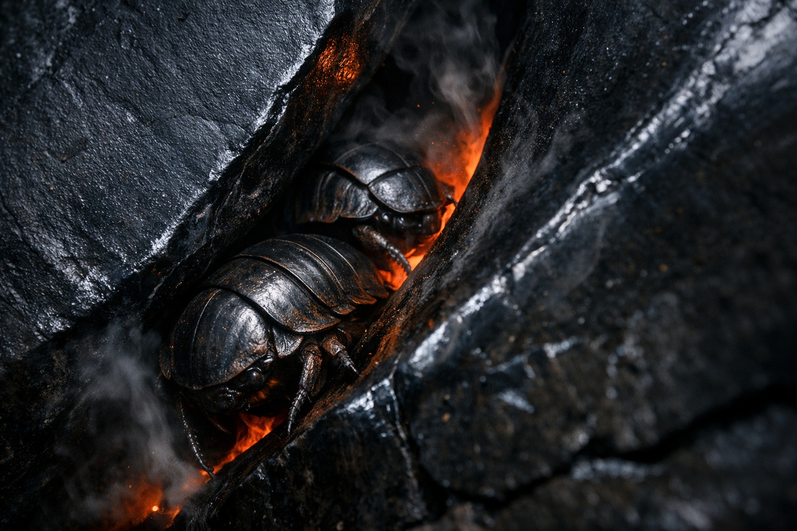

# Chapter 25.2 | The Approach: The Memory

---

He watched them for six hours before the first fragment came back.

The Scorchshells moved in loose columns across the plate-field, their blackened shells catching the dull red glow from below as they navigated fissures that would have swallowed a person whole. Drusniel lay flat on a basalt ridge two hundred yards from the nearest tunnel entrance, his chin resting on his forearms, counting. Counting shells. Counting entrances. Counting the intervals between tremors when the creatures vanished underground and the intervals after which they emerged again.

Srietz crouched beside him, lower, nearly invisible against the dark stone. Elion had positioned himself on a parallel ridge to the east, covering the approach from behind while Drusniel studied the field ahead.

The tunnel entrances were irregular. Some were gaps between tilted plates where the volcanic shelf had cracked and separated, leaving channels barely wider than a torso. Others were proper openings, worn smooth by centuries of shell-traffic, their edges polished to a black glass finish by the passage of armored bodies. Drusniel had identified nine entrances in the first two hours. By the fourth hour, he'd found fourteen. The Scorchshells used them all, but not equally. Three entrances saw heavy traffic. The rest were secondary routes, used by stragglers or lone creatures moving against the flow.

In the fifth hour, the ground shuddered.

Not the sharp crack of a plate splitting. A low, rolling pulse that traveled through the basalt like a heartbeat, deep and slow, lasting four or five seconds before fading. The Scorchshells reacted before the tremor peaked. Every creature on the surface turned toward the nearest tunnel entrance and moved, not panicked but purposeful, their segmented legs carrying them over the broken ground with the fluid certainty of animals following a routine they had performed ten thousand times. Within ninety seconds of the tremor's onset, the plate-field was empty. Every shell underground. Every entrance still.

Drusniel counted.

The silence lasted eleven minutes. Then the first Scorchshell emerged from a primary entrance, tested the air with its front legs, and began crossing the field again. Others followed. Within three minutes, the surface was populated again, the columns reforming as if nothing had happened.

"They knew," Drusniel said.

"Srietz has been observing the same pattern." The goblin's voice was barely above a whisper. "The creatures sense the tremor before it reaches full intensity. They retreat. They wait. They emerge when the cycle passes. Srietz counts an average of twelve minutes underground per event."

Drusniel watched a column of Scorchshells flow toward a secondary entrance. The creatures moved single file through a gap between two plates, each one pausing at the threshold for half a second before committing to the descent. The gap was narrow. Barely wide enough for a shell the size of two fists pressed together. Barely wide enough for one person, sideways, with their pack removed.

The fragment surfaced then. Not gradually, not as a slow recollection. It arrived whole, the way a name comes back hours after you've stopped trying to remember it.

*Follow the small ones through the fire roads. They know the paths that cool.*

He said nothing. He lay on the ridge and let the words settle into the landscape in front of him, fitting them against what he was seeing the way a key fits a lock. The small ones. The Scorchshells, moving through tunnel networks beneath volcanic plates, navigating by instinct along routes that cooled between eruption cycles. Fire roads. The tunnels themselves, carved through stone that burned and cooled and burned again.

Follow them.

The second fragment came less than a minute later, pulled forward by the first, one thread drawing another from the tangle of memory.

*Go fast when the heat turns. The stone breathes and closes. Count to forty, no more.*

Forty. He looked at the plate-field. The tremor had lasted four or five seconds. The Scorchshells had taken ninety seconds to clear the surface. Eleven minutes underground. But that was the surface cycle. The tunnels would have their own rhythm, their own windows. The stone breathes and closes. Thermal expansion in volcanic rock, the tunnels flexing with each pulse of heat from below, narrowing as the stone swelled, opening as it cooled. A window measured not in minutes but in seconds. Count to forty. Forty seconds to move through a passage before the rock closed around you.

"Srietz."

"Srietz is listening."

"The speed potion you brewed after the caves. How long does it last?"

The goblin went quiet. His ears rotated forward, which in Srietz meant the calculation had shifted from observation to personal concern. "Twelve to fifteen minutes, depending on body mass and metabolic rate. Drusniel is larger than the subjects Srietz originally calibrated for. Twelve minutes is the safe estimate."

Twelve minutes. More than enough for a forty-second sprint, with margin for the approach and exit.

"And the jump compound?"

"Clears fissures up to eight feet horizontal, four vertical, with a single dose. Srietz formulated it for exactly the gaps described in—" The goblin stopped. His yellow eyes widened. "Srietz brewed those after Drusniel found the cave writings."

"Yes."

"The writings Srietz did not read. The writings Drusniel memorized and Srietz chose not to ask about, because Srietz recommended focusing on survival first and cosmic mysteries second."

"Yes."

Drusniel reached for his pack. The vials were where he'd stored them weeks ago, wrapped in cloth between the water bladder and the crystal stabilizers from Nyxara. Two glass containers, stoppered with wax, one amber and one pale green. He'd carried them through the black garden, through Nyxara's territory, through four days of Talryn's surveillance. Carried them without knowing when they would matter. Srietz had brewed them after reading the ingredient list Drusniel provided, ingredients found in the cave system, processed without questions about their intended purpose.

He held them up. The amber liquid caught the red glow from the fissures below, turning the color of old blood.

Srietz stared at the vials the way he stared at ledgers that didn't balance. "Those are Srietz's work. Srietz remembers the formulation. But Srietz did not know what they were for."

"Neither did I. Not until now."

The third fragment completed the picture.

*Jump high where the stone breaks. The gaps swallow the slow. Do not stop. Do not look down.*

He could see it now, laid out across the plate-field like a map drawn by dead hands. The tunnel system the Scorchshells used was not random. It was a network, and the network had been navigated before, by someone who had come through this terrain and survived long enough to carve instructions into a cave wall hundreds of leagues behind them. Those instructions had not been prophecy. They had not been lore, or philosophy, or the cosmic warnings that filled the upper sections of the cave wall. They had been scratched fast, by someone in a hurry, in a lower section near the ground.

Directions. Survival notes. Written by hands that had touched this fire and lived.

Follow the Scorchshells through the tunnels. Use speed when the stone contracts. Jump where the plates have broken apart. The ancient drow who carved those words had solved this crossing the only way it could be solved: by watching the creatures that already knew the answer, by timing the volcanic cycle, by running when running was the only option.

Elion appeared on the ridge. He moved without sound, settling beside Drusniel and scanning the plate-field with the calm assessment of someone cataloging threats.

"Tunnel system," Elion said. "I counted eleven entrances from my position. The creatures go down before the tremors and come back up after."

"Fourteen entrances from here. And I know how to use them."

Elion looked at him. The shapeshifter's expression was difficult to read at the best of times. Now it carried something close to wariness.

"How long have you known?"

"I didn't. Not until now." Drusniel turned one of the vials between his fingers. "The cave writings. The ones I found while you were out scouting. The fragments I memorized."

Elion's jaw tightened. "You never mentioned them."

"There were survival instructions carved into the lower wall. Practical notes, not the cosmic fragments. Follow the small creatures. Move fast when the heat turns. Jump where the stone breaks." He gestured at the plate-field. "This is where they lead."

Elion absorbed this in silence. He watched a Scorchshell column enter a primary tunnel, each creature pausing at the threshold before descending. Then he looked at the vials in Drusniel's hand.

"Speed and jumping."

"Srietz brewed them from ingredients we found in the caves. After I described the writings."

"Srietz didn't know what they were for."

"No one did. The pieces were scattered. Cave writings. Alchemical ingredients. Creatures we'd seen but hadn't studied. It all pointed here, and none of us could see the convergence until we arrived."

Srietz had crawled closer during the exchange. The goblin's ears were flat, his fingers working against each other in the unconscious gesture he made when costs exceeded projections.

"Srietz notes a problem." He pointed at a secondary entrance where two Scorchshells squeezed through in sequence, each one tilting its shell to fit through the gap. "The tunnels narrow. The creatures compress their shells to pass through restrictions that would stop anything larger. Srietz estimates the tightest points allow passage for one person. Sideways. Without equipment."

Drusniel had already seen it. The narrow points, the squeeze sections where the tunnel width dropped to what looked like eighteen inches of clearance. One person. Not a group. Not three travelers moving together through a coordinated crossing.

A solo run.

He filed that fact alongside the others and did not say what it meant. Not yet.

Below the ridge, a figure moved across the far edge of the plate-field. Not a Scorchshell. A person, hunched under a heavy pack, picking a route along the perimeter where the fissures were shallow and the ground was mostly stable. A traveler, heading south, skirting the volcanic zone rather than crossing it.

The traveler noticed them on the ridge. Stopped. Assessed. Then altered course slightly, angling close enough for speech but not close enough for threat. A trader's approach, cautious and calculated. Srietz recognized the posture before Drusniel did.

The stranger was a half-orc, broad and wind-burned, wearing patched leathers that had seen more repairs than original stitching. She stopped thirty feet below the ridge and looked up at them with the tired eyes of someone who had been walking for days.

"Szoravel's territory starts a league north," she said without greeting. "If that's where you're headed."

"What do you know about him?" Drusniel asked.

The half-orc shifted her pack. "Depends who's asking and what they've heard." She studied them for a moment, reading the group the way travelers in Wyrmreach always read each other: quickly, thoroughly, looking for the thing that would kill them. "He helps those who reach him. That's the story. Heals the sick. Trades fairly. Keeps the peace in his territory."

"And?"

"And people who visit him come back different." Her jaw worked around the word. "Not wrong. Not damaged. Just different. Quieter. Like they left something behind and don't miss it yet." She looked at the plate-field. "You planning to cross through the tunnels?"

"We're considering it."

"Don't consider long. The cycles are getting shorter. Two days ago the gap between tremors was twenty minutes. Yesterday it was fifteen. Today it looks like twelve." She shouldered her pack. "Whatever's underneath is waking up. Or settling in. Hard to tell the difference down here."

She moved on without farewell, heading south along the perimeter, her silhouette shrinking against the gray basalt until the heat shimmer swallowed her.

Drusniel looked at the plate-field. At the Scorchshells moving in their patient columns. At the tunnel entrances, dark mouths in darker stone. At the vials in his hand, amber and green, brewed from cave ingredients by a goblin who hadn't asked why.

The ancient drow hadn't been writing prophecy. They hadn't been recording lore or philosophy or warnings for scholars to debate across centuries. They had been writing directions. Step by step, creature by creature, second by second. How to cross the fire. How to survive the stone that breathed. How to reach whatever lay on the other side.

And the directions led through fire.

Drusniel wrapped the vials in cloth and returned them to his pack. He would need them soon. The cycles were shortening. The window was closing.

One person. One run. Forty seconds.

He began counting the intervals again, fixing each number in his memory the way he'd fixed the cave writings months ago, building a map from observation the way the dead drow had built one from survival.

The Scorchshells continued their patient crossing below, unbothered by the heat, unbothered by the tremors, following paths they had always known. And somewhere in those paths, scratched into a cave wall by hands long turned to dust, the answer had been waiting for someone to arrive and finally read it in the right place.

---

*Next: The Approach: The Preparation*

**End of Chapter 25.2 — continues in Chapter 25.3: [The Approach: The Preparation](/the-approach-the-preparation/)**
