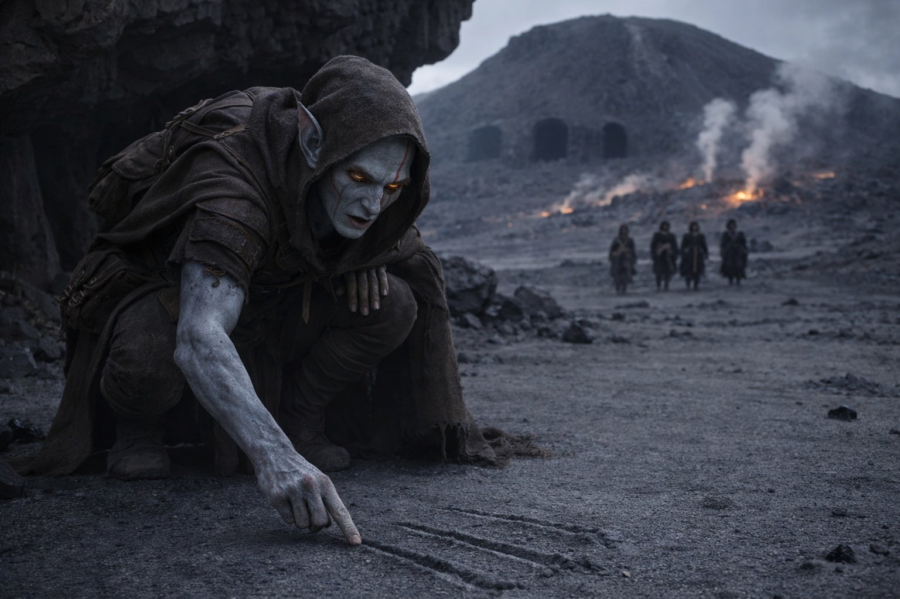
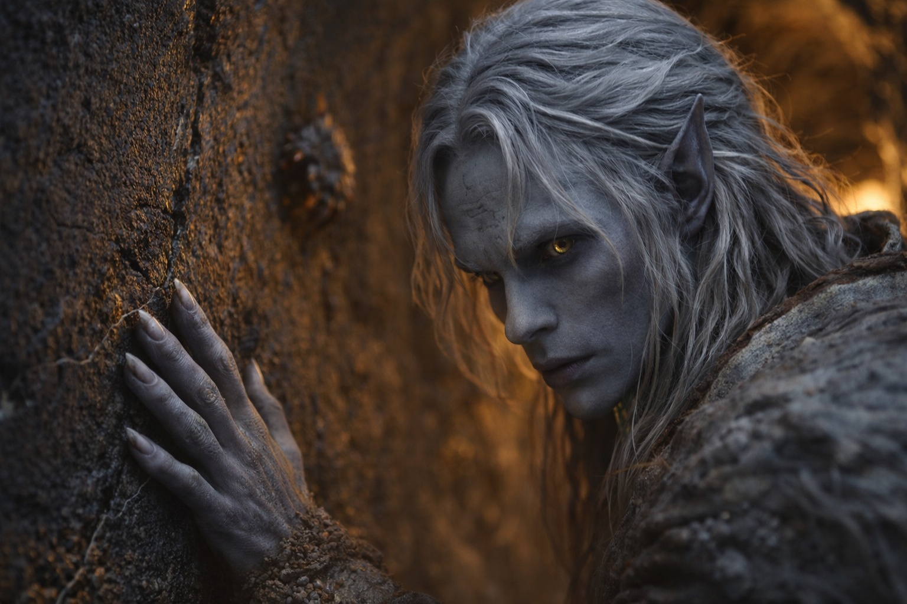
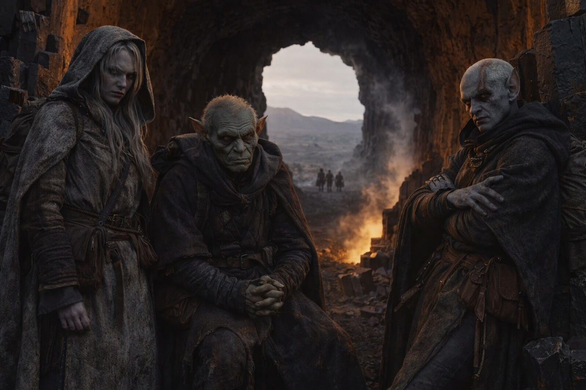
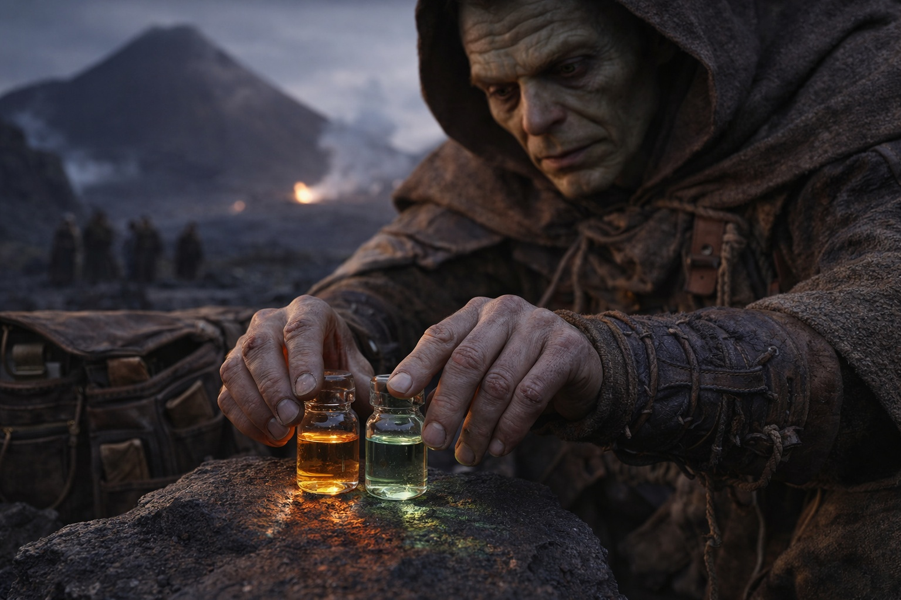
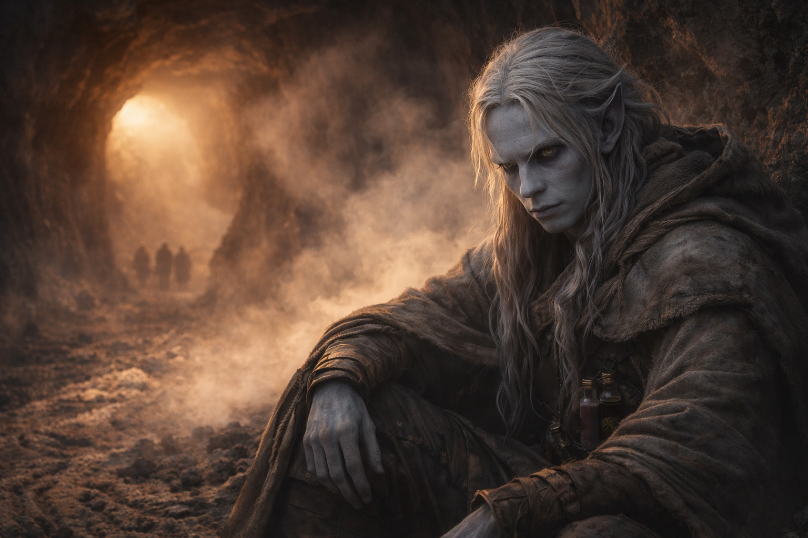

## Chapter 25 | Part 3 | The Preparation

---

Elion returned at dusk, which in Wyrmreach meant the ambient red shifted half a shade darker and the steam from the fissures caught less light. He dropped into a crouch beside the overhang where they'd made camp and drew three lines in the volcanic ash with his finger.

"Three tunnel mouths. All on the southern face, spaced roughly forty paces apart." He pointed to the leftmost line. "The Scorchshells favor this one. Steady traffic, always the same direction. In at the left, out through the center. The rightmost is cold. Nothing uses it."

"Cold meaning what?" Drusniel asked.

"No thermal activity near the entrance. No creatures. No condensation on the walls." Elion paused. "In Wyrmreach, cold usually means something killed the heat. I wouldn't go near it."

Srietz was already crouched over his pack, sorting vials by touch while he listened. His ears were forward, tracking the conversation the way they always did when data was being exchanged. "Srietz notes that the Scorchshells have survived this terrain for generations. Their route selection constitutes the closest thing to a tested path."

"Agreed." Drusniel looked past the overhang toward the open ground between their camp and the mountain's base. A quarter league of flat basalt, broken only by shallow fissures and the occasional vent plume. No walls. No ridgelines. No contained spaces.

His right hand moved before he noticed it, fingers reaching for the stone edge of the overhang. Nothing there. The overhang's lip was smooth, worn by heat and wind, and his fingertips slid across it without catching. He pulled his hand back and pressed it flat against his thigh.

The open terrain offered nothing to read. No fractures to follow, no branching lines to trace, no geometry to settle into. For a quarter league in every direction the ground was flat and featureless and his hands had nothing to do with themselves.

"I need to see the entrance," he said.

They crossed the open ground at a pace that felt wrong. Too exposed, too visible, the mountain growing in front of them like a wall being built in real time. Drusniel kept his eyes on the base where the tunnel mouths would be, and his hands hung at his sides, empty and useless.

The leftmost tunnel mouth was ten feet wide and eight feet tall, narrowing sharply after the first few yards. Basalt columns framed it like broken teeth, and the air that drifted out was warm and wet and smelled of iron and something organic he couldn't name. Mineral deposits crusted the lower walls in patterns that looked almost deliberate.

Drusniel stepped inside.

The change was immediate. Walls. Contained space. Stone pressing close from both sides, and every surface was a map. His fingers found the nearest crack before conscious thought could intervene. A hairline fracture running diagonally from shoulder height to the floor, branching once near the midpoint. He traced it with his thumb, feeling the edges, reading the depth.

Shallow. Surface stress only. The stone behind the crack was solid for at least six inches. He knew this the way he knew his own breathing, because he had been doing this since the Nightmare Sea, since that first terrible passage where the walls closed in and his mind needed something real to hold onto. Hundreds of cracks in dozens of walls across months of travel. Each one traced, cataloged, filed. An anxiety response that had mapped the structural language of Wyrmreach's stone into his hands.

He moved deeper, following the fracture lines. His fingers read the tunnel the way a blind man reads text. Here, a stress pattern radiating from a point of impact, old, the edges worn smooth. There, a fresh crack where thermal expansion had split the basalt within the last few cycles, the edges still sharp enough to cut. He pressed his palm flat and felt the faint vibration of heat moving through the rock.

"The walls are stable for the first thirty feet." He spoke without turning around. "After that, the cracks change. More thermal stress, less impact fracture. The stone is thinner."

"How thin?" Elion's voice came from the entrance, where he'd stopped. His shoulders were too wide for the narrowing passage.

"Four inches in places. Maybe less." Drusniel traced a long vertical crack that ran from ceiling to floor. The edges were parallel, clean, the kind of split that happened when rock expanded and contracted repeatedly around a heat source. "But consistent. Regular thermal cycling. The stone contracts and expands, contracts and expands. It hasn't collapsed because the pressure is predictable."

He could feel it in the walls. The mountain breathed, and the tunnels expanded and contracted with each breath, and the Scorchshells had learned the rhythm the way sailors learn tides. Enter on the exhale. Cross during the pause. Exit before the inhale.

A Scorchshell passed him in the tunnel, six inches from his boot, moving with the unhurried certainty of something that had never needed to think about where it was going. Its shell clicked against the basalt as it navigated a section where the tunnel narrowed to three feet wide. It fit. Barely.

Drusniel fit. Barely.

Srietz would not fit. Not with his pack. Elion would not fit at all.

He came back to the entrance where they were waiting. Elion leaned against the basalt column, arms folded, already knowing what Drusniel was going to say. Srietz had stopped sorting vials.

"The narrow sections are three feet at the tightest point. Maybe less further in." Drusniel looked at Elion. "You can't make it through."

"No."

"Srietz, without the pack, you might fit the first narrows. But the thermal sections after that will be too hot for sustained exposure. Your potions would burn through their duration before you reached the far side."

He would have argued a conclusion like this with anyone else. He didn't.

Srietz's ears went flat against his skull. "Srietz does not approve of the conclusion this analysis is approaching."

"Srietz's approval is not required."

The goblin stared at him. Then, with deliberate calm, he set down the vial he'd been holding and folded his hands in his lap. His ears stayed flat.

"The ancient instructions describe a solo crossing," Drusniel continued. "Whoever wrote them went alone. The Scorchshells navigate individually. The tunnel rewards small, fast, singular passage. Not groups."

"And if the tunnel shifts while you are inside." Srietz did not phrase it as a question.

"Then I deal with it or I don't."

"Srietz finds that answer inadequate."

Elion pushed off the column. He looked at the tunnel mouth, then at Drusniel, then at the flat open ground they'd crossed to get here. His amber-orange eyes caught the red light from inside the tunnel, and for a moment the markings across his face looked like cracks in his own skin.

"If you're right about the tunnels, no one else fits." His voice was flat, the tone he used when he'd already accepted something and was simply stating the terms. "What's the plan?"

Drusniel laid it out. The mountain's breathing cycle lasted roughly twenty minutes between exhales. During the pause, the tunnels stabilized, the thermal vents dropped to survivable levels, and the Scorchshells moved freely. That was his window. Enter on the pause, follow the established path, use the speed potion to cover ground during stable periods, the jump compound for fissures too wide to cross on foot. Reach the far side, assess the passage, come back with information.

"Srietz, the potions."

The goblin was already reaching for his pack, his objections filed but not retracted. He pulled out two vials and held them up, one amber, one pale green.

"The speed compound provides twelve to fifteen minutes of enhanced movement. The exact duration depends on body weight, exertion, and ambient temperature." He turned the amber vial slowly. "In a volcanic tunnel with elevated temperatures, Srietz estimates twelve minutes. Possibly eleven."

"And the jump compound?"

"Three uses per vial. Each use provides a single enhanced leap, approximately fifteen feet horizontal, eight feet vertical. Effective for ninety seconds after ingestion, then the compound must be re-dosed." He set both vials on the stone between them. "The breathing pause lasts twenty minutes. The speed compound lasts twelve. The margin is eight minutes, less if you encounter obstacles, detours, or structural changes. Less if the breathing cycle is shorter than observed."

"Thin margin," Elion said.

"Thin margins are the only kind Wyrmreach offers."

Srietz would not look at the mountain. His eyes stayed on the vials, on the stone, on his own hands arranging supplies with a precision that had nothing to do with organization and everything to do with not looking up.

"If you are not back within a day," the goblin said, "Srietz will assume failure and proceed to identify alternative routes. Srietz will not enter that tunnel."

"Good."

"Srietz was not finished." The goblin's voice was tight. "Srietz will also record the observed data and leave it at the tunnel mouth in a sealed container, so that whoever comes after will have better information than we did." He paused. "Srietz does not intend to come after. Srietz intends to be practical."

The word *practical* carried the weight of everything he wasn't saying. Drusniel heard it. He let it sit without comment, because commenting would have required acknowledging things that were better left in the space between words.

Elion said nothing. He sat down at the tunnel mouth and began checking the edges of his blade with a methodical attention that served the same purpose as Srietz's vial-sorting. Something for the hands to do while the mind worked through calculations it didn't want to finish.

The shapeshifter had been in a cage when Drusniel found him. A prisoner, a thing owned, a body kept alive for someone else's use. Drusniel had opened that cage. He'd done it for practical reasons, tactical reasons, reasons that had nothing to do with kindness and everything to do with needing a scout. But the cage had opened, and the creature inside had followed him ever since, and now that creature sat at the mouth of a tunnel he couldn't enter and sharpened a blade he couldn't use to help.

Elion didn't say what he was thinking. He didn't need to. His hands said it for him, moving across the steel with a care that had nothing to do with the weapon's edge.

Srietz sealed the last vial and set it beside the others. Elion ran his thumb along the blade's edge one more time and sheathed it. Drusniel flexed his fingers, still feeling the ghost-impressions of every fracture he'd traced inside the tunnel.

None of them said what was obvious. They'd each done the part only they could do, and now the parts were finished, and what remained was a tunnel that fit one person.

Drusniel picked up the two vials and slid them into his belt pouch. The glass was warm from Srietz's hands.

The mountain breathed, slow and vast, and the tunnel exhaled a long plume of steam that drifted past them and dissolved into the red-black air. Somewhere inside, Scorchshells navigated passages that had never been walked by anything with the capacity to be afraid.

He would enter on the next pause. Twenty minutes. Maybe less.

The margin was thin. The tunnels were narrow. The instructions were written by someone who had gone alone and never explained whether they'd come back.

He sat at the tunnel mouth and waited for the mountain to exhale.

---

**End of Chapter 25.3 —> 25.4: [The Approach: The Threshold](/the-approach-the-threshold/)**