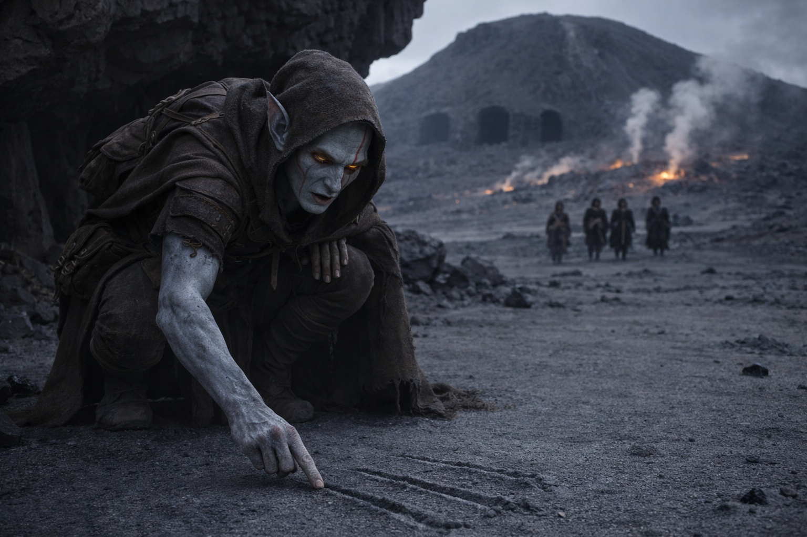
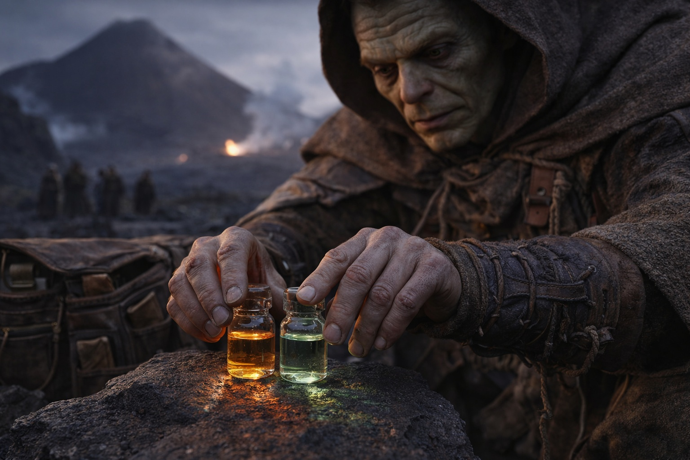

## Chapter 25 | Part 3 | The Preparation

---

Elion returned at dusk, which in Wyrmreach meant the ambient red shifted half a shade darker and the steam from the fissures caught less light. He dropped into a crouch beside the overhang where they'd made camp and drew three lines in the volcanic ash with his finger.

"Three tunnel mouths. All on the southern face, spaced roughly forty paces apart." He pointed to the leftmost line. "The Scorchshells favor this one. Steady traffic, always the same direction. In at the left, out through the center. The rightmost is cold. Nothing uses it."

"Cold meaning what?" Drusniel asked.

"No thermal activity near the entrance. No creatures. No condensation on the walls." Elion paused. "In Wyrmreach, cold usually means something killed the heat. I wouldn't go near it."

Srietz was already crouched over his pack, sorting vials by touch while he listened. His ears were forward, tracking the conversation the way they always did when data was being exchanged. "Srietz notes that the Scorchshells have survived this terrain for generations. Their route selection constitutes the closest thing to a tested path."

"Agreed." Drusniel looked past the overhang toward the open ground between their camp and the mountain's base. A quarter league of flat basalt, broken only by shallow fissures and the occasional vent plume. No walls. No ridgelines. No contained spaces.

His right hand moved before he noticed it, fingers reaching for the stone edge of the overhang. Nothing there. The overhang's lip was smooth, worn by heat and wind, and his fingertips slid across it without catching. He pulled his hand back and pressed it flat against his thigh.

The open terrain offered nothing to read. No fractures to follow, no branching lines to trace, no geometry to settle into. For a quarter league in every direction the ground was flat and featureless and his hands had nothing to do with themselves.

"I need to see the entrance," he said.

They crossed the open ground with nowhere to hide. Drusniel kept his eyes on the tunnel mouths and resisted looking back toward the overhang.

The leftmost tunnel mouth was ten feet wide and eight feet tall, narrowing sharply after the first few yards. Basalt columns framed it like broken teeth, and the air that drifted out was warm and wet and smelled of iron and something organic he couldn't name. Mineral deposits crusted the lower walls in patterns that looked almost deliberate.

Drusniel stepped inside.

The change was immediate. Walls. Contained space. Stone pressing close from both sides, and every surface was a map. His fingers found the nearest crack before conscious thought could intervene. A hairline fracture running diagonally from shoulder height to the floor, branching once near the midpoint. He traced it with his thumb, feeling the edges, reading the depth.

The crack was shallow. He had traced enough fractures since the Nightmare Sea to recognize the worn edges. This one seemed stable, though he could not know how far it ran inside the rock.

He moved deeper, following the fracture lines. His fingers read the tunnel the way a blind man reads text. Here, a stress pattern radiating from a point of impact, old, the edges worn smooth. There, a fresh crack where thermal expansion had split the basalt within the last few cycles, the edges still sharp enough to cut. He pressed his palm flat and felt the faint vibration of heat moving through the rock.

"The walls are stable for the first thirty feet." He spoke without turning around. "After that, the cracks change. More thermal stress, less impact fracture. The stone is thinner."

"How thin?" Elion's voice came from the entrance, where he'd stopped. His shoulders were too wide for the narrowing passage.

"Four inches in places. Maybe less." Drusniel traced a long vertical crack that ran from ceiling to floor. The edges were parallel, clean, the kind of split that happened when rock expanded and contracted repeatedly around a heat source. "But consistent. Regular thermal cycling. The stone contracts and expands, contracts and expands. It hasn't collapsed because the pressure is predictable."

The walls shifted with the heat. He would have to enter after the vents subsided and get out before they started again.

A Scorchshell clicked past his boot and disappeared into a narrow crack beside the passage.

Drusniel fit. Barely.

Srietz would not fit. Not with his pack. Elion would not fit at all.

He came back to the entrance where they were waiting. Elion leaned against the basalt column, arms folded, already knowing what Drusniel was going to say. Srietz had stopped sorting vials.

"I had to turn sideways at the tightest point. It may narrow further in." Drusniel looked at Elion. "You can't make it through."

"Not in this shape. And after today, I couldn't hold another through the crossing."

"Srietz, without the pack, you might fit the first narrows. But the thermal sections after that will be too hot for sustained exposure. Your potions would burn through their duration before you reached the far side."

He would have argued a conclusion like this with anyone else. He didn't.

Srietz's ears went flat against his skull. "Srietz does not approve of the conclusion this analysis is approaching."

"Srietz's approval is not required."

The goblin stared at him. Then, with deliberate calm, he set down the vial he'd been holding and folded his hands in his lap. His ears stayed flat.

"I'll scout it alone," Drusniel said. "If I have to turn back in the narrows, I need the passage clear behind me."

"And if the tunnel shifts while you are inside." Srietz did not phrase it as a question.

"Then I deal with it or I don't."

"Srietz finds that answer inadequate."

Elion pushed off the column. He looked at the tunnel mouth, then at Drusniel, then at the flat open ground they'd crossed to get here. His amber-orange eyes caught the red light from inside the tunnel, and for a moment the markings across his face looked like cracks in his own skin.

"If you're right about the tunnels, no one else fits." His voice was flat, the tone he used when he'd already accepted something and was simply stating the terms. "What's the plan?"

Drusniel explained the plan. They would time more cycles before he entered. He would follow the Scorchshells during a lull, use the speed potion to cross the hot sections and the jump compound for wide fissures. Then he would return with a route for the others, if he could find one.

"Srietz, the potions."

The goblin was already reaching for his pack, his objections filed but not retracted. He pulled out two vials and held them up, one amber, one pale green.

"The speed compound provides twelve to fifteen minutes of enhanced movement. The exact duration depends on body weight, exertion, and ambient temperature." He turned the amber vial slowly. "In a volcanic tunnel with elevated temperatures, Srietz estimates twelve minutes. Possibly eleven."

"And the jump compound?"

"Three doses. Each gives one jump, up to eight feet across or four feet up. Use it within ninety seconds." Srietz set the vials down. "Do not count on twenty minutes of cool stone. The trader said the pauses are shrinking. Srietz wants another measurement."

"Thin margin," Elion said.

"Thin margins are the only kind Wyrmreach offers."

Srietz would not look at the mountain. His eyes stayed on the vials, on the stone, on his own hands arranging supplies with a precision that had nothing to do with organization and everything to do with not looking up.

"If you are not back within a day," the goblin said, "Srietz will assume failure and proceed to identify alternative routes. Srietz will not enter that tunnel."

"Good."

"Srietz was not finished." The goblin's voice was tight. "Srietz will also record the observed data and leave it at the tunnel mouth in a sealed container, so that whoever comes after will have better information than we did." He paused. "Srietz does not intend to come after. Srietz intends to be practical."

Drusniel waited, but Srietz had finished.

Elion sat at the tunnel mouth and checked his blade. He ran his thumb along the same part of the edge twice.

Drusniel remembered opening Elion's cage. Now the shapeshifter was free to leave, and still he sat beside the tunnel.

Drusniel looked away before Elion caught him watching.

Srietz sealed the last vial and set it beside the others. Elion ran his thumb along the blade's edge one more time and sheathed it. Drusniel flexed his fingers, still feeling the ghost-impressions of every fracture he'd traced inside the tunnel.

None of them said what was obvious. They'd each done the part only they could do, and now the parts were finished, and what remained was a tunnel that fit one person.

Drusniel picked up the two vials and slid them into his belt pouch. The glass was warm from Srietz's hands.

Steam poured from the tunnel. Drusniel stepped aside and watched it pass.

He would enter once they had checked the timing.

For now, he waited with them.

He sat at the tunnel mouth and waited for the mountain to exhale.

---

**End of Chapter 25.3 —> 25.4: [The Approach: The Threshold](/the-approach-the-threshold/)**
