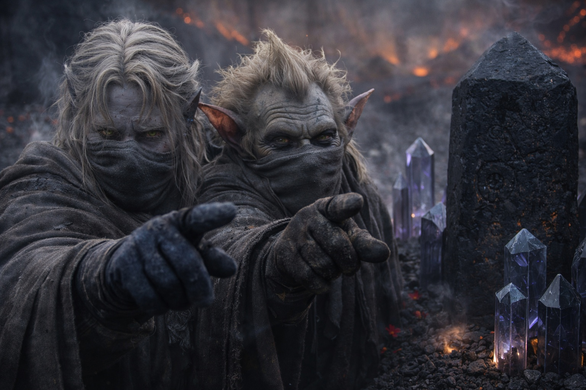

## Chapter 21 | Part 1

--- 

The air tasted wrong.

Not sulfur anymore. The volcanic stink had faded behind them within the first hour of descent, replaced by something sweeter, cloying, chemical. It coated the back of Drusniel's throat like syrup and made his eyes water. Beside him, Srietz had pulled his scarf over his nose and was breathing in shallow, counted intervals.

"Toxin levels are elevated," the goblin said. "Not immediately lethal. Cumulative exposure risk increases after forty-eight hours."

"Then we have forty-eight hours to get through."

"Srietz would prefer twelve."

Black crystals grew in clusters along the path, then in rows that stretched across the valley. Their facets reflected the volcanic light in faint violet patches. Red flowers grew between them, and steam rose from cracks in the soil. Drusniel heard no birds or insects, only the crystals humming.

Drusniel counted the territorial markers. Srietz had taught him the signs during their last night above the contested lands, scratching diagrams in the dirt with a stick: three factions, three systems of claim. Claw marks on stones meant Vorthrak. Burned circles meant Sytherix. And black crystals, cultivated in deliberate geometric arrays, arranged along borders like obsidian fences, meant Nyxara.

They were walking through Nyxara's territory.

"Fastest route to Szoravel passes through her lands," Srietz had warned. "Not the safest. The safest route adds three weeks. Through the volcanic shelf. Srietz calculated the supply cost. We would starve at day eleven."

So Nyxara's lands it was.

Elion walked point, moving with the fluid economy of someone who'd spent decades navigating danger. He'd recovered enough from his last transformation to keep pace, though Drusniel noticed he still favored his left leg. The shapeshifter paused every hundred paces, tilting his head, reading the landscape with senses that went beyond sight.

"We're being watched," Elion said.

Not a warning. A statement.

"Since when?"

"Since the ridge. Maybe before. They're keeping distance." He pointed at a formation of dark stone to the east, then at a cluster of crystals that grew taller than the rest, arranged in a precise arc oriented not toward the volcanic glow but toward the path. "Lookout positions. The crystal arrays are tuned to detect movement."

The hum changed as they walked. Drusniel stopped for a moment, listening, then hurried to catch up.

"Nyxara's people?" he asked.

Srietz made a noise. "Nyxara's *everything*. The lord of this territory does not distinguish between servants and landscape. Everything here serves. The soil, the crystals, the air. We breathe her territory. She knows we are here."

The path narrowed between walls of black stone. Drusniel's fingers twitched against his thigh, his thumb tapping an unconscious rhythm against his index finger. He forced it to stop. Forced his hands to hang loose at his sides. The old grounding impulse, the stone-tracing, rose up and he looked for cracks in the rock walls. Found two. Followed them for three paces before losing the thread.

Focus.

"How far to the border with neutral territory?" he asked.

"Neutral is a generous word," Srietz replied. "No territory in the contested lands is truly neutral. But the gap between Nyxara's control and the next lord's claim is approximately four days of travel at our current pace."

"And beyond that?"

"Szoravel's influence. Not territory. Influence. The mage holds no land. He occupies a position between claims that no one wants badly enough to fight for." Srietz paused. "Or that everyone is afraid to approach."

The path opened onto a plateau and Drusniel stopped.

Black crystals filled the valley below, planted in straight rows from slope to slope. These stood waist-high and gave off enough violet light to show the paths between them.

He searched the rows for movement.

"Srietz objects," the goblin said.

"I know."

"Srietz wishes the objection recorded."

"Recorded."

Elion crouched at the plateau's edge. "One path through the valley. See it? The gap in the crystals. It's maintained. Someone keeps that path clear."

Drusniel saw it. A narrow corridor of bare earth running through the center of the crystal field, ruler-straight, wide enough for three people walking abreast. An invitation. Or a funnel.

"Do we have a choice?"

"Around the valley adds a day and a half and takes us through Vorthrak's territory," Srietz said. "Srietz's analysis of Vorthrak suggests immediate hostility without the pretense of negotiation."

"So through the crystals."

"Through the crystals."

The metallic taste grew stronger as they descended. Crystals crowded both sides of the path. Their hum deepened, and Drusniel thought he saw the nearest spires tilt toward them.

He didn't look back. Whatever was watching from the ridge could wait.

The path led them deeper into the garden.

---

**End of Chapter 21.1 —> 21.2: [The Black Garden: The Observers](/the-black-garden-the-observers/)**
