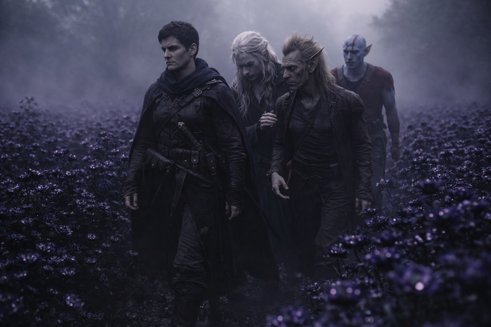
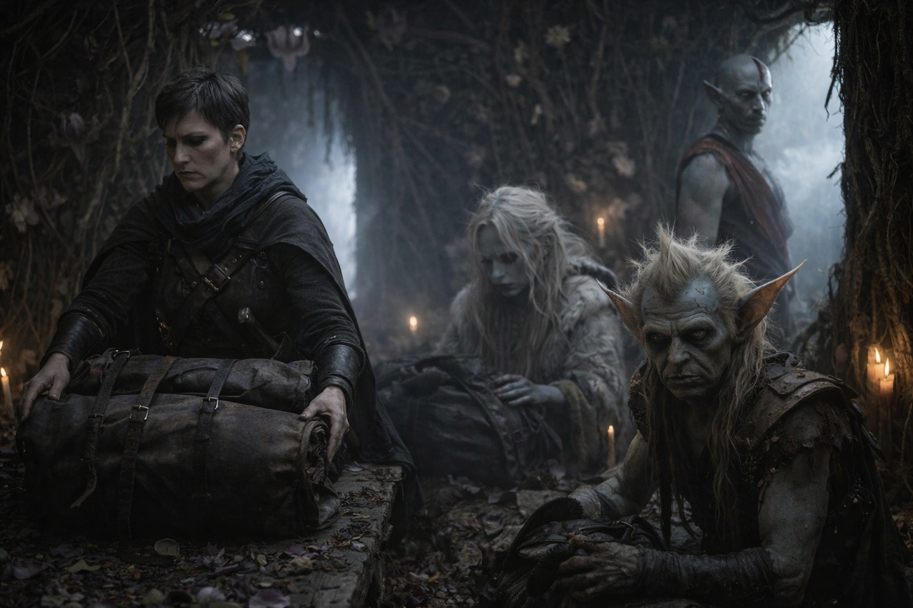
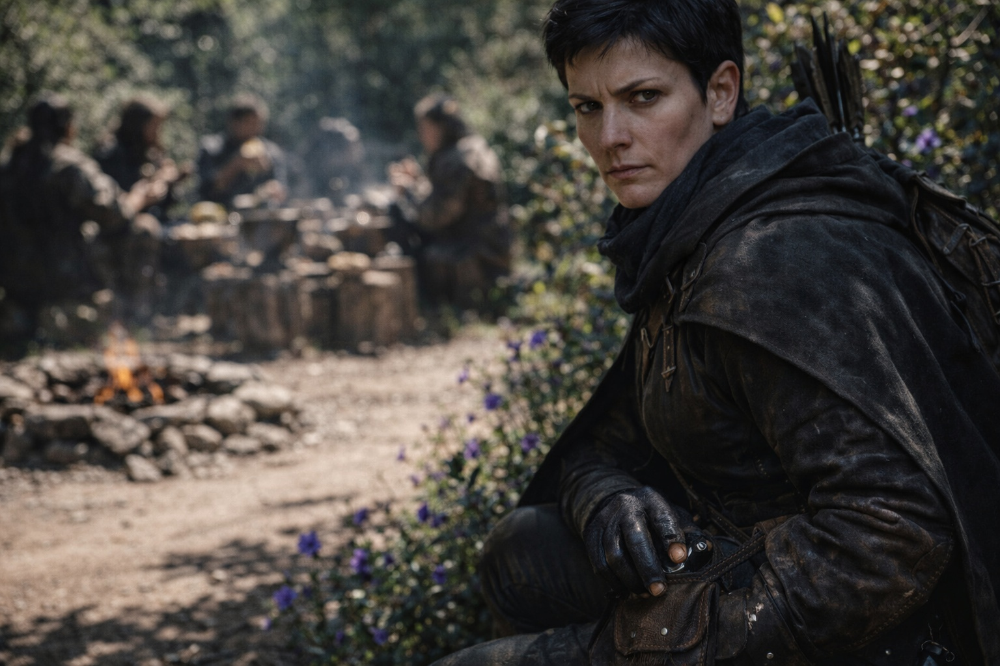

## Chapter 21 | Part 5 | The Terms

--- 

The guide arrived with the dawn.

Drusniel had spent the night listening to the flowers outside. Srietz slept for twenty minutes at a time, getting up between naps to check the entrance.

Elion hadn't slept either. He sat against the wall with his eyes open, watching the entrance, his body perfectly still in a way that no longer seemed human.

The guide was a drow.

Drusniel had not expected to meet another of his people here. She was tall and lean, wearing the same earth-colored armor as Nyxara's scouts but with a bearing that said officer rather than soldier. She stood in the entrance and surveyed them with violet eyes that held professional interest and nothing else.

"I am Talryn," she said. "Lady Nyxara has assigned me to your group for the duration of your passage."

"Assigned," Drusniel repeated.

"Assigned. I will guide you through Lady Nyxara's territory, ensure your safety on the approved route, and facilitate supply stops at designated points." Her voice was clipped, efficient. "I will also observe and report."

"Report what?"

"Everything." She said it without hesitation or apology. "Lady Nyxara values information. You are an investment. Investments are monitored."

Srietz made a noise that in another context might have been a laugh. "Srietz appreciates the candor."

"Lady Nyxara prefers transparency in the terms of service. Deception is reserved for enemies." Talryn stepped inside and set a pack on the floor. "Supplies. Three days' worth. Replenished at each checkpoint. The route to the territorial border takes approximately four days at standard pace."

They packed and followed Talryn out. The chemical smell was stronger in the morning. She took a narrow path between the flower rows without stopping to check the way.

Drusniel walked beside Srietz. Talryn led. Elion brought up the rear, his attention split between the path behind them and the guide ahead.

"Talk to me," Drusniel said to Srietz, keeping his voice low.

"About?"

"Nyxara. Who is she? What is she?"

Srietz's ears twitched. He was quiet for a long time, longer than Drusniel had ever seen the goblin take before speaking.

"A lord of the contested lands," he said finally. "One of three. The strongest, by Srietz's calculation, though not the most aggressive. Vorthrak fights for territory and Sytherix schemes for it. Nyxara *grows* hers." He gestured at the flowers. "These are not decoration. They are product. Alchemical base. Mind-affecting compounds. Compliance agents. She doesn't sell soldiers or weapons. She sells influence. Control. The ability to make people agree with things they would otherwise resist."

Drusniel moved away from the flowers at the edge of the path.

"She sells poisons."

"Srietz prefers the term 'applied alchemy.' But yes. The flowers are the foundation of an economic empire. Every lord, every faction, every minor ruler in Wyrmreach who needs to convince, control, or pacify comes to Nyxara." A pause. "She does not need armies. Her customers are armies."

They walked in silence for a while. The flowers pressed close on either side of the path, petals tracking their progress, and Drusniel tried not to think about what those petals contained.

At midday, Talryn stopped at a clearing with a fire pit, stacked supplies and water. She handed out rations, then took a position where she could watch the approach.

Drusniel found Srietz sitting apart, staring at his hands.

"What lives in the gaps?" Drusniel asked. "Between the territories. Nyxara said to ask you."

"Things that were pushed out." Srietz didn't look up. "When three lords divide territory, the division is not clean. The creatures, the magics, the *things* that don't serve any lord are forced into the borders between. They accumulate. They evolve. They become something that doesn't fit any lord's control, which is why no lord claims the gaps."

"How bad?"

"Srietz spent three days in the gap once. Srietz lost two toes, a business partner, and all desire to return." The goblin finally looked at him. "Nyxara's protection is real. Her territory is safe because she controls it absolutely. The gap is dangerous because no one controls it at all."

Elion approached from the far side of the clearing. He'd been walking the perimeter, not pacing, not nervous. Cataloging.

"The guide reports everything," Elion said quietly. "She's already sent a signal. Small device, hidden in her belt pouch. Pressed it twice during the morning march."

"Nyxara said she'd observe."

"Observation and reporting are different scales." Elion sat beside him. "She's not just watching. She's documenting."

"Can you blame her?"

"No. But we should talk carefully while she's near." He paused. "And you should know: Nyxara referenced Szoravel like she knows him. Not as a rumor. As someone she has dealings with."

Drusniel turned that over. Nyxara and Szoravel. The lord of the black garden and the mage who sits between the cracks. Connected.

"She collects things," Srietz said from beside them, so quietly it was almost lost to the rustle of flowers. "People are things."

On the path ahead, Talryn stood and shouldered her pack. It was time to move.

Drusniel shouldered his pack. He would have to keep his magic to himself until they reached the border. Talryn was already watching him.

The flowers watched them go. They always watched.

---

**End of Chapter 21.5 —> 22.1: [The Fracture: The Pressure](/the-fracture-the-pressure/)**
