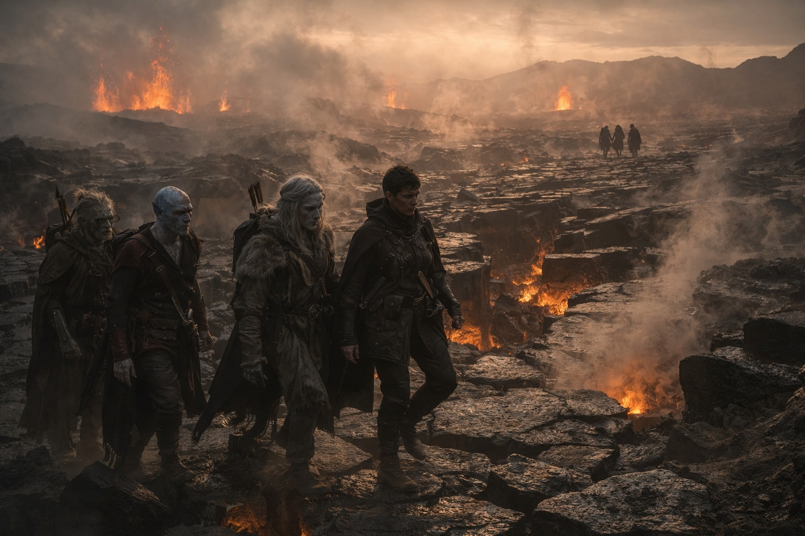
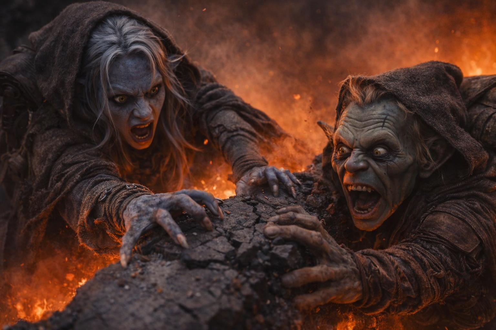
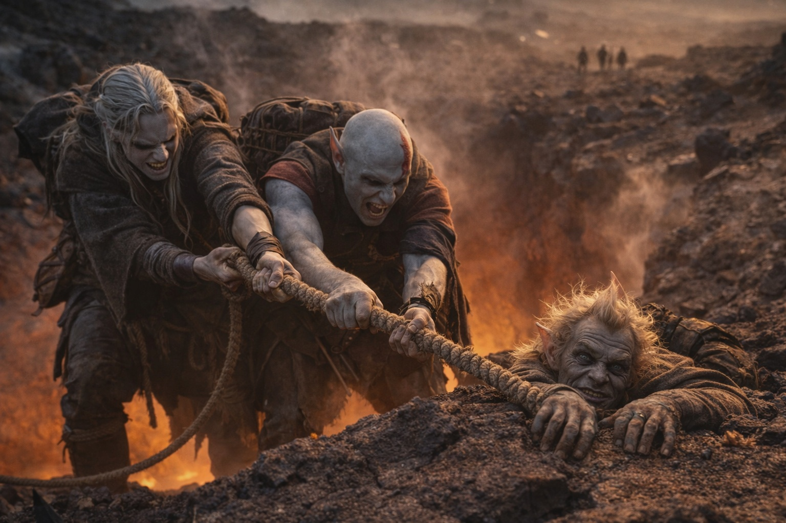
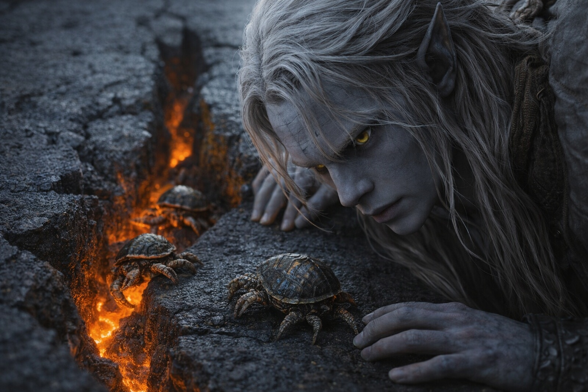

## Chapter 23 | Part 2 | The Difficult Crossing

--- 

The terrain broke on the third morning.

Tilted basalt shelves blocked the route. Some were as wide as market stalls; others barely had room for a person to stand. Steam rose from the red-lit gaps between them, carrying the smell of sulfur and hot iron.

Talryn stopped at the edge and studied the field without expression. After a moment, she pointed left, tracing a line through the broken plates that only she could see.

"Single file. Step where I step."

Srietz peered over the edge of the nearest gap. The glow from below lit his face orange. "Srietz notes that the recommended path crosses approximately thirty separate plates, any of which could shift under weight." He pulled back. "Srietz also notes that there is no alternative route."

"There is not," Talryn confirmed.

They started across.

The first ten plates were stable. Wide shelves with solid footing, gaps narrow enough to step over without commitment. Drusniel counted the crossings automatically, his fingers brushing the basalt surface when he crouched to test stability. The stone was warm to the touch, not dangerously so, but warm in a way that reminded him the ground here was alive.

At the twelfth plate, he noticed the creatures.

Small things, no larger than his fist, clinging to the vertical faces of the basalt where the gaps dropped away. Armored shells that caught the red light from below, segmented legs gripping the rock with a precision that bordered on obscene. They looked like someone had crossed a crab with a tortoise and then decided the result needed more edges. Their shells were ridged, blackened, flecked with mineral deposits that matched the stone so perfectly they were nearly invisible until they moved.

One of them traversed the gap between two plates while Drusniel watched. It released its grip on one face, dropped six inches, caught the opposite wall with its front legs, and pulled itself across in a single fluid motion. No hesitation. No calculation. It knew the gap the way a spider knows its web.

"Scorchshells," Srietz said from behind him. The goblin had noticed them too. "Srietz has seen them in the deeper volcanic regions. They navigate thermal vents, lava seams, active fissures. Their shells insulate against heat that would cook anything else." A pause. "Srietz would very much like to study one."

"Later."

They kept moving. Plate thirteen, fourteen, fifteen. The gaps widened. Talryn crossed them with long strides, finding purchase on edges that crumbled under Drusniel's boots when he followed. He adjusted, stepping where the stone looked thickest, reading the fracture patterns the way he'd read spell matrices at the academy. Structure, stress points, likely failure modes.

At plate nineteen, the ground moved.

Not a tremor. A shift. The entire shelf tilted two degrees to the right with a grinding sound that Drusniel felt in his teeth. He dropped low, hands flat against the stone, and felt the plate settle into its new angle with a bass vibration that traveled up through his wrists and into his chest.

"Move," Talryn said. Her voice was the same flat tone. She was already on the next plate.

They moved together, Elion scrambling from the rear.

Plate twenty shifted as Elion's weight left it.

Plate twenty-one held. Twenty-two held. Twenty-three groaned but stayed level. They were past the midpoint now, the far edge of the broken field visible through the heat shimmer. Drusniel let himself breathe.

Plate twenty-four split in half.

The crack ran from edge to edge, fast and loud, a sound like a tree trunk snapping. Drusniel was already on twenty-five when it happened. Srietz was not.

Srietz dropped with the broken half. His pack caught on the remaining edge, leaving his legs swinging above the red glow. He let out a strangled grunt and clawed at the stone.

Drusniel reached.

Not with his hands. His hands were too far. He reached with his mind, with the trained reflex of a mage who had spent years calling power the way other people called breath. He reached for the Voice.

The silence that answered was absolute.

Nothing answered. For an instant he waited, while Srietz hung from the broken plate.

Elion caught Srietz.

The shapeshifter had been behind the goblin and below him, already on the tipped portion of the plate, one hand gripping a fracture line in the basalt. His other hand closed around Srietz's wrist with the grip of someone who understood, in his body rather than his mind, what falling meant.

Drusniel snapped back. He dropped flat on plate twenty-five, extended his arm, and grabbed the goblin's pack strap. Between them, he and Elion hauled Srietz up and across to solid ground. The broken plate slid into the chasm behind them with a sound that took too long to fade.

They lay on the basalt, breathing hard. Srietz clutched his pack with both hands and stared at the gap where plate twenty-four had been.

"Srietz requests a moment," the goblin said.

They took several. Talryn waited on the far side, watching them with an expression caught between concern and calculation. Impossible to tell.

Drusniel sat with his back against a ridge of cooled lava and pressed his fingers into a crack in the stone beside him. He traced its path along the surface, letting the geometry settle his breathing. A long crack, forking twice, ending at a chip where something had struck the basalt years ago.

The crack was real. The stone was real, and so was the heat pressing against his back.

The Voice had not come.

It had never answered a call. Both times it had spoken without invitation.

But he had reached for it.

Not consciously. Not deliberately. The way you reach for a railing when you stumble, the way you flinch before a blow lands. Reflex. A trained response so deep it bypassed thought and went straight to action. When crisis hit, his first instinct had not been magic, had not been his own hands, had not been to call for help from the people standing beside him.

His first instinct had been the Voice.

A Scorchshell crossed the broken edge, finding holds in the freshly exposed stone. Three more followed it.

Drusniel looked down at his own hands.

Drusniel watched them until Talryn signaled the group to move. He stood, checked his footing, and crossed the remaining plates in silence.

He did not reach for anything.

At the next gap, he reached for solid stone before stepping across. He still remembered the instant he had waited for the Voice while Srietz fell.

Next time, that hesitation could kill one of them.

---

**End of Chapter 23.2 —> 23.3: [The Debt Anticipated: The Conversation](/the-debt-anticipated-the-conversation/)**
