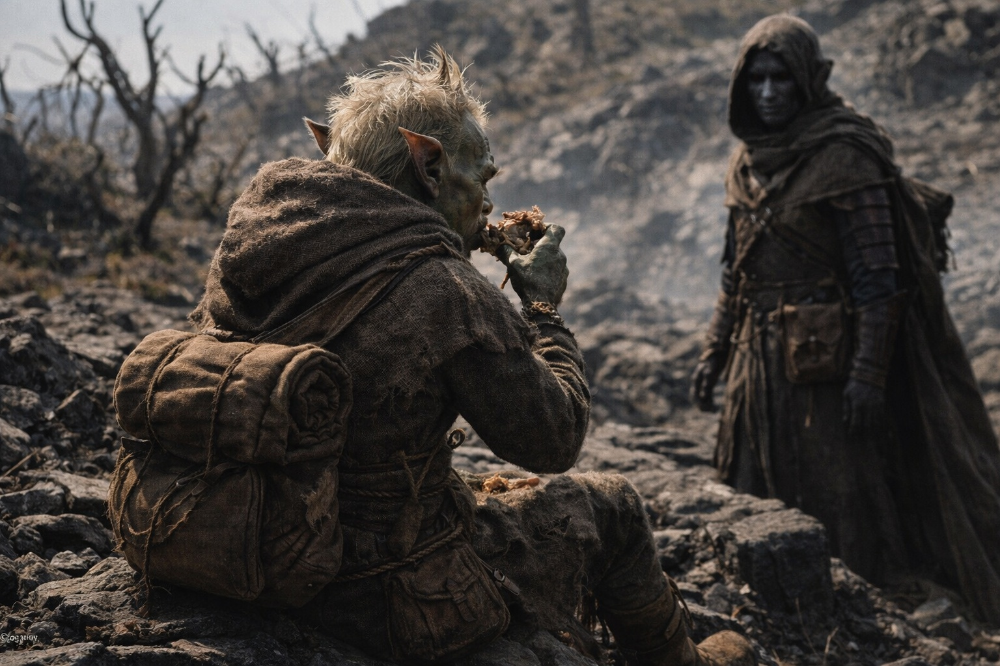
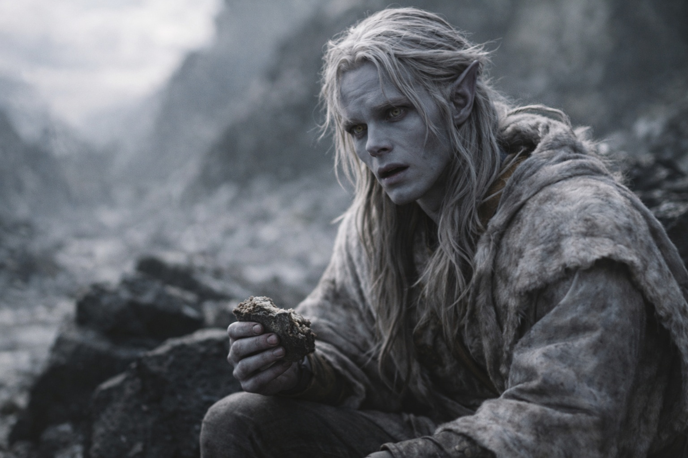
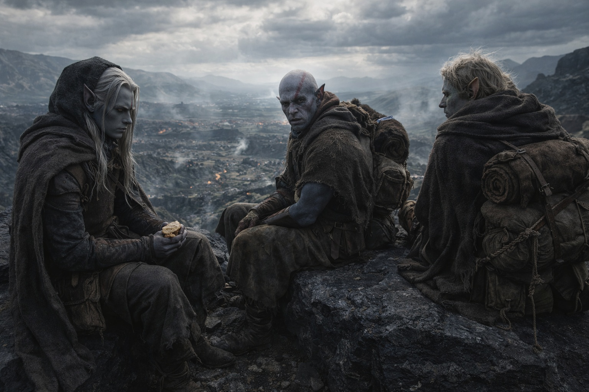

---
order: 281
title: "The Departure: The Conversation"
description: "The silence lasted until midday, which was longer than Drusniel expected and shorter than he deserved."
date: 2024-09-24
language: en
chapter: 31
subchapter: 4
storyline: drusniel
canon_phase: main
canon_sequence: D-031-004
narrative_weight: high
category: Wyrmreach
author: Drusniel
type: Main
tags: ['#the departure', '#drusniel', '#srietz', '#elion', '#wyrmreach']
thumbnail: image.jpg
featured: false
counterpart_path: site/content/posts/es/wyrmreach/la-partida-la-conversacion/index.mdx
counterpart_title: "La Partida: La Conversación"
---

## Chapter 31 | Part 4 | The Conversation

---

The silence lasted until midday, which was longer than Drusniel expected and shorter than he deserved.

They stopped to eat on a shelf of black stone with a view of the ground behind them. No pursuit. Drusniel checked the Thornfield border on the map before putting it away.

Srietz ate with his back to Drusniel. He'd tested the dried provisions with something from his belt pouch, a drop of liquid that changed color on contact with the food, and had eaten only after confirming whatever his standards required. The ritual was familiar. The direction he faced while performing it was new.

"Srietz has a question about the route." He addressed Elion. "Does the drow plan to sell anyone else along the way? Srietz needs to plan."

Drusniel put down his ration. Szoravel had inspected Srietz's scars, questioned him about Vexrath and demanded an inventory. Drusniel hadn't asked whether Srietz wanted any part of the examination.

Elion sat against the outcrop, watching them both.

Elion kept his voice low. "He stayed, Drusniel. You could at least look at him."

Drusniel looked at him.

"He still has to walk beside you. You don't get to put this behind you just because we left the tower."

Drusniel looked down at the unfinished food.

"I know."

"Then why did you let him examine us?" Elion asked. "You wanted answers. We had to stand there while he took what he wanted."

"I thought he'd refuse if he didn't want to."

"You could have asked."

Below the shelf, branches scraped against the rock.

Drusniel turned toward Srietz.

"The Null is one phase of a larger system. Szoravel holds Alter. The chassis and other components are missing. He thinks I can use them, but he hasn't demonstrated a repair." Drusniel looked at them. "That is what I learned."

Srietz's ears rotated one degree toward Drusniel. Not a turn of the head. Just the ears. Listening despite refusing to look.

"He says the barrier is failing. I needed to know whether carrying this thing closer would make it worse."

"Srietz understood the scope," the goblin said. Still to Elion. Still not looking. "Srietz did not need to be examined like a tool to understand the scope. Srietz needed to be asked."

Drusniel had no answer to that.

"You're right," Drusniel said.

Srietz's ears went flat. He looked at Drusniel for the first time since they'd stopped.

"Srietz will continue walking with the group," the goblin said. The words were directed at Elion but the volume was calibrated for Drusniel's ears. "Srietz will continue providing route information, supply assessment, and chemical support. Srietz will not continue pretending these are gifts. They are Srietz's leverage. When the drow needs something only Srietz can provide, Srietz will remember this conversation."

"Fair," Drusniel said.

"Srietz did not ask if the drow thought it was fair." He stood, dusted his hands, and began repacking. "Srietz stated terms."

Elion waited until Srietz finished packing.

"And me?" Elion asked.

Drusniel looked at him. "What about you?"

"He found a dormant presence in me. Then he stopped the examination." Elion's jaw tightened. "What did he mean?"

"I don't know what he meant. He didn't explain."

"But you'll try to find out."

"Yes."

"Without asking me first."

Drusniel stopped himself before answering.

"I'll ask before I involve you again."

Elion studied him. "I'll hold you to that."

They packed and set off. Srietz stayed beside Elion, but Drusniel could hear them talking now.

At the next turn, Srietz waited until Drusniel had checked the map.

---

**End of Chapter 31.4 —> 31.5: [The Departure: The Weight](/the-departure-the-weight/)**
