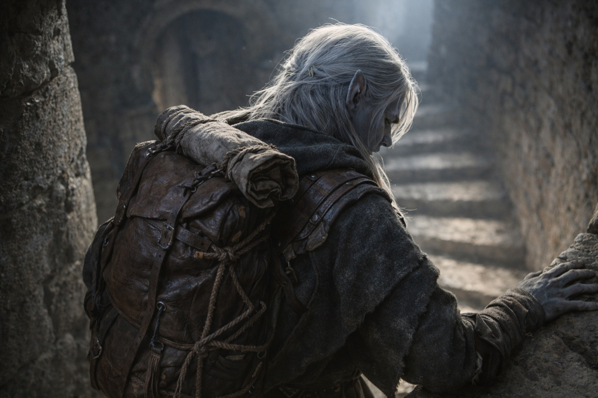

# Chapter 31.2 | The Departure: The Final Words

---

Szoravel was waiting at the base of the tower with a pack he hadn't been carrying the day before.

Not his own. A supplies pack, assembled with the same systematic precision that characterized everything the older drow did. Water skins. Dried provisions. A rolled map case. Three pouches of something Drusniel couldn't identify and Szoravel didn't explain. He placed it on the ground between them the way a merchant places goods on a table: the transaction made visible, the terms implied.

"Supplies for eight days on the eastern route. The map covers the territory between here and the Thornfield border. After the border, you're in contested land and my maps are unreliable." He stepped back from the pack. "Take what you need. Leave what you don't. I won't be offended."

The morning air was cold and sharp and carried the scent of the sparse vegetation that grew around Szoravel's hold, twisted shrubs and lichen that survived in Wyrmreach's hostile conditions through stubbornness rather than adaptation. Srietz was already outside, standing by a low wall with Elion, the two of them occupying the same silence with the ease of people who'd figured out each other's tolerances.

"The Dreamlands directions," Drusniel said. "The ridge. The tower. How much of it can I trust?"

"How much of it stayed consistent when perspective shifted?"

"I only projected once."

"Then you can't trust any of it. Single readings are noise. Multiple readings become signal. The fracture lines that persist when everything else changes are the structural ones. You didn't have time for multiple readings, so your directions are guesses refined by instinct. Better than random. Worse than reliable."

Drusniel let that settle. Guesses refined by instinct. He'd been navigating on less.

Szoravel crossed to his workbench, an outdoor slab of stone that served as his secondary workspace. A leather satchel sat on it. He opened it and removed the crystal box he'd used during the assessment, the one that had held the diagnostic crystals. He placed it beside the supply pack.

"Three calibration crystals. Not the ones I used for examination. Simpler. They'll help you practice projection. Place them in a triangle, sit inside, close your eyes. The procedure you experienced last night. Repeat it. Build a composite of your Dreamlands readings. When three independent projections agree on a direction, follow it."

"And the cost?"

"The cost is the cost. Your body will protest. Your ear will bleed. The disorientation will compound with each projection until your consciousness develops tolerance or breaks." He said it the way he'd said everything: with precision, without warmth, with the particular indifference of someone who'd already calculated the acceptable casualty rate and found it within parameters. "You'll learn. Or you won't. Both outcomes produce data I can use."

Drusniel almost smiled at that. It died somewhere between the impulse and his face. "Is that what this was? Data collection?"

Szoravel looked at him. The obsidian-chip eyes held nothing that resembled emotion and everything that resembled calculation. "You came to my hold carrying an artifact I've spent decades studying. You have the dual affinity the system requires. Your body has been adapted by crystal exposure to an extent that makes you functionally compatible with the barrier. You are, at this moment, the most significant variable in a system I've devoted my life to understanding." He paused. "Yes. This was data collection. If it also helped you, that's incidental but not unwelcome."

The honesty was brutal and somehow easier to stand than kindness would have been. Drusniel picked up the supply pack. Checked the weight. Distributed items into his own pack and Srietz's designated supply bag.

"One more thing," Szoravel said, the cadence of an afterthought that wasn't.

Drusniel stopped.

"Nyxara sent word this morning. The conversation you owe. She's calling it in."

The air in Drusniel's lungs went cold. "When?"

"Now. She's coming here to collect. She dispatched a runner at dawn, which means she knew your location before I told her, which means her network is more thorough than I estimated." Szoravel checked the position of the sun. It was still low, barely clearing the ridge to the east. "You have perhaps two hours before she arrives. I suggest you run."

"Run."

"East. Fast. The route on the map avoids her primary patrol corridors. She won't pursue past the Thornfield border." He said this with the confidence of someone who believed it. The same confidence he'd shown in the tower. The confidence that Drusniel now knew might be wrong, because Szoravel's assessment of Nyxara's interests had been wrong before, and neither of them would know which errors mattered until the errors arrived.

"She could track us."

"She will track you. Nyxara doesn't send runners for conversations she's willing to postpone. But tracking and pursuing are different investments. She has a territory to manage and a war to not lose. Chasing you beyond the Thornfield costs more than the conversation is worth." He closed the leather satchel. "Probably."

"Probably."

"I deal in probabilities, not certainties. The certain thing is that she's coming. What she does when she arrives and you're gone is a probability I can estimate but not control."

Drusniel shouldered the pack. The weight was different now. Not heavier. More specific. Every item in it had been chosen by someone who understood what lay ahead and had decided that this much help, and no more, was what the transaction warranted.

"Thank you," he said.

Szoravel received the words the way he received all input: as data. "Don't thank me. Survive long enough to activate the Chassis. That's the return on my investment."

He turned and walked back into the tower. The door didn't close behind him because it had never been closed. But the message was the same. The transaction was complete. The help was given. The relationship was over.

Drusniel stood at the base of the tower with his pack and his crystals and his unreliable directions and a two-hour head start on a lord who wanted a conversation he couldn't afford to have. He looked at Srietz and Elion by the wall.

"We're leaving. Now. East. Fast."

Srietz was moving before the sentence finished. Whatever his grievances, whatever distance he'd built between himself and Drusniel, the goblin's survival instincts operated on a timescale faster than resentment. Elion unfolded from his position against the wall, his body shifting into the configuration of someone prepared to cover ground quickly, grey limbs finding their pace.

They ran.

---

*Next: The Departure: The Path Forward*

**End of Chapter 31.2 — continues in Chapter 31.3: [The Departure: The Path Forward](/the-departure-the-path-forward/)**
