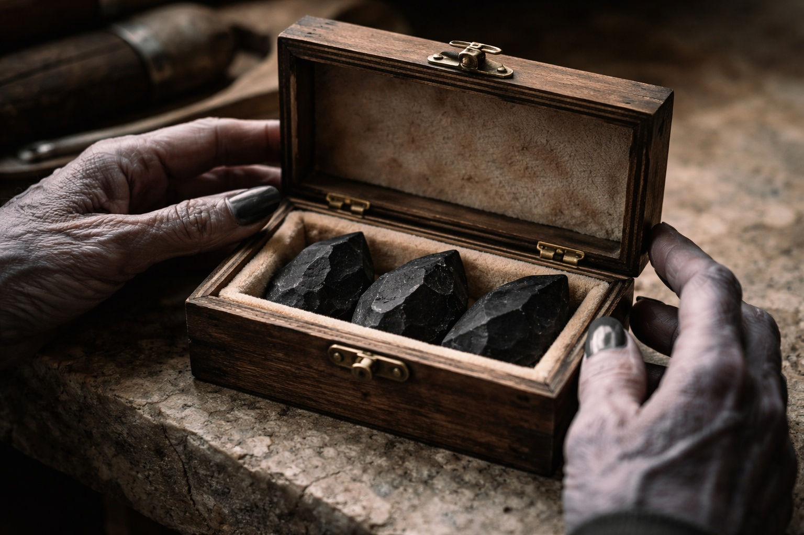
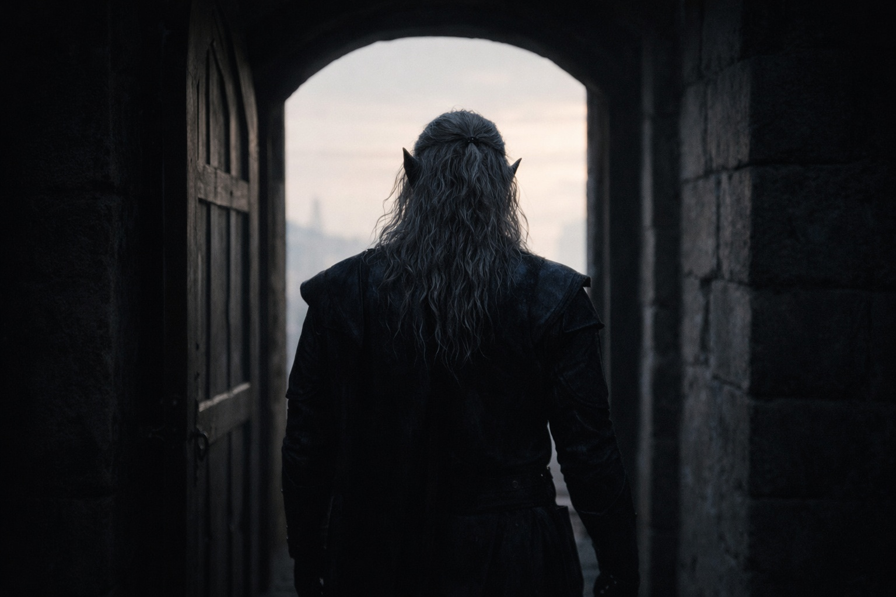
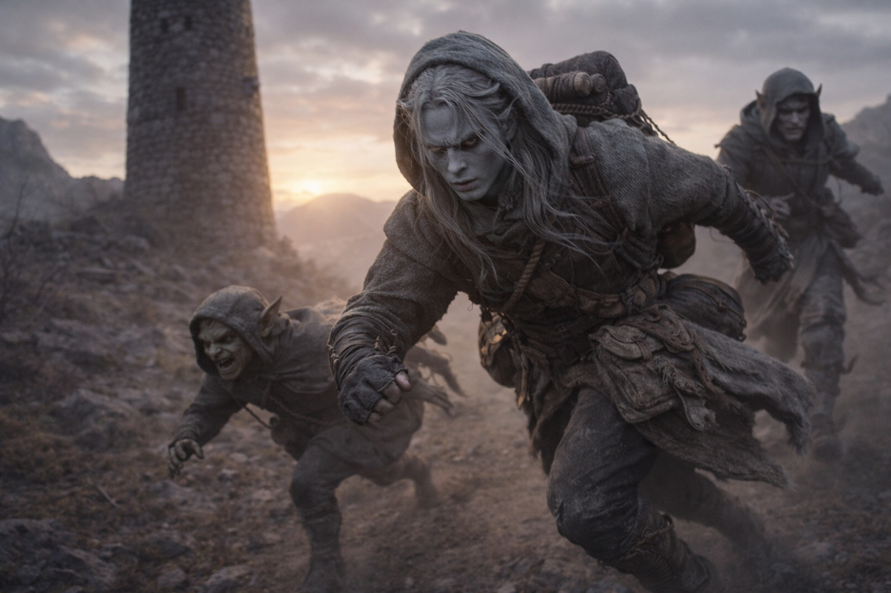

## Chapter 31 | Part 2 | The Final Words

---

Szoravel was waiting at the base of the tower with a pack he hadn't been carrying the day before.

The pack held waterskins, dried food and a rolled map. Szoravel put it between them.

"Ten days of supplies. Map verified as far as Thornfield. Beyond the border, no reliable survey."

Srietz waited beside a low wall with Elion. Neither joined Drusniel at the tower entrance. Cold air reached through his shirt as he bent to check the waterskins.

"The Dreamlands directions," Drusniel said. "The ridge. The tower. How much of it can I trust?"

"How much of it stayed consistent when perspective shifted?"

"I only projected once."

"Then the route remains unverified. Continue the readings in the field. The tower assessment is suspended."

Drusniel looked toward the road. Something had changed since last night.

Szoravel crossed to his workbench, an outdoor slab of stone that served as his secondary workspace. A leather satchel sat on it. He opened it and removed the crystal box he'd used during the assessment, the one that had held the diagnostic crystals. He placed it beside the supply pack.

"The remaining three from your haul. Calibrated." Szoravel tapped the box. "Repeat the triangle arrangement. Three independent readings before committing to a dream route."

"And the cost?"

"Record bleeding and disorientation after each attempt. Stop if you lose awareness of your body."

"Is that what this was?" Drusniel asked. "Data collection?"

"Yes. Assessment incomplete. Deliver the remaining readings."

Drusniel checked the supplies and divided them between his pack and Srietz's bag.

"One more thing," Szoravel said.

Drusniel stopped.

"Nyxara sent a summons this morning. Another audience."

The air in Drusniel's lungs went cold. "When?"

"Here. Within two hours. Departure now." Szoravel checked the eastern ridge.

"Run."

"East. Follow the marked route. Cross at Thornfield."

"She could track us."

"Tracking remains possible. Pursuit beyond the border: unlikely." He closed the satchel.

"Probably."

"No guarantee. The summons is confirmed."

Drusniel tightened his pack straps. Two hours left no room to argue.

"Thank you," he said.

"Deliver the readings. No activation without assessment."

Szoravel returned to the tower, leaving the door open.

Drusniel looked at Srietz and Elion by the wall. He had two hours, supplies and a map that covered only part of the route.

"We're leaving. Now. East. Fast."

Srietz was moving before he finished. Elion pushed away from the wall and followed.

They ran.

---

**End of Chapter 31.2 —> 31.3: [The Departure: The Path Forward](/the-departure-the-path-forward/)**
