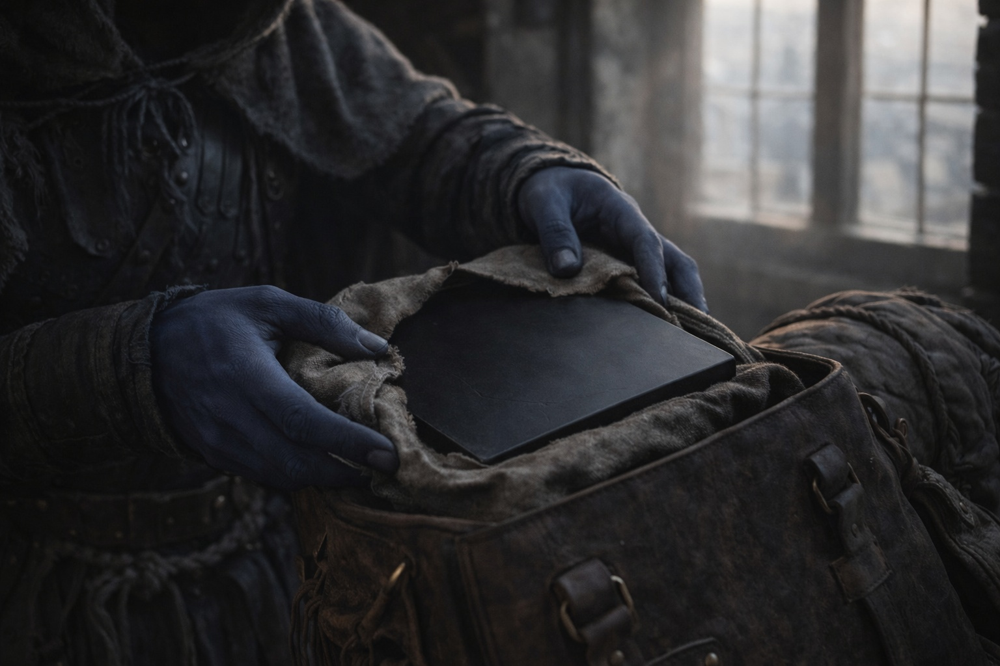
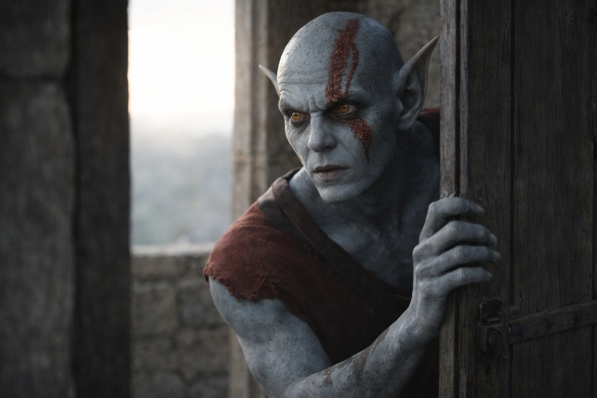

## Chapter 31 | Part 1 | The Morning

---

Srietz packed his gear without speaking.

He'd moved his bedroll to the far wall during the night, as far from Drusniel as the room allowed, and now he rolled it with the efficient precision of someone who'd learned, in years of captivity and flight, that a tight bedroll was the difference between fitting your pack through a narrow gap and dying on the wrong side of it. His hands worked. His ears were flat. His yellow eyes tracked his own fingers and nothing else.

When Elion asked if he was ready, Srietz answered Elion. Not Drusniel.

"Srietz is ready." A pause. The pause held the weight of something deliberate. "Srietz walks with the group." Another pause. "Srietz does not walk with him."

He didn't look at Drusniel once.

Morning light came through the tower's narrow windows in thin shafts that did nothing to warm the stone. Drusniel had been awake since before the light, sitting on the pallet where he'd bled from his ear the night before. The blood had dried on the cloth in a pattern he could read if he wanted to, the way he read cracks in stone, the way he now apparently read fractures in the fabric of consciousness. He didn't read it. Some data wasn't useful.

His body felt like it had been dismantled and rebuilt in approximately the correct order. The disorientation Szoravel had warned about was there, a persistent sense that the world was half a degree off true, as if every surface and shadow had shifted while he slept and hadn't quite returned to its original position. His right ear was healed. The headache was constant, low, manageable. The memory of the Dreamlands sat in his mind like a stone in his shoe, present and unavoidable and wrong.

He packed. The Null went into his pack first, wrapped in cloth, its weight familiar and meaningless and suddenly not meaningless at all. A bomb or a bandage. He'd been carrying it for weeks. Now he knew what it was. Or some of what it was. Enough to make the weight feel different.

Szoravel's tower was quiet in the manner of a place that had been quiet for decades and resented interruption. The workbench where the mercury disc had hummed was cleared, the disc gone, stored somewhere in the shelves that lined the walls. The fire pit held ash and the memory of heat. Books were stacked where they'd always been stacked, in an order that was probably systematic and looked like chaos.

Elion moved through the morning routine with the controlled efficiency of someone whose body was a tool he'd chosen for the task. Grey skin, amber-orange eyes, the red markings on his face that might have been paint and might have been something else. He packed his few belongings, checked the door, scanned the room. His movements carried a tension that hadn't been there before Szoravel's examination. The word "passenger" sat between them, unnamed and enormous.

Drusniel had tried to talk to him about it the night before, after the dream projection. Elion had closed his eyes. Not asleep. Refusing.

Fair.

Everyone was carrying something they hadn't signed on for. The question of whether to discuss it was the kind of question that answered itself by going unanswered, and Drusniel was learning, slowly and at considerable cost, that some truths survived better in silence than in conversation.

He checked his supplies. Water: adequate. Food: two days, maybe three if Srietz supplemented from the landscape. Crystals: four black ones in a leather pouch at his belt, gathered from the chamber weeks ago, their surface warm against his hip. Tools: climbing picks, rope, the knife he'd carried since Umbra'kor. The Null. The information Szoravel had given him, which didn't fit in a pack and weighed more than everything else combined.

He carried: the knowledge that the barrier was failing. That the Chassis was a maintenance tool in three parts. That Szoravel held Alter. That Zaelar held Sense. That the Null was the third phase, Erase, and that together they could extend the barrier's life or dismantle it, and nobody knew which until activation. That he was compatible, not chosen. That the difference mattered less than it should.

He carried: two debts to the Voice. One for his own survival. One for the group's. He carried a conversation owed to Nyxara, content undefined, deadline approaching. He carried directions from the Dreamlands that might be real or might be the distorted reflections of a thousand dreaming minds.

And he carried the knowledge that his consciousness had been leaking into a plane where something vast and ancient could find him, and that he'd be going back.

Srietz finished packing and left the room. The doorway held his absence for a moment before Elion followed. Their footsteps descended the stone stairs, Srietz's light and quick, Elion's measured and strange, and then Drusniel was alone in the tower room where he'd learned more in two days than in the preceding weeks, and none of it had made anything simpler.

He shouldered his pack. The Null pressed against his spine. The crystals hummed at his belt.

He left the room and didn't look back.

---

**End of Chapter 31.1 —> 31.2: [The Departure: The Final Words](/the-departure-the-final-words/)**