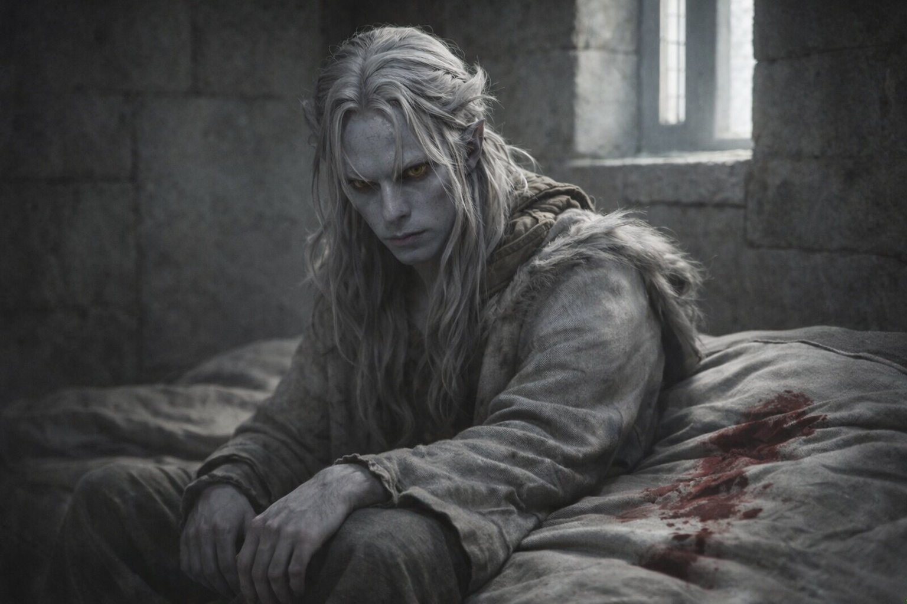
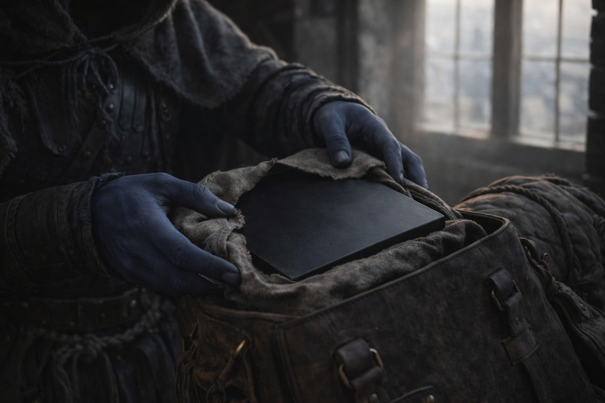

## Chapter 31 | Part 1 | The Morning

---

Srietz packed his gear without speaking.

He'd moved his bedroll to the far wall during the night. Now he rolled it tight, ears flat, watching his hands.

When Elion asked if he was ready, Srietz answered Elion. Not Drusniel.

"Srietz is ready." He tightened a strap. "Srietz walks with the group. Srietz does not walk with him."

He didn't look at Drusniel once.

Morning light reached the pallet where Drusniel had spent the night. He folded the bloodstained cloth and put it away.

His ear had stopped bleeding. The headache remained, and the floor seemed to tilt when he stood. He waited for it to settle before packing.

He checked the Null beneath his shirt. Cold and inert. Szoravel had named its function, but had shown him no safe way to use it.

The workbench was clear. Szoravel had put away the measuring disc, and the fire pit held cold ash.

Elion packed his few belongings and checked the door. He'd barely spoken since Szoravel found the dormant presence. The red marks stood out against his pale bluish-white skin.

Drusniel had tried to talk to him about it the night before, after the dream projection. Elion had closed his eyes. Not asleep. Refusing.

Fair.

Drusniel had left him alone after that.

He checked the water and the two days of food left in his pack. Four of the seven crystals from the mountain hung at his belt; Szoravel still had the other three for calibration. His rope, picks and knife were where he'd left them.

Erase. Phase II. The Null was one component, and Szoravel held Alter. The chassis and the remaining pieces were still missing. Without them, no one had demonstrated a repair.

He still owed the Voice twice. Nyxara wanted another audience, though he had promised no further service. And his only route beyond Szoravel's map came from a dream he hadn't verified.

And he carried the knowledge that his consciousness had been leaking into a plane where something vast and ancient could find him, and that he'd be going back.

Srietz left, with Elion following. Drusniel heard their steps on the stairs and finished fastening his pack.

He shouldered it. The crystals hummed at his belt.

He left the room and didn't look back.

---

**End of Chapter 31.1 —> 31.2: [The Departure: The Final Words](/the-departure-the-final-words/)**
