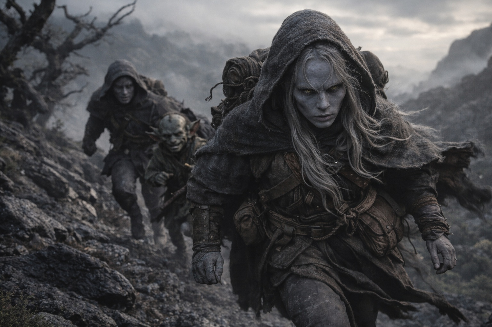
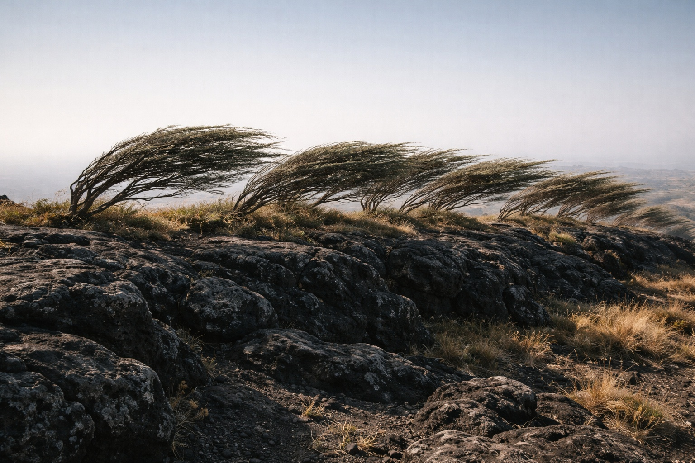
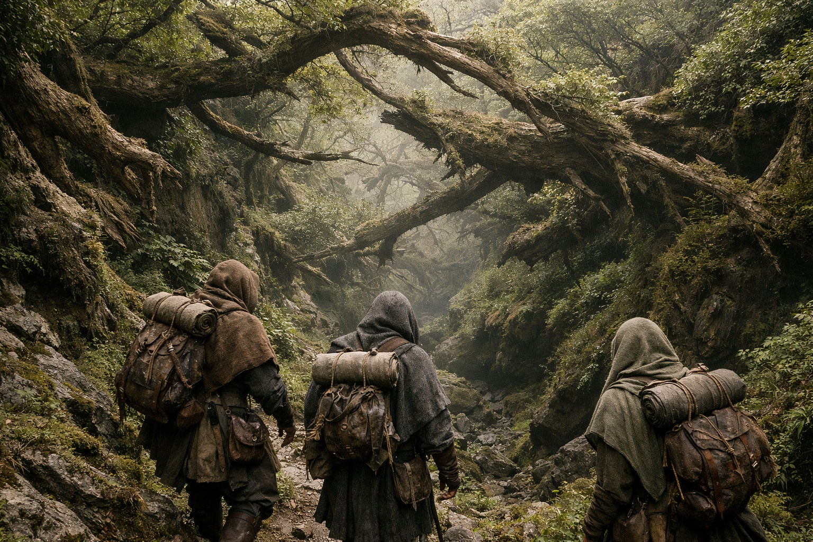
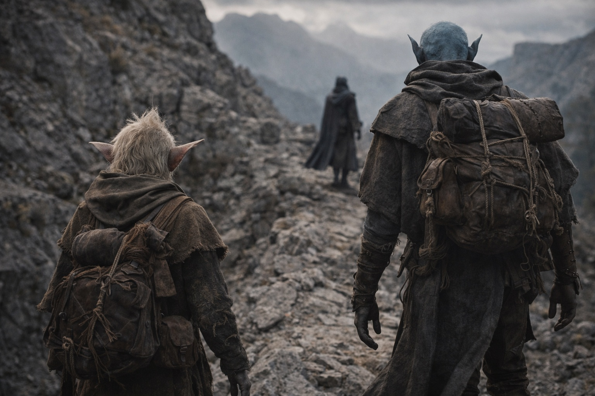
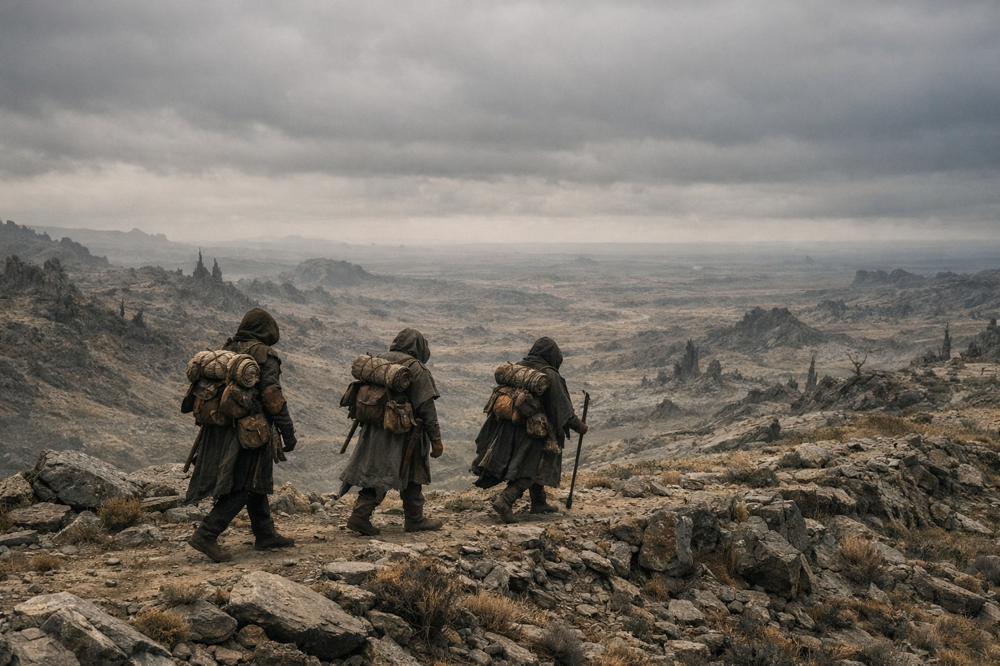

# Chapter 31.3 | The Departure: The Path Forward

---

They ran until the tower was a smudge on the horizon, and then they ran further.

The eastern route on Szoravel's map followed a ridgeline that cut through the twisted landscape of central Wyrmreach, skirting the edges of territories that Szoravel had marked with symbols Drusniel didn't recognize but could infer. Danger zones. Patrol routes. Places where the ground itself was unstable, where the barrier's degradation had loosened the relationship between surface and depth and the terrain couldn't be trusted to stay where it was.

Srietz ran with the focused economy of a creature whose legs were half the length of Drusniel's and who compensated with a stride frequency that bordered on mechanical. He'd positioned himself beside Elion from the first minute. Not behind. Not in front. Beside. The geometry was deliberate. He walked with Elion. He ran with Elion. The space beside Drusniel remained empty.

Elion moved the way Elion always moved, with a fluidity that contained the suggestion of other configurations, other bodies, other ways of occupying space. His grey skin caught the morning light and held it without reflecting it, the surface of something that was and wasn't stone, that was and wasn't anything permanent. He ran without apparent effort, which either meant the distance was easy for him or that he'd chosen a body that made running efficient. With Elion, Drusniel had learned, the distinction between capability and choice was often invisible.

Behind them, the ground shook.

Not an earthquake. Not the sharp crack of tectonic movement. A pressure shift, the kind that came before a storm, except the sky was clear and the wind was still. The air thickened. Changed taste. The metallic flavor that Drusniel had grown accustomed to in Wyrmreach sharpened into something more specific, like the smell before a lightning strike concentrated into a single direction.

Srietz's ears went rigid. "That is not geological."

"No." Drusniel kept running. "That's Nyxara."

The pressure rolled over the landscape the way a wave rolls over sand: not crashing but inexorable, flattening the ambient noise, compressing the space between each sound until the silence between footsteps felt deliberate. The twisted shrubs along the ridge bent east, away from the source, as if the air itself was being pushed ahead of something large.

Not a person. Not a mounted lord with a retinue. Presence. The kind that changed the physics of the space it occupied. Drusniel had felt it before, at a distance, in the meetings Szoravel had arranged. The formal audience where Nyxara had spoken to him with the precise disinterest of someone cataloguing assets. She'd been contained then. Controlled. Whatever she was doing now, she wasn't bothering to contain it.

"Faster," Drusniel said.

They ran faster. The ridgeline descended into a shallow valley where the vegetation thickened into something resembling a forest, if forests grew sideways and the trees had given up on any consistent relationship with gravity. The canopy provided cover. Drusniel didn't know if cover mattered against whatever Nyxara was, but it limited sightlines and he'd take what he could get.

The pressure peaked. For one long moment, the air felt solid. Then it released. The trees creaked. The ground settled. The ambient noise of Wyrmreach returned, wrong and constant and suddenly reassuring in its familiarity.

She'd arrived at the tower. Found him gone.

Drusniel listened for pursuit. Heard nothing. The silence might mean she'd accepted the absence or it might mean she was deciding how much the conversation was worth relative to the effort of chasing. Szoravel had called it a probability. Drusniel was betting his survival on the probability that Nyxara's calculus would favor patience over pursuit.

He kept running.

They cleared the valley and climbed the next ridge. The landscape opened east: more of Wyrmreach's hostile geography, stone and scrub and sky, stretching toward the Thornfield border that Szoravel's map placed two days out at pace. Two days of open terrain where any lord with eyes could track three figures on a ridge.

No one suggested turning back. No one suggested splitting up, either. Srietz stayed. That was worse than leaving. It meant he wanted Drusniel to live with what he'd done. Every day. Every league. The goblin's presence was not forgiveness. It was accounting.

They slowed to a sustainable pace when the running became untenable. Walking east, single file on the ridge, Drusniel in front with the map, Srietz and Elion behind, the space between them measured not in paces but in the quality of the silence that filled it.

The sun climbed. The tower disappeared. Ahead of them, east, the Thornfield border waited. Beyond it, contested land and unreliable maps and the directions Drusniel had pulled from the Dreamlands, cryptic and possibly wrong and the only guidance he had.

Behind them, Nyxara. Somewhere. Deciding.

They walked. The landscape swallowed them the way it swallowed everything: slowly, indifferently, without distinguishing between travelers and terrain.

---

*Next: The Departure: The Conversation*

**End of Chapter 31.3 — continues in Chapter 31.4: [The Departure: The Conversation](/the-departure-the-conversation/)**
