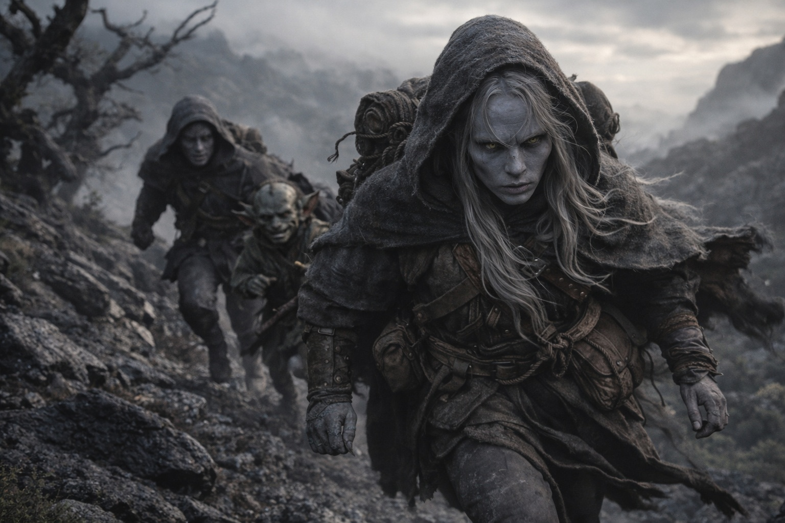
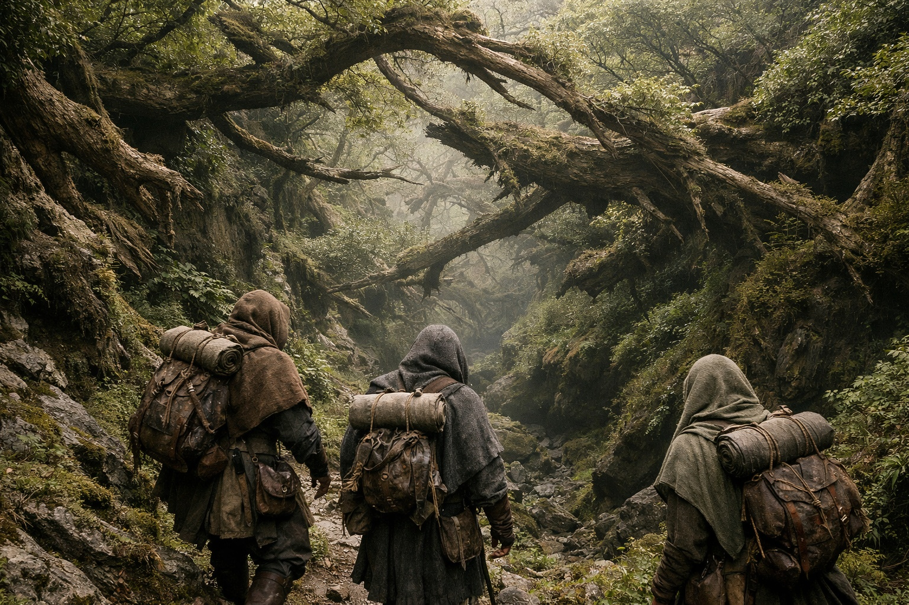
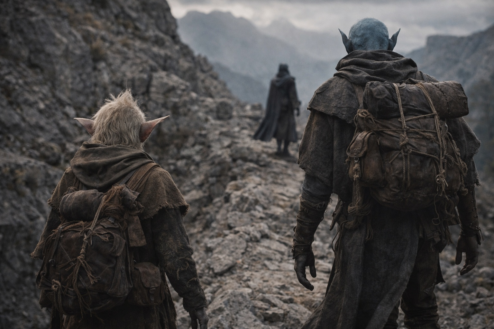

## Chapter 31 | Part 3 | The Path Forward

---

They ran until the tower was a smudge on the horizon, and then they ran further.

Szoravel's eastern route followed a ridge past several marked hazards. Drusniel couldn't read all the symbols. He stayed on the path where the map showed broken ground.

Srietz kept pace with short, quick strides. He stayed beside Elion, leaving Drusniel to run alone.

Elion cleared the broken ground without slowing. Drusniel couldn't spare the breath to ask how long he could keep it up.

Behind them, the ground shook.

Pressure closed around his ears. He stumbled and caught himself. The sky was clear, but the air smelled as it did just before lightning struck.

Srietz's ears went rigid. "That is not geological."

"No." Drusniel kept running. "That's Nyxara."

The shrubs bent east. Pressure blocked his ears, and for a moment he couldn't hear the others' feet.

He'd felt that pressure in Nyxara's hall before they ever reached Szoravel. It was stronger now.

"Faster," Drusniel said.

They ran down into a valley beneath crooked trees. Drusniel couldn't tell whether the canopy would hide them from Nyxara. He took the cover anyway.

The pressure peaked, then released. Drusniel heard the branches creak and Srietz's feet striking the path behind him.

Was she at the tower already?

He listened for pursuit and heard nothing. That wasn't enough to make him stop.

He kept running.

They cleared the valley and climbed the next ridge. The landscape opened east: more of Wyrmreach's hostile geography, stone and scrub and sky, stretching toward the Thornfield border that Szoravel's map placed two days out at pace. Two days of open terrain where any lord with eyes could track three figures on a ridge.

Srietz stayed with them. When Drusniel looked back, the goblin turned toward Elion.

They slowed when Srietz began to stumble. Drusniel led them along the ridge with the map open in his hands.

The sun climbed as they followed the ridge. Szoravel's map ended at Thornfield. Beyond it, Drusniel would have to test the directions he'd brought back from the dream.

Behind them, Nyxara. Somewhere. Deciding.

They walked until the ridge hid the tower.

---

**End of Chapter 31.3 —> 31.4: [The Departure: The Conversation](/the-departure-the-conversation/)**
